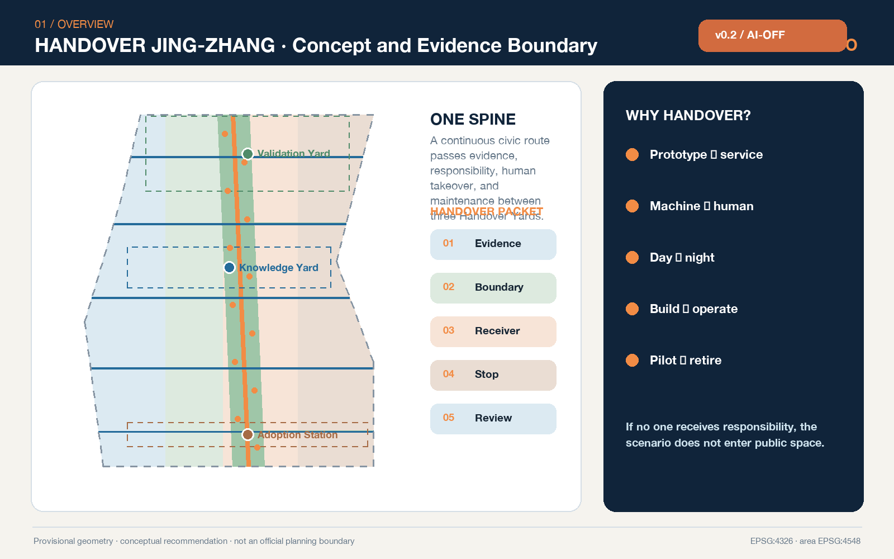
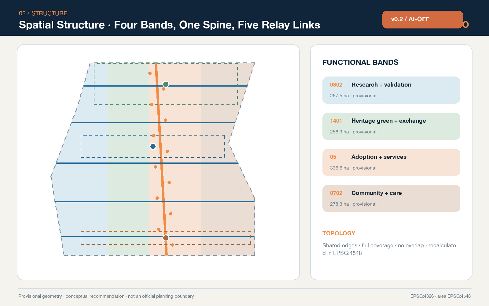
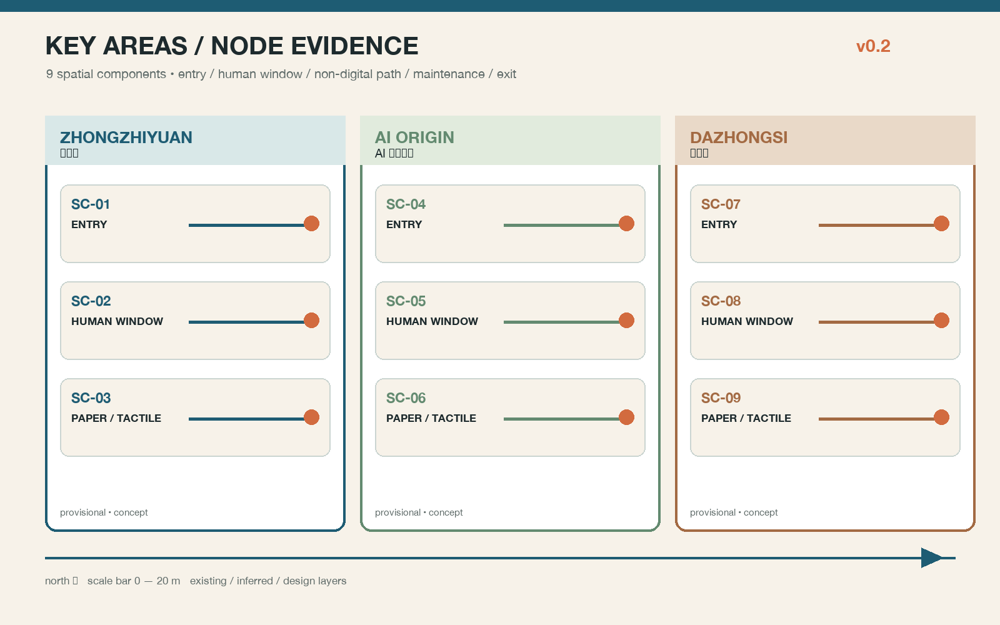
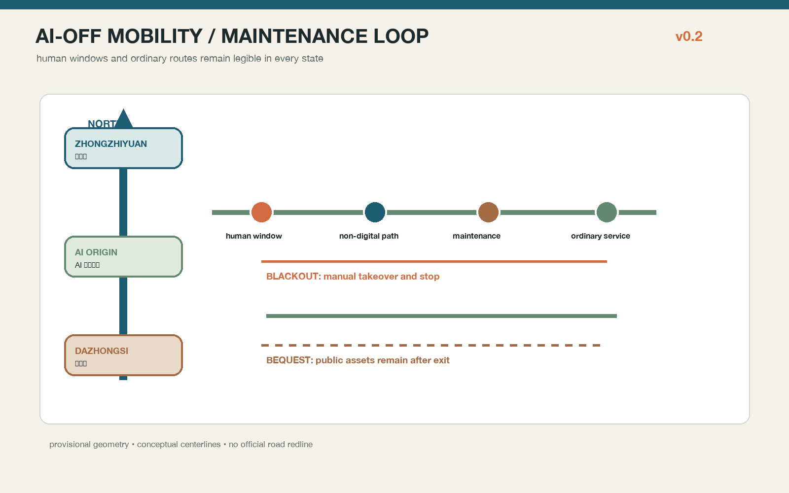
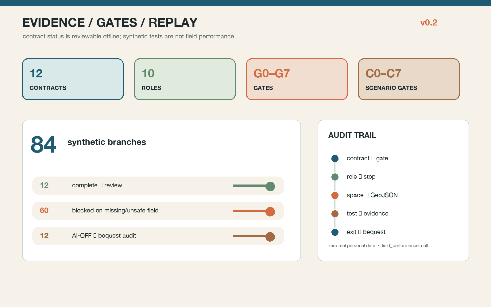

# HANDOVER JING-ZHANG

> Urban AI interfaces that remain continuous, accountable, and caring

## Design Basis and Source List

This proposal begins with an ordinary but frequently neglected question: who carries an AI prototype into public service, who takes over from an automated recommendation to make a human judgment, who restores a place when an event ends, and who keeps a service available when a device fails? HANDOVER JING-ZHANG makes those transfers an urban-design subject. Every spatial move names the initiator, receiver, deliverable, stop condition, human alternative, and next review date. An AI scenario without a responsible receiver, a human doorway, or an exit path does not enter a public-space pilot. The official announcement defines the objectives, three spatial levels, and design tasks; the cleared Agent Taskbook defines the six Agent-facing requirements. [source:OFFICIAL-ANNOUNCEMENT] [source:AGENT-TASKBOOK] [standard:PROJECT-OFFICIAL-ANNOUNCEMENT]

The repository does not currently provide official polygons for the Overall Design Area or the three Key-Area Detailed Design Areas. This package uses the maintainer-defined provisional boundary derived from textual extents and approximate announced areas. It is used only for concept generation, layer clipping, visualization, and intake self-check—not as an official planning boundary, parcel line, road redline, ownership boundary, or approval basis. Issues #846 and #1029 document unresolved location questions; this proposal neither “corrects” nor upgrades the geometry. Once official polygons arrive, the complete package must be recalculated. [source:BOUNDARY-SOURCE] [source:KEY-AREA-SOURCE] [data:geometry/site_boundary.geojson#SITE-001]

The evidence hierarchy is explicit. The official announcement and professional standards define tasks and methods; the Source Registry limits permitted uses; the processed fact pack is only a reading aid; the proposal geometry and metrics express this concept. Pages, PDFs, and images are explanatory artifacts and cannot overwrite GeoJSON, metrics, or matrices. [source:SOURCE-REGISTRY] [source:PROCESSED-FACT-PACK] [source:SITE-PACKAGE]

Generation uses only public or cleared repository materials, seven official or first-party global case pages, original diagrams, and a local system font. It uses no commercial map tiles, news images, portraits, corporate logos, non-public material, or personal data. Areas are recalculated in EPSG:4548 while exchange coordinates remain EPSG:4326. The submitted provisional geometry measures about 1,141.3 hectares, but that number describes the temporary geometry only; it does not replace the announced approximate value or an official survey. [metric:site_area_sqm] [depth:existing_conditions_diagnosis]

## Three-Level Scope Framework

The Coordinated Research Area asks who carries innovation forward. At the approximately 43.6 km² strategic scale, universities, research, enterprise development, professional services, public scenarios, and community feedback form a chain of research, validation, adoption, maintenance, and retirement. The Overall Design Area asks where each handover occurs. On the provisional approximately 11.4 km² working surface, the proposal establishes one north–south Handover Spine, five east–west Relay Links, three Handover Yards, and twelve Handover Points. The Key-Area Detailed Design Areas ask what is transferred and who receives it: Zhongzhiyuan carries prototypes into controlled validation, the AI Origin Community carries knowledge into open collaboration, and Dazhongsi carries products into civic adoption and long-term operation. [depth:three_level_scope_framework] [data:geometry/key_areas.geojson#PROV-KEY-001]

“One Spine, Three Yards, Two Wings, Twelve Shifts” is not a new redline. It is a transferable spatial-and-responsibility grammar. The Spine carries continuous walking, cycling, accessibility, information, and heritage interpretation. The three Yards are a Validation Handover Yard, Knowledge Handover Yard, and Adoption Handover Station. The Zhongguancun Technology Services Wing brings legal, capital, talent, and intellectual-property support; the Xiaoyue River Scenario Enablement Wing returns evidence from mobility, care, culture, and daily services to research teams. Twelve scenario cards fix input, output, risk, and receiver. The design layers contain twelve concept nodes and five transverse links. [metric:handover_node_count] [metric:cross_link_count] [depth:overall_spatial_structure]

Four land-use bands share exact edges so they cover the temporary submitted boundary without overlap: research and validation; heritage green spine and public exchange; adoption and commercial service; and community service and everyday care. These are functional relationships, not approved land-use changes. The rough rectangular Key-Area boundaries remain low-contrast provisional constraints in every figure. [data:geometry/land_use.geojson#LU-001] [standard:MNR-LAND-USE-CLASSIFICATION-GUIDE]

## Coordinated Research Area: Industry and Future City Research

The proposal defines “handover capacity” as public quality infrastructure for an AI innovation ecosystem. An innovation chain cannot end with a model or device launch. Version, source rights, test results, intended-use boundary, human takeover, maintenance budget, and retirement conditions must travel with the artifact. Five interfaces support this chain. A research interface preserves reproducible experiments and model/data documentation. A validation interface supports controlled safety, accessibility, and real-environment tests. An adoption interface translates professional evidence into understandable public service statements. A maintenance interface secures inspection, spares, training, and incident review. An exit interface ensures that a failed pilot can stop, data can be handled properly, and space can return to ordinary use. Together they serve full-stack innovation, a world-class ecosystem, AI-enabled scenarios, an active city, and a credible voice in AI governance. [standard:PROJECT-AGENT-OPEN-CALL-TASKBOOK] [depth:risk_missing_data]

Seven global cases supply mechanisms only; none supplies Haidian-scale quantities, investment, or regulatory controls:

| Case | Transferable mechanism | Jing-Zhang translation | Not imported |
| --- | --- | --- | --- |
| Cambridge Kendall Square | Innovation facilities coordinated with mixed urban life and public space | Bring research outcomes to legible public interfaces | Area, lease, and development controls [source:CASE-KENDALL] |
| Singapore one-north | Work-live-play-learn beside research, education, and daily life | Put four everyday needs into every handover network | Tenant lists, investment, or land regime [source:CASE-ONE-NORTH] |
| Barcelona 22@ | Industrial renewal and collaboration among knowledge and creative sectors | “Services first, space gradually” in an existing district | Local policy powers and sector ratios [source:CASE-22BARCELONA] |
| Toronto Quayside | Public realm, affordable living, and ecology delivered together | Transfer public-value duties with every project | Housing quantities and development commitments [source:CASE-QUAYSIDE] |
| Montréal MIL | Rail-land renewal links university research, housing, and public space | Connect heritage and near-campus innovation through Relay Links | Local planning controls and construction volumes [source:CASE-MIL] |
| Helsinki Kalasatama | A district used as a learning and experimentation platform | Controlled pilots must record stopping and review | Technology maturity and local deployment facts [source:CASE-KALASATAMA] |
| Hamburg HafenCity | Mixed use, strong public realm, and phased governance | Evidence gates, not promised dates, control phasing | Investment, intensity, and flood-engineering solutions [source:CASE-HAFENCITY] |

The ecosystem map packages eight elements for handover. Land and space state where a test may occur. Industry states the problem. Finance states who bears test and maintenance costs. Talent states who can perform professional review. Compute and data state scope and expiry. Scenarios state real users and exit conditions. Governance states complaints, correction, and incident review. The proposal invents no company list, investment figure, output forecast, or government commitment. Seven cases and their eight-element translation remain visible in the structured evidence. [metric:innovation_case_count] [depth:development_intensity_controls]

The identity uses an “H/O” handover symbol: parallel rail lines exchange color at a node, and the slash is both a railway signal and a baton passing from one person to another. Rail blue denotes evidence continuity, relay orange human takeover, commons green public value, and heritage copper accumulated time. The logo direction, graphics, and layout are original to this package; no external trademark or restricted font is used.

## Overall Design Area: Urban Renewal and Regulatory-Plan-Level Urban Design

The overall renewal logic is “record first, open second, build later, and keep handing over.” The first step completes official polygons and surveys of buildings, ownership, roads, utilities, heritage, and public services. The second tests service desks, wayfinding, temporary crossings, and Handover Cards in existing or reversible spaces. The third considers physical work only after structural safety, ownership, planning control, fire safety, and public feedback pass. The fourth binds every project to an operator, maintenance budget, human posts, and an exit plan. Without official regulatory controls, the proposal makes no claim about Floor Area Ratio, height, coverage ratio, setback, or final construction volume. [standard:MOHURD-CONTROL-DETAILED-PLANNING] [depth:land_use_layout]

The four conceptual land bands are topologically partitioned from the same provisional boundary: about 267.5 ha of research and validation, 258.9 ha of park/open space, 336.6 ha of industry and commercial service, and 278.3 ha of community service. The values test complete coverage and functional relationship; they are not parcel approvals. [metric:land_use_0802_area_sqm] [metric:land_use_1401_area_sqm] [metric:land_use_05_area_sqm]

The community-service concept band reserves continuous space for everyday handovers; its recalculated area combines with the other three bands to equal the submitted boundary. [metric:land_use_0702_area_sqm] The building layer contains eighteen “handover carriers.” They represent potential types for adaptive reuse or later infill and do not correspond to surveyed buildings. The combined footprint is a reproducible design quantity, while total floor area, FAR, height, and building-specific retain/renovate/demolish decisions remain pending official information. [data:geometry/buildings.geojson#HANDOVER-BLDG-01] [metric:building_footprint_area_sqm]

The public green spine connects the three Yards, while five transverse Relay Links bring services from both Wings to the Heritage Park and Key Areas. The road layer is a concept centerline only. Without redlines, sections, traffic counts, or station-interface data, it makes no engineering-feasibility claim. Professional development should test continuous walking, cycling, wheelchair access, shade, seating, night lighting, loading, emergency access, and bicycle parking in each section. [data:geometry/roads.geojson#HANDOVER-SPINE] [metric:concept_route_length_m]

## Detailed Design of Key Areas

All three Key Areas share a “Handover Table.” One side shows the present task, input sources, and responsible person. The other shows the human doorway, stop control, next receiver, and review date. A paper, voice, and tactile explanation behind the table preserves access without a smartphone. The component may occupy an existing ground floor, courtyard, or temporary pavilion, but its exact location, area, and form require official polygons, survey, and ownership confirmation. [depth:three_key_area_detailed_design] [metric:key_area_count]

**Zhongzhiyuan — Validation Handover Yard.** Five spatial stages form an intake gallery, isolated test court, diverse-user walk-through street, human review room, and maintenance store. A model, robot, or edge device first submits purpose, data boundary, failure modes, and an exit plan. Only after isolated testing may it enter a slow, time-limited, supervised public walk-through. The Qinghe-facing edge remains a low-disturbance green-interface concept and makes no claim about flood, blue-line, or ecological engineering. Initial concepts are a Model Safety Handover Desk, Embodied Accessibility Test Street, and Edge-Device Maintenance Class. [data:geometry/key_areas.geojson#PROV-KEY-001]

**Beijing AI Origin Community — Knowledge Handover Yard.** Near-campus innovation follows a relay of research summary, open-source documentation, rights check, venture transfer, and community explanation. Spaces include a First Question Classroom, Open-Source Maintenance Table, Rights and Data Clinic, Everyday Talent-Service Window, and Evening Collaboration Court. Public display does not automatically grant an open license; policy, intellectual property, and investment advice retains a professional human doorway. Walking connections express only a campus-park-neighborhood concept and presume no opening of controlled property. [data:geometry/key_areas.geojson#PROV-KEY-002]

**Dazhongsi — Adoption Handover Station.** The first encounter between a product and real city users is hosted by a Public Premiere Room, Four-Quadrant Walking Review Table, Night-Shift Maintainer Point, Accessible Human-Service Desk, and International Handover Salon. Smart devices, content services, and enterprise tools disclose data, limits, and complaint routes before wider use. After an event, the operator records incidents, clears the site, and restores ordinary use. Station integration, four-quadrant crossing, and bicycle organization remain conceptual recommendations for transport professionals. [data:geometry/key_areas.geojson#PROV-KEY-003]

Three AI pilgrimage and honor nodes are the First Artifact Signal Tower, Open-Source Handover Clock, and Civic Relay Wall. They do not celebrate a single firm or a myth of inevitable technology. They show a verifiable public contribution: who proposed, validated, maintained, corrected, and retired an artifact. Displays distinguish submission, review, pilot, adoption, and retirement. A person or organization is named only with permission; otherwise the role and method remain anonymous.

### Node-level spatial evidence

Each Key Area now resolves into three locatable concept nodes, nine in total (`SC-01`—`SC-09`), matched one-to-one with `HANDOVER-NODE-01`—`09` in `geometry/public_space.geojson`. Zhongzhiyuan's `SC-01` intake porch, `SC-02` isolated test court, and `SC-03` repair class table retain a human window, paper status card, maintenance logistics, and ordinary walking. The AI Origin Community's `SC-04` account-free learning table, `SC-05` open-source maintenance table, and `SC-06` knowledge-translation window put rights review and accessible explanation at the entrance. Dazhongsi's `SC-07` human adoption desk, `SC-08` cultural-guide loop, and `SC-09` night-maintenance point make complaints, fact review, clearance, and night maintenance spatial obligations. Node properties, entry–human window–non-digital route–maintenance line–ordinary post-exit service are recorded in `visual/assets/spatial-components.json`; drawings show north, scale, and existing/inferred/design layer keys.

## AI-OFF: the city still works — contracts, gates, and the first 12 weeks

Handover is now a checkable machine artifact rather than a narrative promise. `visual/assets/handover-contracts.json` contains twelve contract cards. Each card names the no-AI ordinary-service baseline, bounded AI role, allowed/prohibited data, spatial carrier, suggested accountable role, human takeover, hard stop, AI-OFF route, data deletion, recovery evidence, review window, and public assets retained after exit. `governance-raci.json` names ten suggested role types and stop authority; none is presented as an already authorized government body. `implementation-gates.json` connects project gates G0–G7 and scenario gates C0–C7 to the contracts and evidence.

The first 12 weeks move from a no-AI baseline through small reversible BOOST trials, human review, BLACKOUT rehearsal, and BEQUEST review. Week 0 fixes the baseline and deletion rule; weeks 1–4 verify data, accessibility, safety, and named receivers; weeks 5–8 open only supervised reversible services; weeks 9–11 rehearse stop and exit; week 12 decides expansion, revision, or retirement through an independent review role. Nine H01–H09 renewal projects bind maintenance actions, KPIs, and exit conditions. Five regional interfaces are explicitly `proposal_to_verify`; they are not cooperation or funding claims. [data:visual/assets/first-12-weeks.json] [data:visual/assets/implementation-gates.json] [data:visual/assets/renewal-projects.json] [data:visual/assets/regional-interfaces.json]

The offline `unplugged-runner.js` deterministically runs 12 scenarios × 7 branches = 84 synthetic tabletop branches: 12 complete contracts enter authorized review, 60 missing-field or prohibited-data branches are blocked, and 12 AI-OFF branches enter public-bequest review. Its output declares zero real personal data and `field_performance: null`; synthetic tests are not presented as field performance. The weighted review dimensions and their links to prose, drawings, GeoJSON, and JSON artifacts are indexed in `review-evidence-map.json`; the privacy, safety, accessibility, heritage, maintenance, copyright, public-acceptance, and implementation risk register is `risk.json`. [data:visual/assets/unplugged-tabletop-evidence.json] [metric:evidence_branch_count] [depth:handover_contract_system]

Media only carries the state narrative and does not replace spatial evidence. `assets/media/handover-walkthrough.mp4` is a silent, approximately 40-second concept sequence through BASE, BOOST, BLACKOUT, and BEQUEST. The cover, three Key-Area experience images, VTT captions, and bilingual transcript are marked `concept / presentation_only`; rights limits are recorded in `report/copyright_statement.md`.

## AI Innovation Ecosystem, Personas, and AI+ Scenarios

Six personas guide the proposal. Researchers need reproducible experiments and clear intake criteria. Start-up teams need low-cost validation and professional advice. Residents need understandable purpose, the ability to refuse unnecessary collection, and human help. Older and disabled users need accessible and non-digital equivalent paths. Night-shift maintenance and service workers need safe arrival, rest, spares, and real workstations. International visitors and young learners need multilingual explanation and low-barrier participation. Personas describe public needs only; they do not become personal dossiers or credit scores. [metric:persona_count] [source:ELDERLY-SMART-TECH] [standard:BARRIER-FREE-ENVIRONMENT-LAW]

The onsite-guidance and human-operated-service requirement in Article 39 of the Barrier-Free Environment Construction Law is used only for the medical, social-security, financial, and living-payment service contexts it lists. This proposal does not generalize it into a universal statutory duty for all public spaces, although a visible human doorway is adopted voluntarily as a broad design rule. The national policy on older people and smart technology is background for keeping traditional and smart channels in parallel; it is not presented as a 2026 local implementation fact. [source:BARRIER-FREE-LAW]

| # | Scenario card | Space and primary users | Handover package | Human/exit boundary |
| --- | --- | --- | --- | --- |
| 01★ | Model Safety Handover | Zhongzhiyuan; researchers, enterprises | Version, test scope, failure examples | Safety lead releases; isolated test can stop |
| 02★ | Embodied Accessibility Walk | Zhongzhiyuan; disabled participants, robot teams | Route, speed, yielding, incidents | Onsite safety takeover; failure exits |
| 03★ | Edge-Device Maintenance Class | Zhongzhiyuan; maintainers, developers | Energy, data, spares, shutdown | Manual inspection retained; device can go offline |
| 04 | First Question AI Literacy | AI Origin; children, parents, teachers | Sources, generation, fact distinction | Teacher/parent review; no child profiling |
| 05 | Open-Source Relay Table | AI Origin; universities, developers, start-ups | License, version, contribution, withdrawal | Rights review; display is not an open license |
| 06 | Enterprise Service Copilot | Wing service points; start-ups | Public-policy date, scope, consultation | No eligibility/legal decision; hand over to a person |
| 07 | Health-Service Navigation | Community window; residents, visitors | Public directory and update date | No diagnosis or health-data collection; clinical review |
| 08 | Family-Safe Walking | Spine; children, wheelchairs, older users | Barrier audit, times, site-image index | Transport and accessibility review |
| 09 | Low-Speed Delivery Takeover | Limited route; shops, residents, maintainers | Speed, time, liability, complaint | Supervised; conflict pauses pilot |
| 10 | Jing-Zhang Cultural Guide | Heritage Spine; visitors, students | Facts, curation, rights, revision date | Human fact check; synthetic content labeled |
| 11 | Night Event Handover | Dazhongsi; night workers, public | Capacity, noise, clearance, restoration | Operator accepts duty; exceedance stops event |
| 12 | Civic Adoption Assembly | Dazhongsi; firms, residents, professionals | Pilot evidence, dissent, scale/exit advice | Open agenda; humans make final decision |

The first three of the twelve cards are industry testing-and-validation scenarios. They use only public, synthetic, or expressly authorized data and begin only after risk, accessibility, operations, and human-takeover checks. Counts align with the spatial nodes. [metric:scenario_card_count] [metric:industry_validation_scenario_count] [data:geometry/public_space.geojson#HANDOVER-NODE-01]

For scenarios that provide generated text, images, audio, or video to the public, the Interim Measures for Generative AI Services are applied only within their stated scope: complaint and reporting access and content-handling responsibilities are recorded. The proposal does not infer a general opt-out right from Article 14, invent a numeric Article 15 response deadline, or assume that any service has completed filing or security assessment. [source:GEN-AI-MEASURES] [standard:GENERATIVE-AI-INTERIM-MEASURES]

## Land Use, Building Scale, and Retain-Renovate-Demolish Strategy

The four bands use codes from the official classification subset, but the labels express conceptual functions rather than approved uses. The research band supports tests and professional service, the Heritage Green Spine protects continuous public space, the adoption band supports exhibition, business, and daily service, and the community band supports care, learning, and human-service windows. Adjacency is not a request for maximum mixing. It ensures that an intensive innovation space remains within walking reach of public space, human service, and maintenance logistics. [standard:MOHURD-URBAN-DESIGN-MEASURES] [depth:height_massing_character]

Buildings follow R-A-I-G: Record structure, use, ownership, history, energy, and users; Adapt first through accessibility, energy upgrades, open ground floors, and building services; Infill only when official conditions allow; and Go/No-Go through planning, architecture, structure, fire, heritage, ownership, and public review. Eighteen building footprints are carrier prototypes, not surveyed structures, and establish no building-specific demolition or construction conclusion. [depth:retain_renovate_demolish]

Handover cost sets the threshold. A building that serves a community, carries historical information, remains structurally repairable, or supports a mature maintenance network should be retained first. A building that can improve with low disturbance should be adapted first. Demolition is considered only when safety cannot be achieved, public connectivity cannot be solved, and alternatives have completed lifecycle comparison. Until official building records exist, drawings show spatial types and processes—not floors, heights, finalized façades, or investment estimates.

## Transport, Rail, Municipal Infrastructure, and Public Services

The mobility network is a north–south Handover Spine, five east–west Relay Links, and three Key-Area access loops. The Spine is a conceptual continuous route for walking, cycling, accessibility, and culture. The links bring universities, firms, neighborhoods, and Wing services into the Heritage Park. The loops connect testing, human service, logistics, and public transport inside each Key Area. All alignments are for professional development and must be redesigned when road redlines, rail interfaces, flows, slopes, fire access, and utility data are available. [depth:traffic_rail_slow_parking]

Every Handover Point combines a digital interface, a human window, and a non-digital path. The interface shows task and status. A person handles explanation, correction, and exceptions. Paper directories, tactile information, clear wayfinding, and onsite staff preserve basic service without a smartphone. These facilities are suggested for station entrances, Key-Area halls, park gates, and community-service edges. They must not obstruct accessible clear width, and a QR code is never the only doorway. [data:geometry/public_space.geojson#HANDOVER-NODE-12]

Municipal and new infrastructure follows minimum sensing, edge processing, tiered authorization, human inspection, switch-off, and repairability. Sensors and edge devices record energy, data scope, retention, maintenance owner, spares, and shutdown. Predictive maintenance assists scheduling and does not cancel periodic human inspection. Missing pipeline, capacity, fire, flood, and energy data produces an interface checklist—not an engineering conclusion. [data:geometry/constraints.geojson#CONSTRAINT-PROVISIONAL-SITE] [depth:municipal_new_infrastructure]

## Blue-Green Network, Public Space, and Urban Character

The blue-green system is the public base of the handover chain. Design green space consists of the north–south Heritage Green Spine, green courts in the three Yards, and five transverse shade/stormwater links. Its present recalculated concept ratio is about 14.4%. Public space consists of twelve Handover Points and the three Yards and has a concept ratio of about 4.7%. These are values from the provisional design layers, not statutory green-space ratios or built quantities. [data:geometry/green_space.geojson#HANDOVER-GREEN-SPINE] [metric:green_ratio] [metric:public_space_ratio]

The public-space rule is “ordinary use and passage first; testing and events second.” Commuting, rest, children’s play, older users’ stay, accessible passage, and maintenance receive baseline capacity. Exhibition, tests, roadshows, and commercial events may reserve only remaining capacity and must display organizer, duration, noise, data, clearance, and complaint responsibilities. Crowd, safety, ecology, or accessibility conflict pauses the event and restores ordinary use. [depth:blue_green_public_space]

Urban character comes from the act of handover rather than technological decoration. A continuous rail-blue line means a traceable task chain. Short relay-orange strokes indicate human takeover. Commons-green fields mark free stay and ecological baseline. Heritage-copper numbers mark time and source. Night design illuminates walking surfaces, human-service entrances, and status signals while limiting large screens, blue light, and continuous animation. Railway history, Zhongguancun innovation, and new AI culture meet through the narrative of transport, computation, and handover—without invented history or copied corporate identity.

Three landmarks and twelve Handover Points form the honor-display system. Contributions are recorded as propose, validate, maintain, correct, and retire, rather than rewarding only a first launch. Every record includes factual status, source, rights, expiry, and appeal. Cultural interpretation requires human curation and fact review, with generated content visibly separated from archival fact.

## Renewal Projects, Implementation Policy, and Phasing

| Project | Type | Reversible first move | Gate to the next stage |
| --- | --- | --- | --- |
| H01 Handover identity and status system | Brand/wayfinding | Moveable signs, paper cards, offline page | Heritage, rights, accessibility, public test |
| H02 Zhongzhiyuan Validation Yard | Industry validation | Isolated test and scheduled walk-through | Official boundary, safety, operator |
| H03 AI Origin Knowledge Yard | Innovation service | Open-source maintenance and clinic in existing space | Ownership, fire, data, license |
| H04 Dazhongsi Adoption Station | Civic adoption | Public demonstration, human desk, assembly | Station, road, commercial operation review |
| H05 Five Relay Links | Mobility/public realm | Walk audit, temporary signs, tactical pilot | Redline, flow, accessibility, fire |
| H06 Twelve Handover Points | Public service | Modular tables, seats, shade, human duty | Site permission, maintenance budget, operator |
| H07 Three public honor nodes | Culture/landmark | Digital prototype and rights workflow | Facts, attribution, heritage, maintenance |
| H08 Handover ledger and incident review | Governance/operation | Minimum fields, offline copy, quarterly review | Privacy, records, complaints, deletion |
| H09 Night-maintainer support network | Public interest | Supplies, rest, spares, safe arrival | Labor, operation, fire, site review |

Nine renewal projects advance in three phases. [metric:renewal_project_count] The near term “states responsibility first” through moveable Handover Tables, open days, and audits. The middle term “connects space next” through walking, ground-floor, and blue-green work that has passed professional review. The long term “lets public value decide whether to keep it,” expanding, adjusting, or retiring projects from annual evidence. Phase geometry is a concept extent—not a government schedule or funding commitment. [data:geometry/phasing.geojson#PHASE-01] [metric:phase_count] [depth:phasing_implementation]

A proposed Handover Charter requires every pilot to have a receiver, human doorway, stop condition, maintenance budget, incident record, and restoration after exit. The annual cycle opens questions and recruitment in spring, runs controlled tests in summer, holds a civic adoption assembly in autumn, and publishes a review in winter. “Global Urban AI Handover Week” is an event concept pending approval, inviting developers, professionals, residents, and maintainers to work on failed cases and transferable methods. Open templates, training, and follow-up service form the conversion pathway; investment, funds, or government support is never written as a confirmed commitment. [depth:renewal_project_list]

## Metrics, Area Recalculation, and Compliance Matrix

Metrics fall into three groups. The first is reproducible from submitted GeoJSON: provisional site area, four land bands, conceptual building footprints, green and public space, route length, nodes, and phases. The second requires official controls and existing-condition data: total floor area, FAR, height, coverage, setback, road redline, and facility capacity remain unknown. The third is a proposed operating-performance family: handover completeness, available human takeover, correction closure, on-time maintenance, accessible completion, and restoration after exit. These receive values only after authorized real pilots. [depth:metrics_recalculation]

`compliance_matrix.json` covers announcement sections 1.3, 1.4, 1.5 and agent.1–agent.6. `standard_matrix.json` distinguishes mandatory professional references, bounded legal/policy references, and data gaps. `design_depth_matrix.json` links diagnosis, land use, buildings, transport, municipal systems, blue-green space, Key Areas, projects, phasing, and risks to geometry, metrics, drawings, and self-check. Every known metric appears near the relevant design claim, and `data-metric` values in the offline visual match `metrics.json`. [standard:MOHURD-ARCH-DESIGN-DEPTH-2016]

The metrics are not an optimization contest. Green and public-space ratios test the everyday public base. Building footprints test whether carrier scale remains visibly conceptual. Routes and nodes test whether the handover network enters space. Scenario, persona, and case counts test Taskbook completeness. None replaces site quality, professional judgment, or public opinion.

## Risk, Copyright, and Compliance

The first risk is geometric misreading. Provisional boundaries support intake only; official polygons trigger complete recalculation of layers, areas, figures, PDFs, and HTML. The second is planning overreach. Regulatory controls, ownership, buildings, roads, heritage, utilities, and public-facility inventories are missing; every spatial move is therefore a “Conceptual Recommendation,” “Reference Scheme,” or “Material for Professional Development.” The third is technical overreach. Automated output does not replace medical diagnosis, administrative permission, safety judgment, legal advice, or public decision. [data:geometry/key_areas.geojson#PROV-KEY-003] [depth:risk_missing_data]

The fourth risk is a responsibility gap when a pilot ends, a supplier changes, or equipment fails. A receiver, maintenance budget, human alternative, stop condition, and spatial restoration reduce it. The fifth is privacy and inequality: no cross-scenario personal profile, no persistent identification as a public-space entrance, and no smartphone-only service. The sixth is culture and copyright: history, names, marks, fonts, images, and generated content require recorded rights; unauthorized material does not enter display.

The primary report, translation, GeoJSON, PNG diagrams, offline HTML, and PDFs were generated by Codex (OpenAI) in the workspace authorized by the GitHub account owner. Pillow, Shapely, PyProj, and repository validation scripts were used. All drawings are original and contain no external basemap. A local system font is rasterized and is not redistributed. Full generation and rights notes are in `report/copyright_statement.md`. This proposal claims no official approval, statutory planning force, funding promise, engineering feasibility, or guaranteed implementation.

## References

- Haidian Branch of the Beijing Municipal Commission of Planning and Natural Resources, official qualification announcement, 9 May 2026. [source:OFFICIAL-ANNOUNCEMENT]
- Structured excerpt of the Agent Open Call Taskbook and its ten co-creation principles. [source:AGENT-TASKBOOK]
- Ministry of Housing and Urban-Rural Development, Measures for Urban Design Management and the rules for regulatory detailed planning. [standard:MOHURD-URBAN-DESIGN-MEASURES] [standard:MOHURD-CONTROL-DETAILED-PLANNING]
- Ministry of Natural Resources, land-use and sea-use classification guide. [standard:MNR-LAND-USE-CLASSIFICATION-GUIDE]
- Interim Measures for Generative AI Services, the Barrier-Free Environment Construction Law, and the older-person smart-technology policy are used only within the boundaries recorded in `sources.json`. [source:GEN-AI-MEASURES] [source:BARRIER-FREE-LAW] [source:ELDERLY-SMART-TECH]
- Seven international cases are mechanism comparisons only. Their URLs, access dates, publishers, rights limitations, and prohibited uses are recorded in `sources.json`.

The final authority relationship is simple: tasks and standards constrain the design; provisional geometry carries this round of reproducible expression; metrics and matrices support review; images and pages aid reading; humans and professional teams make final judgments. No explanatory artifact is promoted into a statutory or official fact.
