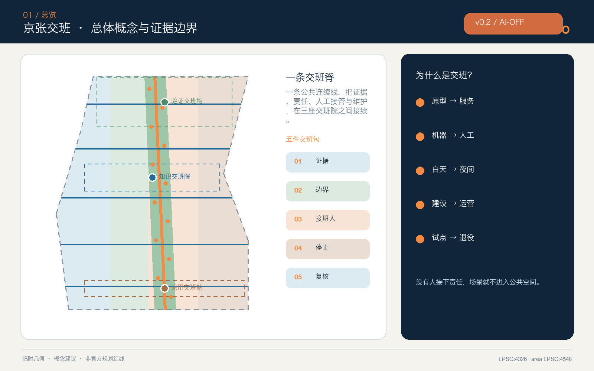
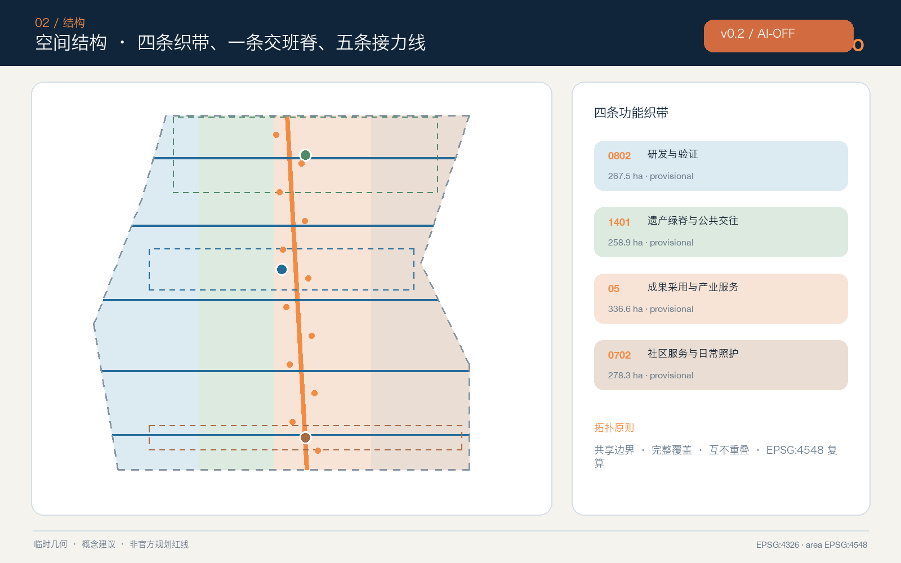
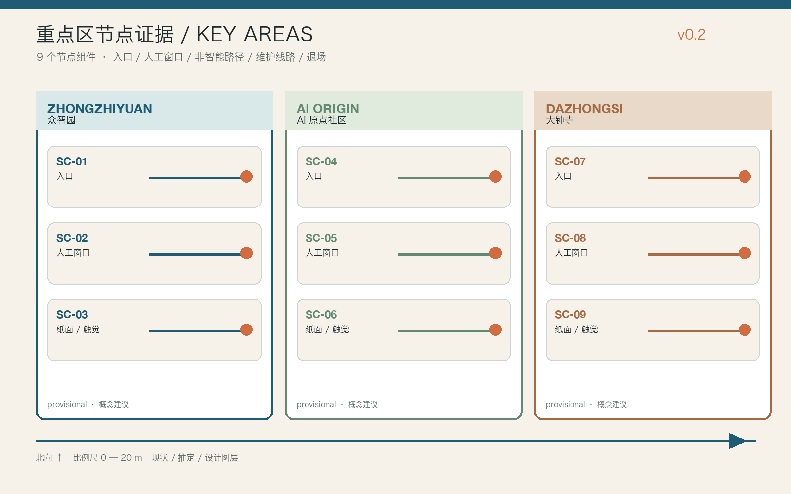
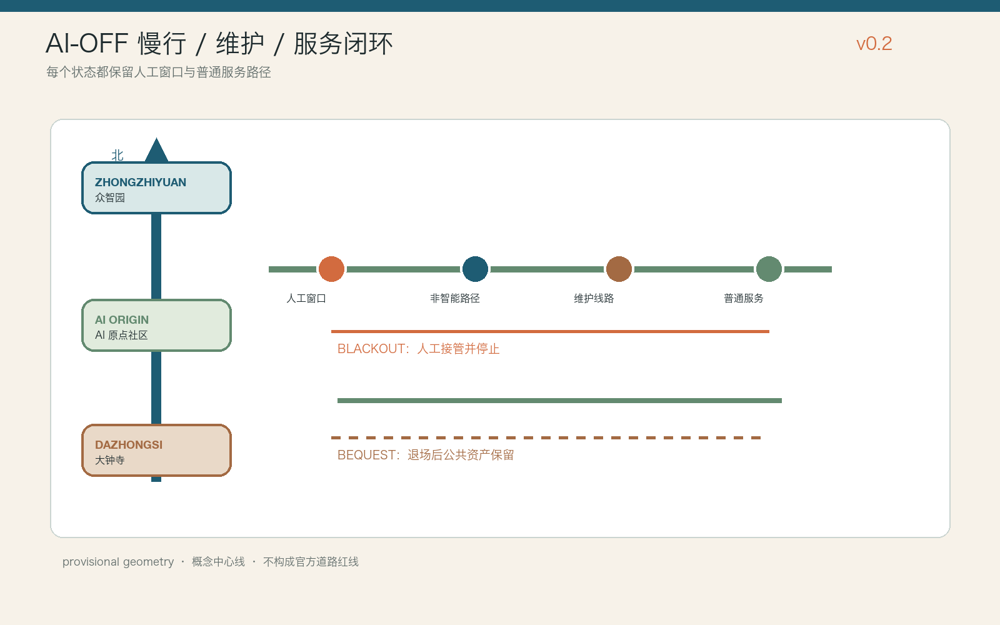
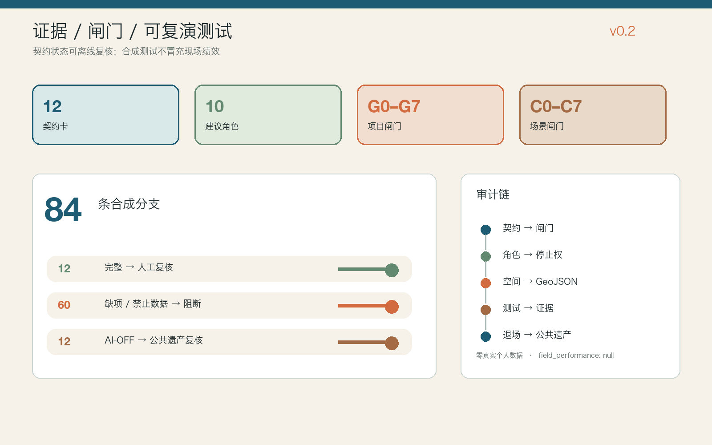

# 京张交班 / HANDOVER JING-ZHANG

> 可接续、可问责、可照护的城市 AI 接口

## 设计依据与资料清单

本方案从一个日常但常被忽略的问题出发：AI 原型由谁接成公共服务，自动建议由谁接成人工判断，活动结束后由谁接管场地，设备失效时谁继续提供服务？“京张交班”把交接责任从后台流程变成城市设计对象。每个空间动作都同时给出发起方、接班方、交付物、停止条件、人工替代和下一次复核时间；没有责任主体、人工入口或退出路径的 AI 场景，不进入公共空间试点。项目目标、三层范围和设计任务来自官方公告，六项智能体任务来自已清权任务书。[source:OFFICIAL-ANNOUNCEMENT] [source:AGENT-TASKBOOK] [standard:PROJECT-OFFICIAL-ANNOUNCEMENT]

当前仓库未提供 official 总体范围和三处重点区 polygon。提交包沿用维护者依据公告文字四至与约面积形成的 provisional boundary，只用于概念生成、图层裁切、可视化和 intake 自检，不是官方红线、地块边界、道路红线、产权边界或审批依据。Issue #846 和 #1029 已记录临时边界与公开背景位置之间的待核问题；本方案不自行修正或升级这些几何，official polygon 发布后须整包重算。[source:BOUNDARY-SOURCE] [source:KEY-AREA-SOURCE] [data:geometry/site_boundary.geojson#SITE-001]

资料权威顺序为：官方公告与专业标准确定任务和方法，来源登记表限定用途，事实包只提供阅读导航，方案几何与指标表达本次概念推导。页面、PDF 和图片均是解释层，不可反向改写 GeoJSON、指标或矩阵。[source:SOURCE-REGISTRY] [source:PROCESSED-FACT-PACK] [source:SITE-PACKAGE]

生成过程仅使用仓库公开/清权资料、七个官方或第一方全球案例页面、自绘图形和本机系统字体；未使用商业地图瓦片、新闻图片、人物肖像、企业 Logo、非公开资料或个人数据。空间面积按 EPSG:4548 复算，交换坐标为 EPSG:4326。提交范围复算约 1141.3 公顷，但该数字只描述临时几何，不能替代公告约值或正式测绘。[metric:site_area_sqm] [depth:existing_conditions_diagnosis]

## 三层范围工作框架

统筹研究范围回答“谁把创新接下去”：在约 43.6 平方公里的产业与城市关系尺度上，把高校研究、企业研发、专业服务、公共场景和社区反馈组织为“研究—验证—采用—维护—退役”的交班链。总体设计范围回答“交班在哪里发生”：以约 11.4 平方公里的临时概念范围为工作底板，形成一条南北交班脊、五条东西接力线、三座交班院和十二个交班点。重点区域回答“交什么、谁负责”：众智园负责从原型到受控验证，AI 原点社区负责从知识到开放协作，大钟寺负责从产品到城市采用与长期运营。[depth:three_level_scope_framework] [data:geometry/key_areas.geojson#PROV-KEY-001]

“一脊三院两翼十二班次”不是新红线，而是一套可迁移的空间—责任语法。一脊承载公共慢行、信息和文化连续性；三院分别是验证交班场、知识交班院、采用交班站；中关村科技服务翼接入法务、资本、人才与知识产权服务，小月河场景赋能翼把交通、照护、文化和日常服务反馈送回研发端；十二班次把场景的输入、输出、风险和接班人固定为可读卡片。十二个概念节点与五条横向联系均由设计图层表达。[metric:handover_node_count] [metric:cross_link_count] [depth:overall_spatial_structure]

用地采用四条共享边界的功能织带，保证当前提交边界完整覆盖且不重叠：研发与验证、遗产绿脊与公共交往、成果采用与商业服务、社区服务与日常照护。四类用地是功能协同建议，不是法定地类调整；三处重点区的矩形外观也只是 provisional constraint，图面用低对比虚线处理。[data:geometry/land_use.geojson#LU-001] [standard:MNR-LAND-USE-CLASSIFICATION-GUIDE]

## 统筹研究范围产业与未来城市研究

“交班能力”被定义为 AI 创新生态的公共质量基础设施。创新链不能止于发布模型或设备，而要把版本、资料许可、测试结果、适用边界、人工接管、维护预算和退役条件一起交付。建议建立五类协作接口：研究接口负责可复现实验与模型/数据说明；验证接口负责安全、无障碍和真实环境的受控测试；采用接口负责把专业结论翻译成公众可理解的服务说明；维护接口保障巡检、备件、培训和事件复盘；退出接口确保失败试点可停止、数据可处理、空间可恢复。它们分别支撑全栈自主创新、世界级创新生态、AI+ 场景、活力城市和 AI 治理话语权。[standard:PROJECT-AGENT-OPEN-CALL-TASKBOOK] [depth:risk_missing_data]

七个全球案例只提供机制参照，不提供海淀本地规模、投资或管控指标：

| 案例 | 可借鉴机制 | 京张转译 | 不移植内容 |
| --- | --- | --- | --- |
| Cambridge Kendall Square | 创新设施与混合城市生活、公共空间协同 | 把科研内部成果接到可进入的公共界面 | 面积、租赁、开发指标 [source:CASE-KENDALL] |
| Singapore one-north | work-live-play-learn 与研发、教育、生活并置 | 四类日常需求进入交班节点 | 企业名单、投资和土地制度 [source:CASE-ONE-NORTH] |
| Barcelona 22@ | 产业更新、知识与创意协作 | 既有城区采用“服务先行、空间渐进” | 产业比例与本地政策权限 [source:CASE-22BARCELONA] |
| Toronto Quayside | 公共空间、可负担生活与生态目标共同交付 | 公共价值与项目责任同步交班 | 住宅数量和开发承诺 [source:CASE-QUAYSIDE] |
| Montréal MIL | 铁路场地更新、大学研究、住房和公共空间相连 | 京张遗产与近校创新通过横向接力线缝合 | 规划指标与建设量 [source:CASE-MIL] |
| Helsinki Kalasatama | 新区作为城市试验与学习平台 | 受控试点必须记录停止和复盘 | 技术成熟度和本地部署事实 [source:CASE-KALASATAMA] |
| Hamburg HafenCity | 混合功能、高质量公共空间与分期治理 | 分期以证据闸门而非日期承诺推进 | 投资额、开发强度与防洪方案 [source:CASE-HAFENCITY] |

生态图谱以八项要素构成交班包：土地与空间说明“在哪里可试”；产业说明“解决什么问题”；资金说明“谁承担试验和维护成本”；人才说明“谁能完成专业复核”；算力与数据说明“使用范围和期限”；场景说明“真实用户与退出条件”；治理说明“投诉、纠错和事件复盘”。方案不编造企业、投资额、产值或政策承诺。七个案例和八项要素的数量在结构化指标中留痕。[metric:innovation_case_count] [depth:development_intensity_controls]

品牌采用“H/O”交班符号：两条平行轨线在节点处交换颜色，中间的斜杠既像铁路信号，也像人把接力棒递给另一个人。轨蓝代表证据连续，接力橙代表人工接管，公地绿代表公共利益，遗产铜代表时间沉积。Logo 方向、图形和版式均为本方案自绘，不使用外部商标或受限字体。

## 总体设计范围城市更新与控规深度城市设计

总体更新遵循“先盘点、再开放、后建造、持续交班”。第一步补齐 official polygon、现状建筑、权属、道路、市政、文保和公共服务底数；第二步在既有或可逆空间中测试服务台、导视、临时过街和交班卡；第三步只在结构安全、权属、控规、消防和公众意见通过后研究实体改造；第四步把运营责任、维护预算、人工岗位和退出安排写入每个项目。缺少正式控规时，本方案不判断容积率、建筑高度、建筑密度、退线或最终建设规模。[standard:MOHURD-CONTROL-DETAILED-PLANNING] [depth:land_use_layout]

四类用地概念面积由同一临时边界拓扑分割并复算：科研与验证用地约 267.5 公顷，公园绿地与开放空间约 258.9 公顷，产业与商业服务约 336.6 公顷，社区服务约 278.3 公顷。它们用于检验完整覆盖和功能关系，不构成地块用途审批。[metric:land_use_0802_area_sqm] [metric:land_use_1401_area_sqm] [metric:land_use_05_area_sqm]

社区服务概念用地为日常交班预留连续空间，其复算面积与其他三条织带共同等于提交边界。[metric:land_use_0702_area_sqm] 当前建筑层布置 18 个“交班载体”，只表达可供保留建筑适应性改造或后续增补的空间类型，不对应真实建筑。建筑基底合计为可复算的设计量，但总建筑面积、容积率、楼高和具体拆改留仍待正式调查。[data:geometry/buildings.geojson#HANDOVER-BLDG-01] [metric:building_footprint_area_sqm]

总体结构通过公共绿脊串联三院，五条横向接力线把两翼服务送入公园与重点区。道路图层只表达概念中心线：没有道路红线、断面、交通量和站点接口资料时，不宣称工程可行。建议专业深化时把每条线的连续步行、骑行、轮椅通行、阴影、座椅、夜间照明、装卸、应急和非机动车停放放在同一断面内校核。[data:geometry/roads.geojson#HANDOVER-SPINE] [metric:concept_route_length_m]

## 重点区域详细设计

三处重点区的共同构件是“交班桌”：一侧展示当前任务、输入来源和责任人，另一侧显示人工入口、停止按钮、下一班和复核日期；桌后配置不依赖手机的纸质/语音/触觉说明。构件可以进入既有首层、院落或临时展亭，但具体位置、面积和形式必须在 official polygon、现状和权属复核后确定。[depth:three_key_area_detailed_design] [metric:key_area_count]

**众智园｜验证交班场。** 形成“接件廊—隔离测试庭—多样用户走查街—人工复核屋—维修仓”五段流程。模型、机器人或端侧设备先提交用途、数据、失败模式和退出方案；隔离环境完成测试后，才进入低速、限时、有人值守的公共走查。临清河方向只提出低扰动绿色界面概念，不触碰河道蓝线、防洪或生态工程判断。首批概念项目包括模型安全交班台、具身无障碍测试街和端侧设备维修课。[data:geometry/key_areas.geojson#PROV-KEY-001]

**北京 AI 原点社区｜知识交班院。** 以近校创新为核心组织“研究摘要—开源说明—权利检查—创业转化—社区解释”的接力。空间包括第一问教室、开源维护桌、权利与数据咨询台、人才日常服务窗和夜间协作院；高校成果不因公开展示而自动获得开放许可，政策、知识产权和投资建议保留专业人工入口。慢行缝合只表达校区—园区—街区的概念关系，不预设校园权属开放。[data:geometry/key_areas.geojson#PROV-KEY-002]

**大钟寺｜采用交班站。** 围绕“产品第一次面对真实城市用户”设置公共首映厅、四象限步行走查台、夜班维护者补给点、无障碍人工服务台和国际交班客厅。智能终端、内容消费和企业服务在扩大部署前先公开说明数据、限制和投诉入口；活动结束后由运营团队完成清场、事件复盘和空间恢复。大钟寺站接驳、路口四象限和非机动车组织均为待交通专业深化的概念建议。[data:geometry/key_areas.geojson#PROV-KEY-003]

三处 AI 朝圣/荣誉节点分别是“首件信号塔”“开源交班钟”“城市接力墙”。它们不纪念单一企业或技术神话，而展示可核查的公共贡献：谁提交、谁验证、谁维护、谁纠错、谁决定退役。展示明确区分“投稿、审查、试点、采用、退役”，获得授权后才显示个人或机构名称；无授权时仅展示匿名角色和方法。

### 节点级空间证据

三处重点区各落到三个可定位的概念节点，共九个节点（`SC-01`—`SC-09`），并与 `geometry/public_space.geojson` 的 `HANDOVER-NODE-01`—`09` 一一对应。众智园的 `SC-01` 接件廊、`SC-02` 隔离测试庭、`SC-03` 维修课台，均保留人工窗口、纸面状态卡、设备维修后勤和普通步行；AI 原点社区的 `SC-04` 非账号共学桌、`SC-05` 开源维护桌、`SC-06` 知识转译窗，将许可核验与无障碍解释放在入口界面；大钟寺的 `SC-07` 人工采用服务台、`SC-08` 文化导览环、`SC-09` 夜班维护点，把申诉、事实复核、清场和夜间维护写进空间。节点属性、入口—人工窗口—非智能路径—维护线路—退场后的普通服务见 `visual/assets/spatial-components.json`；图纸统一标出北向、比例尺、现状/推定/设计图层。

## AI-OFF，城市仍可用：交班契约、闸门与首 12 周

“交班”从叙事升级为可检查的机器工件。`visual/assets/handover-contracts.json` 提供 12 张契约卡；每张卡同时写明无 AI 普通服务基线、AI 的有限作用、允许/禁止数据、空间载体、建议责任角色、人工接管、硬停止、AI-OFF 路径、数据删除、恢复证据、评估窗口与退场后保留的公共资产。`governance-raci.json` 给出 10 类建议角色和停止权；不把任何建议角色冒充为已授权政府主体。`implementation-gates.json` 把 G0—G7 项目闸门与 C0—C7 场景准入闸门挂到契约和证据上。

首 12 周按“无 AI 基线—小范围 BOOST—人工复核—BLACKOUT 演练—BEQUEST 复盘”推进：第 0 周锁定基线和删除规则，第 1—4 周完成数据、无障碍、安全和责任人核验，第 5—8 周只开放可逆、有人值守的服务，第 9—11 周演练停止与退场，第 12 周由独立复核角色决定扩大、修订或退出。九个 H01—H09 更新项目分别绑定维护动作、KPI 和退出条件；五个区域接口全部标注为待核实建议，不写成合作或资金承诺。[data:visual/assets/first-12-weeks.json] [data:visual/assets/implementation-gates.json] [data:visual/assets/renewal-projects.json]

离线 `unplugged-runner.js` 固定跑 12 场景 × 7 分支 = 84 条合成桌面推演：12 条完整契约进入授权复核，60 条缺项或违规数据分支阻断，12 条 AI-OFF 分支进入公共遗产复核。输出明确声明零真实个人数据，`field_performance: null`，不把合成测试伪装成现场绩效。评分维度与正文、图件、GeoJSON、JSON 工件的对应关系见 `review-evidence-map.json`；隐私、安全、无障碍、文保、维护、版权、公众接受度和实施风险见 `risk.json`。[data:visual/assets/unplugged-tabletop-evidence.json] [metric:evidence_branch_count] [depth:handover_contract_system]

展示媒体只承担状态叙事，不替代空间证据：`assets/media/handover-walkthrough.mp4` 为约 40 秒无声概念漫游，依次表达 BASE、BOOST、BLACKOUT、BEQUEST；封面、三处重点区体验图、VTT 字幕和双语文字稿均标注 `concept / presentation_only`，权利边界见 `report/copyright_statement.md`。

## AI 创新生态、人才画像与 AI+ 场景

六类用户画像为：研究者需要可复现实验和清晰接件标准；创业团队需要低成本验证与专业咨询；周边居民需要看懂用途、拒绝不必要采集并获得人工帮助；长者与残障使用者需要无障碍、非智能等价路径；夜班维护与服务人员需要安全到达、休息、备件和真实工位；国际访客与青年学生需要多语解释和低门槛参与。画像只描述使用需求，不建立个人档案或信用评分。[metric:persona_count] [source:ELDERLY-SMART-TECH] [standard:BARRIER-FREE-ENVIRONMENT-LAW]

无障碍法第 39 条的现场指导与人工办理要求仅用于其列举的医疗、社会保障、金融和生活缴费服务场所，本方案不把它泛化为所有公共空间的法定义务；但把“可见人工入口”作为自愿采用的通用设计准则。老年人智能技术政策仅作传统渠道与智能服务并行的背景参照，不写成 2026 年本地已落实事实。[source:BARRIER-FREE-LAW]

| # | 场景卡 | 空间与主要用户 | 交班包 | 人工/退出边界 |
| --- | --- | --- | --- | --- |
| 01★ | 模型安全交班 | 众智园；研究者、企业 | 版本、测试集范围、失败样例 | 安全负责人放行；隔离环境可停 |
| 02★ | 具身无障碍走查 | 众智园；残障参与者、机器人团队 | 路线、速度、避让与事件记录 | 现场安全员接管；不通过即退出 |
| 03★ | 端侧设备维修课 | 众智园；运维人员、开发者 | 能源、数据、备件、停机流程 | 人工巡检保留；设备可下线 |
| 04 | 第一问 AI 素养课 | 原点；儿童、家长、教师 | 来源、生成与事实区分 | 教师/家长审核；不建未成年人画像 |
| 05 | 开源成果接力桌 | 原点；高校、开发者、创业团队 | 许可、版本、贡献、撤回 | 权利人员复核；展示不等于开放许可 |
| 06 | 企业服务 Copilot | 两翼服务点；创业团队 | 公开政策日期、适用范围、咨询入口 | 不作资格或法律决定；转人工 |
| 07 | 健康服务导航 | 社区窗口；居民、访客 | 公开服务目录、更新时间 | 不诊断、不采健康数据；医疗人员复核 |
| 08 | 家庭安全慢行 | 交班脊；儿童、轮椅、长者 | 断点走查、时段、现场照片索引 | 交通与无障碍专业复核 |
| 09 | 低速配送接班 | 限定路线；商户、居民、维护者 | 速度、时段、责任、投诉 | 有人值守；冲突即暂停 |
| 10 | 京张文化导览 | 遗产绿脊；游客、学生 | 史实、策展、授权、修订日期 | 人工史实复核；合成内容明示 |
| 11 | 夜间活动交班 | 大钟寺；夜班人员、公众 | 容量、噪声、清场、次日恢复 | 运营负责人签收；超限终止 |
| 12 | 城市采用会 | 大钟寺；企业、居民、专业团队 | 试点证据、异议、扩大/退出建议 | 公开议程；人类作最终决定 |

十二张场景卡中前三项是产业测试验证场景；它们只使用公开、合成或明确授权数据，且必须通过风险、无障碍、运营和人工接管检查才可开始。数量与图层节点一致。[metric:scenario_card_count] [metric:industry_validation_scenario_count] [data:geometry/public_space.geojson#HANDOVER-NODE-01]

面向公众提供生成文本、图像、音频或视频的场景，按《生成式人工智能服务管理暂行办法》的适用范围记录投诉举报入口和内容处置责任；本方案不从第 14 条推导一般用户退出权，不编造第 15 条数字时限，也不推定某服务已完成备案或安全评估。[source:GEN-AI-MEASURES] [standard:GENERATIVE-AI-INTERIM-MEASURES]

## 用地、建筑规模与拆改留方案

四条用地织带使用正式分类子集编码，但名称表达概念功能而非已批用途。研发验证带容纳测试与专业服务，遗产绿脊优先连续公共空间，成果采用带承接展示、商务与生活服务，社区服务带承接照护、学习和人工窗口。相邻关系的核心要求不是“功能越多越好”，而是每个高强度创新空间都能步行到达公共空间、人工服务和维护后勤。[standard:MOHURD-URBAN-DESIGN-MEASURES] [depth:height_massing_character]

建筑采用 R-A-I-G 四步：Record 先记录结构、用途、权属、历史、能耗和使用者；Adapt 优先通过无障碍、节能、首层开放和机电更新延续使用；Infill 仅在正式条件允许时研究补建；Go/No-Go 由规划、建筑、结构、消防、文保、产权和公众意见共同决定。18 个建筑基底是“载体原型”，不对应真实房屋，也不形成具体拆除或新建结论。[depth:retain_renovate_demolish]

拆改留门槛强调交接成本：正在服务社区、含有历史信息、结构可修复或维护网络成熟的建筑优先保留；可以低扰动提升的优先改造；只有安全无法达标、公共连通无法解决且替代方案完成全生命周期比较时，才进入拆除候选。official 建筑底数到位前，图纸只表达空间类型与流程，不表达层数、楼高、立面定稿或投资估算。

## 交通、轨道、市政与公共服务设施

交通系统由南北交班脊、五条东西接力线和三座重点区接驳环构成。交班脊是步行、骑行、无障碍和文化导览的连续概念线；横向接力线把高校、企业、社区与两翼服务接入遗址公园；接驳环把重点区内部的测试、人工服务、后勤和公共交通联系起来。所有线位仅供专业团队深化，须在道路红线、轨道接口、流量、坡度、消防和市政资料到位后重新设计。[depth:traffic_rail_slow_parking]

每个交班点设置“数字界面＋人工窗口＋非智能路径”三联设施：数字界面显示任务和状态，人工窗口处理解释、纠错和例外，非智能路径以纸质目录、触觉标识、清晰导视和现场人员保证基本服务。三联设施优先放在站口、重点区门厅、公园入口和社区服务界面，不侵占无障碍净宽，也不以二维码作为唯一入口。[data:geometry/public_space.geojson#HANDOVER-NODE-12]

市政和新型基础设施遵循“最小感知、边缘处理、分级授权、人工巡检、可关闭、可维修”。传感器与端侧设备记录能源、数据范围、保存期限、维护责任、备件和停运方式；预测性维护只辅助排程，不替代定期人工巡检。管线、容量、消防、防洪和能源底数缺失时，只形成接口清单，不形成工程结论。[data:geometry/constraints.geojson#CONSTRAINT-PROVISIONAL-SITE] [depth:municipal_new_infrastructure]

## 蓝绿空间、公共空间与城市风貌

蓝绿系统是交班链的公共底盘。设计绿地由一条南北遗产绿脊、三处交班院绿庭和五条横向雨水/遮阴联系构成，当前复算比例约为 14.4%；公共空间由十二个交班点和三处院落组成，复算比例约为 4.7%。这些是临时边界内的概念图层比例，不是法定绿地率或已建成面积。[data:geometry/green_space.geojson#HANDOVER-GREEN-SPINE] [metric:green_ratio] [metric:public_space_ratio]

公共空间遵循“先通行与日常，后测试与活动”。通勤、休息、儿童游戏、长者停留、无障碍通行和维护作业获得底线容量；展示、测试、路演和商业活动只能预约剩余容量，并标明主办、时段、噪声、数据、清场和投诉责任。遇到拥挤、安全事件、生态影响或无障碍冲突，活动暂停并恢复日常用途。[depth:blue_green_public_space]

城市风貌从“交班动作”而非科技装饰中获得识别：轨蓝连续线表示可追溯的任务链，接力橙短划表示人工接管点，公地绿块表示免费停留与生态底线，遗产铜编号表示时间和来源。夜景只强调行走面、人工服务入口与状态信号，限制大屏、蓝光和持续动画；铁路历史、中关村创新与 AI 新文化通过“运输—计算—交接”的叙事相连，但不伪造历史事件或复制企业视觉。

三个地标与十二个交班点构成荣誉展示系统。贡献按“提出—验证—维护—纠错—退役”五类记录，避免只奖励首发者；每条记录含事实状态、来源、许可、有效期和申诉入口。文化导览必须由人工策展和事实复核，生成内容与档案事实明确区分。

## 更新项目清单、实施政策与分期计划

| 项目 | 类型 | 可逆先行方式 | 进入下一阶段的闸门 |
| --- | --- | --- | --- |
| H01 交班识别与状态系统 | 品牌/导视 | 可移动标识、纸质卡和离线页面 | 文保、版权、无障碍与公众测试 |
| H02 众智园验证交班场 | 产业验证 | 隔离测试与预约走查 | official 范围、安全、运营责任 |
| H03 原点知识交班院 | 创新服务 | 既有空间中的开源维护与咨询桌 | 权属、消防、数据与许可 |
| H04 大钟寺采用交班站 | 城市采用 | 公开演示、人工服务与交班会 | 站点、道路、商业运营复核 |
| H05 五条横向接力线 | 慢行/公共空间 | 走查、临时标识和战术性试点 | 道路红线、流量、无障碍、消防 |
| H06 十二交班点 | 公共服务 | 模块化桌、座椅、遮阴和人工值班 | 场地许可、维护预算、服务主体 |
| H07 三座公共荣誉节点 | 文化/地标 | 数字原型和授权流程 | 史实、署名、文保、长期维护 |
| H08 交班账本与事件复盘 | 治理/运营 | 最小字段、离线副本和季度复盘 | 隐私、档案、投诉与删除规则 |
| H09 夜班维护者支持网 | 公共利益 | 补给、休息、备件与安全到达 | 用工、运营、消防和场地复核 |

九个更新项目按三期推进。[metric:renewal_project_count] 近期“先把责任说清”建设可移动交班桌、开放日和走查；中期“再把空间接上”实施通过专业复核的慢行、首层和蓝绿更新；长期“由公共价值决定去留”根据年度证据扩大、调整或退役。三期几何只是概念范围，不是政府时序或资金承诺。[data:geometry/phasing.geojson#PHASE-01] [metric:phase_count] [depth:phasing_implementation]

建议设立“交班公约”：每个试点必须有接班人、人工入口、停止条件、维护预算、事件记录和退出后的空间恢复。年度运营采用四季循环——春季公开问题与招募，夏季受控测试，秋季城市采用会，冬季公共复盘；“全球城市 AI 交班周”为待审批的活动品牌，邀请开发者、专业人员、居民和维护者围绕失败案例与可移交方法协作。活动成果通过开源模板、培训和后续咨询转化，不把招商、资金或政府支持写成确定承诺。[depth:renewal_project_list]

## 指标体系、面积复算与合规矩阵

结构化指标分三类。第一类可由本次 GeoJSON 复算：临时场地面积、四类用地、概念建筑基底、绿地、公共空间、路线长度、节点和分期。第二类必须等待官方控规与现状资料：总建筑面积、容积率、建筑高度、建筑密度、退线、道路红线和设施容量，均保持 unknown。第三类是运营绩效建议：交班完整率、人工接管可用率、纠错闭环率、维护按期率、无障碍完成率和退出后恢复率，需在真实试点经授权采集后才可形成数值。[depth:metrics_recalculation]

`compliance_matrix.json` 覆盖公告 1.3、1.4、1.5 与 agent.1–agent.6；`standard_matrix.json` 区分强制专业依据、可用法律/政策参照和资料缺口；`design_depth_matrix.json` 将现状、用地、建筑、交通、市政、蓝绿、重点区、项目、分期和风险挂接到几何、指标、图纸和自检。所有 known 指标均在正文靠近相关判断处出现，展示页的 `data-metric` 与 `metrics.json` 一致。[standard:MOHURD-ARCH-DESIGN-DEPTH-2016]

本方案的指标不是“越大越好”。绿地和公共空间比例检验日常公共底盘，建筑基底检验载体规模是否仍保持概念边界，路线与节点数量检验交班网络是否落到空间，场景/画像/案例数量检验任务书完整性；任何指标都不能替代现场质量、专业判断或公众意见。

## 风险、版权与合规说明

第一类风险是几何误读：provisional boundary 与重点区只用于 intake，official polygon 到位后必须重算全部图层、面积、图件、PDF 和 HTML。第二类是规划越权：控规、权属、建筑、道路、文保、市政和公共设施底数缺失，因此所有空间落地均为“概念建议”“参考方案”或“可供专业团队深化研究”。第三类是技术越界：自动输出不得代替医疗诊断、行政许可、安全判断、法律意见或公共决定。[data:geometry/key_areas.geojson#PROV-KEY-003] [depth:risk_missing_data]

第四类风险是责任空档：试点结束、供应商变化或设备失效可能无人接管；通过接班人、维护预算、人工替代、停止条件和空间恢复降低风险。第五类是隐私与不平等：不建立跨场景个人画像，不以持续识别作为公共空间入口，不把智能手机作为唯一服务渠道。第六类是文化与版权：历史、姓名、商标、字体、图片和生成内容逐项登记许可，未授权内容不进入展陈。

主报告、双语译稿、GeoJSON、PNG 图解、离线 HTML 与 PDF 由 Codex（OpenAI）在用户授权的 GitHub 账号工作区内生成；使用 Pillow、Shapely、PyProj 和仓库校验脚本，自绘图形不包含外部地图底图。系统字体只在本地渲染为像素，不随包分发；完整生成与许可说明见 `report/copyright_statement.md`。本方案不声称政府批准、法定规划效力、资金承诺、工程可行性或保证实施。

## 参考资料

- 北京市规划和自然资源委员会海淀分局，《百年京张 AI 创新带城市设计国际方案征集资格预审公告》，2026-05-09。[source:OFFICIAL-ANNOUNCEMENT]
- 面向智能体开源征集任务书结构化摘录及十条共创原则。[source:AGENT-TASKBOOK]
- 住房和城乡建设部《城市设计管理办法》与《城市、镇控制性详细规划编制审批办法》。[standard:MOHURD-URBAN-DESIGN-MEASURES] [standard:MOHURD-CONTROL-DETAILED-PLANNING]
- 自然资源部《国土空间调查、规划、用途管制用地用海分类指南》。[standard:MNR-LAND-USE-CLASSIFICATION-GUIDE]
- 《生成式人工智能服务管理暂行办法》、无障碍环境建设法及老年人智能技术政策，均按来源登记中的适用边界使用。[source:GEN-AI-MEASURES] [source:BARRIER-FREE-LAW] [source:ELDERLY-SMART-TECH]
- 七个国际案例只用于机制对照；URL、访问日期、发布主体、许可限制与禁止用途详见 `sources.json`。

最终权威关系为：任务与标准约束设计，临时几何承载本次可复算表达，指标和矩阵支持审查，图片与页面帮助阅读，人类与专业团队作最终判断。提交包不把任何解释层材料升级为法定或官方事实。
