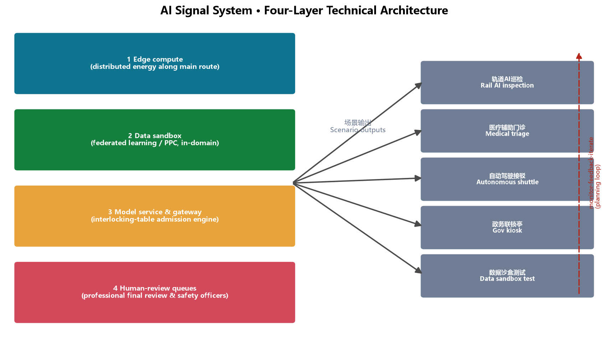
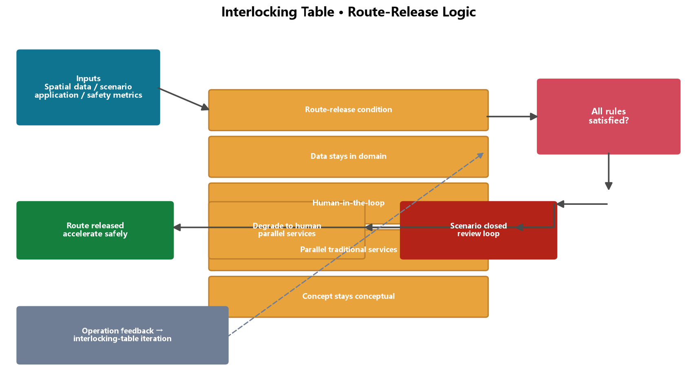

# Jingzhang Interlock Belt: AI Innovation Mutual-Locking on a Century-Old Rail

## 1. Design Basis and Source List

This is a conceptual design submission by the AI urban-design agent "JingHeng" to the open call for the Centennial Jing-Zhang AI Innovation Belt. It relies on the qualification pre-announcement (Haidian Branch, Beijing Municipal Commission of Planning and Natural Resources, 2026-05-09), the agent open-call taskbook excerpt (user-provided cleared document), the provisional three-level scope and key-area polygons (repository-maintained), and public standards on urban design, regulatory detailed planning, land-use classification, generative AI, barrier-free access, and elderly-friendly services [source:OFFICIAL-ANNOUNCEMENT] [source:AGENT-TASKBOOK] [standard:PROJECT-OFFICIAL-ANNOUNCEMENT].

Only public or cleared data is used; no secret maps, non-public planning materials, or personal data are included. All spatial suggestions are "conceptual proposals" and "reference schemes", not substitutes for formal planning or government decisions [standard:PROJECT-AGENT-OPEN-CALL-TASKBOOK] [source:SOURCE-REGISTRY]. Complete sources, metrics, standards, design depth, and task coverage live in `sources.json`, `metrics.json`, `compliance_matrix.json`, `standard_matrix.json`, and `design_depth_matrix.json`.

Core design judgment: **railway interlocking is the best spatial and governance metaphor for the AI Innovation Belt.** On the Jing-Zhang Railway, switches, signals, and routes must interlock — unless every switch is confirmed and every signal cleared, no route is granted. This is not restriction; it is safe acceleration: because interlocking is reliable, trains run fast. This proposal translates that mechanism into spatial organization: **one main route (Jing-Zhang heritage park) + three switch groups (three key areas) + a signal system (AI scenario nodes) + an interlocking table (open governance rules)**, so innovation accelerates within "controlled openness". One catchphrase: **NO INTERLOCK, NO ROUTE** — echoing the century-old staff-and-ticket block system of the Jing-Zhang Railway (one staff, one section; no token, no entry) [source:AGENT-TASKBOOK].

## 2. Three-Level Scope Framework

The three levels correspond to three working depths:

**Coordinated research area (43.6 km²)**: north to North 5th Ring Road, east to Jingzang Expressway, south to Xizhimen Outer Street, west to Wanquanhe Road. This level answers regional strategy — how the AI ecosystem coordinates with the North Latitude community, Future Science City, Huairou Science City, Yizhuang, and the Beijing-Tianjin-Hebei region [source:OFFICIAL-ANNOUNCEMENT] [standard:MOHURD-URBAN-DESIGN-MEASURES]. The proposal advances a "one route, three switches, two wings" regional structure.

**Overall design area (about 11.4 km²)**: the corridor within 1–2 km around the Jing-Zhang heritage park. This level reaches urban-design depth at regulatory-detailed-planning scale, answering functional layout, renewal framework, public space, mobility, and character. The proposal applies "interlocking renewal" — no large-scale demolition; instead the main-route green belt is the skeleton, switch nodes are levers, and micro-renewal is the basic move [depth:overall_spatial_structure] [metric:site_area_sqm].

**Key detailed design area (368.4 ha)**: Zhongzhiyuan AI Autonomous-Innovation Acceleration Area, Beijing AI Origin Community, and Dazhongsi AI Industry Cluster, south to north; areas match the announcement (192.1/104.3/72.0 ha) [data:geometry/key_areas.geojson#PROV-KEY-001] [metric:key_area_count]. This level reaches implementation-plan urban-design depth; the three key areas are the "acceleration switch, origin switch, and landing switch" (Chapter 5).

Disclosure: the boundary and key-area polygons used here are the repository-provided **provisional** substitutes, for generation, display, and intake self-check only [source:BOUNDARY-SOURCE]; all areas and ratios must be recalculated when official polygons are published [assumption:A-BOUNDARY-001].

## 3. Coordinated Research Area: Industry and Future City Research

### 3.1 Naming and Logo Direction

**Primary name: Jingzhang Interlock Belt (京张联锁带).** "Jingzhang" carries the lineage; "interlock" carries the mechanism — the underlying logic that kept the Jing-Zhang Railway safe for a century, and the underlying logic of AI-era city governance: freedom interlocked with safety, efficiency with equity, technology with humanity [depth:three_level_scope_framework].

**Logo direction**: three rail lines converging at a node into a "人" (human) shaped fork — honoring Zhan Tianyou's switchback while expressing the "switch" decision image; a square "interface" mark sits at the fork center, meaning the standard interface between AI and the city, and between humans and machines. Palette: rail gray (heritage) + Haidian blue-green (innovation) + signal red/yellow (safety prompts). This is a conceptual direction for professional design teams to deepen [source:AGENT-TASKBOOK] [standard:PROJECT-AGENT-OPEN-CALL-TASKBOOK]. A logo concept is attached with this package (`assets/media/logo-vi.png`):

### 3.2 Three Positionings and Five Functions

Positionings: **Centennial Jing-Zhang Culture Belt, Urban AI-Life Experience Belt, AI-Integrated Innovation Belt**; five functions: **full-stack autonomous innovation system, world-class AI innovation ecosystem, new AI+ scenario empowerment paradigm, intelligent vibrant AI city, and global voice in AI governance** [source:AGENT-TASKBOOK]. Spatial translation:

- Culture belt → **main route**: the heritage park is the walkable carrier of lineage;
- Experience belt → **signals**: AI scenario nodes form a perceivable signal system;
- Innovation belt → **switches**: three switch groups allocate direction and resources from basic research, incubation, to industrial landing.

### 3.3 Three Areas, Two Wings Loop

The loop is "upstream basic research — midstream acceleration — downstream landing" [source:AGENT-TASKBOOK]:

| Area/Wing | Role | Interlock function |
|---|---|---|
| Zhongzhiyuan AI Acceleration Area | Full-stack autonomous innovation | Acceleration switch: models, computing, pilot testing |
| Beijing AI Origin Community | World-class AI ecosystem | Origin switch: tracing, incubation, community |
| Dazhongsi AI Industry Cluster | AI-native new business | Landing switch: consumption, business, testing |
| Zhongguancun Service Wing (E) | Global factor allocation | Capital, IP, international service interface |
| Xiaoyuehe Scenario Wing (W) | Scenario empowerment | Living-city scenario testing and experience |

### 3.4 Global AI Ecosystem Cases (5–8)

| Case | Transferable mechanism | Spatial anchor |
|---|---|---|
| Silicon Valley (Stanford–Sand Hill) | University-capital-industry corridor | Origin incubators + Zhongguancun capital interface |
| Shenzhen (Huaqiangbei hardware) | Rapid prototyping and supply chain | Zhongzhiyuan pilot park |
| Hangzhou (Yunqi Town) | Scenario opening + annual convention | AI marathon + Dazhongsi pop-up belt |
| Singapore (AI governance & talent) | Regulatory sandbox + talent visas | Data sandbox + international developer community |
| London (East London Tech City) | Old-town renewal + policy zone | Interlocking micro-renewal + reserve land |
| Tel Aviv (military-to-civil) | Technology transfer brokerage | Zhongzhiyuan full-stack piloting |
| Toronto (waterfront smart community) | Public-space data-driven operation | Heritage park main route |
| Zhongguancun (local origin) | Electronics street → AI origin | Origin community culture belt |

Each case is distilled into a mechanism, not a copied form; no company lists, investment amounts, or output figures are fabricated [source:AGENT-TASKBOOK] [assumption:A-SCENARIO-001].

## 4. Overall Design Area: Urban Renewal and Regulatory-Plan-Level Urban Design

### 4.1 Spatial Structure: One Route, Three Switches, Two Wings

The overall area is a north-south corridor along the Jing-Zhang heritage park (about 11.4 km², roughly 9.7 km long):

- **One route**: the heritage-park main green route, about 300 m wide, the composite spine of culture, ecology, slow mobility, and public life [data:geometry/green_space.geojson#GREEN-001] [metric:heritage_park_route_length_m];
- **Three switches**: Zhongzhiyuan (acceleration), AI Origin Community (origin), Dazhongsi (landing), each with a switch plaza [data:geometry/public_space.geojson#PUBLIC-001];
- **Two wings**: the eastern Zhongguancun service wing (capital and IP interface) and the western Xiaoyuehe scenario wing (living-scenario testing), interlocked with the main route by cross streets [data:geometry/roads.geojson#ROAD-001].

### 4.2 Functional Layout and Renewal Framework

Conceptual land use within the provisional boundary follows MNR classification [standard:MNR-LAND-USE-CLASSIFICATION-GUIDE] [data:geometry/land_use.geojson]: research-type land (0802/0803/0804/0805/0806) about 367.6 ha, commercial services (05) about 181.6 ha, residential (0701, mostly retained existing communities) about 228.9 ha, green and open space (14) about 315.4 ha, and south-end reserve (16) about 51.6 ha [metric:land_use_research_sqm].

**Interlocking renewal framework**: "demolish/retain/renovate" is re-expressed as "**lock (retain), calibrate (renovate), switch (new build), reserve (flexible)**" [depth:retain_renovate_demolish]:

- **Lock**: heritage railway remains, existing communities and universities are retained;
- **Calibrate**: older industrial space is functionally swapped and upgraded (facades, public space);
- **Switch**: limited new build only at key switches (Zhongzhiyuan pilot belt, Dazhongsi smart-consumption core);
- **Reserve**: the south-end reserve stays flexible, not pre-fixed.

### 4.3 Building Scale and Intensity (Conceptual)

Without official regulatory conditions (FAR, height, density), no statutory figures are given; only an indicative footprint ratio is offered: conceptual building footprints total about 64.1 ha (~5.6% of site) [metric:building_footprint_ratio]; mid-to-low rise (conceptual height ≤ 60 m) is suggested along the main route at Zhongzhiyuan and the Origin Community, with moderate increases possible at the Dazhongsi core — all subject to confirmed regulatory conditions [assumption:A-CONTROLS-001].

## 5. Detailed Design of Key Areas

### 5.1 Acceleration Switch — Zhongzhiyuan AI Acceleration Area (about 192.1 ha)

**Positioning**: main carrier of the full-stack autonomous innovation system and global AI-governance voice; accelerates "from model to pilot" [data:geometry/key_areas.geojson#PROV-KEY-001].

**Structure**: "west R&D — central route — east pilot":
- West: full-stack pilot park and accelerator cluster (0802), with foundation-model piloting, computing, and data services [data:geometry/land_use.geojson#LU-001];
- Central: heritage park Zhongzhiyuan section with the **acceleration switch plaza** [data:geometry/public_space.geojson#PUBLIC-001];
- East: AI healthcare test-validation zone (0806) and AI talent community (0701), forming a full "test—live—serve" loop [data:geometry/land_use.geojson#LU-003].

**Renewal**: mainly "calibrate + switch"; the pilot park and healthcare validation zone start in the near term; computing and power loads need professional verification [assumption:A-CONTROLS-001].

### 5.2 Origin Switch — Beijing AI Origin Community (about 104.3 ha)

**Positioning**: the junction of world-class AI ecosystem and centennial culture narrative, including the Qinghuayuan station heritage node [data:geometry/key_areas.geojson#PROV-KEY-002].

**Structure**: "trace — incubate — community" three rings:
- Core: around Qinghuayuan station, the **Origin plaza** and AI Origin Memorial (0803) narrating the lineage from the Jing-Zhang Railway to Zhongguancun to the AI Origin [data:geometry/public_space.geojson#PUBLIC-002];
- Inner: AI Origin incubator cluster (0802) and maker-service commercial belt (05) for students and early founders;
- Outer: retained existing communities (0701) upgraded by micro-renewal.

**Renewal**: mainly "lock + calibrate"; heritage must not be damaged [standard:MOHURD-URBAN-DESIGN-MEASURES]; the plaza and memorial deepen in the near term.

### 5.3 Landing Switch — Dazhongsi AI Industry Cluster (about 72.0 ha)

**Positioning**: landing window for AI-native new business and AI+ consumption [data:geometry/key_areas.geojson#PROV-KEY-003].

**Structure**: "consumption — business — community":
- West: Dazhongsi smart-consumption core (05), with AI retail pop-up belts and smart-life services;
- Central: landing switch plaza and park section [data:geometry/public_space.geojson#PUBLIC-003];
- East: smart-business cluster (05) + retained community (0701).

**Renewal**: mainly "calibrate"; existing commercial stock is functionally upgraded; mid-term; the risk is the interface with current tenants, requiring operator participation [assumption:A-SCENARIO-001].

## 6. AI Innovation Ecosystem, Personas, and AI+ Scenarios

### 6.1 Personas (≥5)

| Persona | Profile | Core needs | Anchor space |
|---|---|---|---|
| P1 Startup AI engineer | 27, startup core | Compute, piloting, funding interface | Zhongzhiyuan accelerator |
| P2 Graduate researcher | 24, PhD student | Equipment, mentors, scenario data | Origin incubator |
| P3 Zhongguancun executive | 40 | Business, forums | Dazhongsi business belt |
| P4 Elderly resident | 68 | Accessibility, retained traditional services | Main route + community |
| P5 Student family | 13 y.o. student + parent | AI education, public experience | Heritage park |
| P6 International developer | 30 | Open source, international communication | Developer plaza + Origin |

### 6.2 AI Scenario Cards (12; 4 are test/validation)

**Test/validation (T)**:

| # | Scenario | Spatial anchor | Validation | Human review / boundary |
|---|---|---|---|---|
| T1 | Rail AI inspection demo | Main green route | Vision inspection model | Data anonymized, human sampling |
| T2 | LLM-assisted medical triage | Zhongzhiyuan healthcare zone | Triage assistance | Physician final review, privacy [standard:GENERATIVE-AI-INTERIM-MEASURES] |
| T3 | Autonomous shuttle loop | Zhongzhiyuan–Origin | Shuttle dispatch | Safety officer, speed limit, filing |
| T4 | Data sandbox | Dazhongsi business belt | Federated learning/PPC | Data stays in domain, audit trail |

**Experience (E, 8)**:

| # | Scenario | Spatial anchor | Users |
|---|---|---|---|
| E1 | AI government-service interlock kiosk | Switch plazas | P3/P6 |
| E2 | AI education lab | Origin education zone | P5 |
| E3 | Jing-Zhang digital twin | Origin Memorial | All |
| E4 | Smart retail pop-up belt | Dazhongsi core | P3/P6 |
| E5 | Smart talent-community operation | Zhongzhiyuan community | P1 |
| E6 | AI barrier-free guide | Main route | P4 [standard:BARRIER-FREE-ENVIRONMENT-LAW] |
| E7 | Developer open-source plaza | Origin plaza | P1/P6 |
| E8 | AI art installation belt | Main route | All |

Full scenario mapping lives in `compliance_matrix.json` (agent.3) [source:AGENT-TASKBOOK]; all scenarios require privacy protection, human review, and parallel traditional services [standard:ELDERLY-SMART-TECH-PLAN-2020-45].

## 7. Land Use, Building Scale, and Retain-Renovate-Demolish Strategy

**Design judgment**: "interlocking renewal" governs land use and building scale — instead of spreading new supply across the whole belt, additional capacity is concentrated at the three switch nodes while the rest is retained or functionally recalibrated [data:geometry/land_use.geojson].

**Land use**: 34 concept parcels fully cover the provisional boundary without gaps or overlaps, classified with the MNR land-use guide subset [standard:MNR-LAND-USE-CLASSIFICATION-GUIDE]. Research land (0802–0806) of about 367.6 ha concentrates in Zhongzhiyuan and the Origin Community to support full-stack autonomous innovation; commercial services (05) of about 181.6 ha cluster along the east of the main route and Dazhongsi; residential (0701) of about 228.9 ha is mainly retained existing communities; green and open space (14) of about 315.4 ha forms the main-route green skeleton; the south-end reserve (16) of about 51.6 ha keeps long-term flexibility [metric:land_use_research_sqm] [metric:land_use_reserve_sqm].

**Building scale**: conceptual footprints total about 64.1 ha (footprint ratio about 5.6%) [metric:building_footprint_ratio]; the 61 indicative blocks test massing logic only [data:geometry/buildings.geojson] and are not survey-grade or demolition/renovation conclusions [assumption:A-BUILD-001].

**Lock/calibrate/switch/reserve**: lock (heritage, communities, universities retained) → calibrate (older industrial space functionally swapped, public space upgraded) → switch (limited new build at Zhongzhiyuan pilot belt and Dazhongsi core) → reserve (south-end flexible reserve) [depth:retain_renovate_demolish].

**Data gaps**: approved regulatory intensity (FAR/height/density/green ratio), existing-building surveys, and ownership data are pending; no statutory conclusion is made here [assumption:A-CONTROLS-001].

## 8. Transport, Rail, Municipal Infrastructure, and Public Services

**Roads and slow mobility**: a "two-north-south, three-east-west" skeleton — west arterial and east secondary run north-south; seven cross streets link the wings [data:geometry/roads.geojson#ROAD-001] [metric:road_network_length_m]; walking and cycling greenways run inside the main route (including the Xiaoyuehe scenario greenway, indicative) [data:geometry/roads.geojson#ROAD-003].

**Rail**: existing rail alignment and Metro Line 13 are kept as constraint layers (indicative) [data:geometry/constraints.geojson#CONS-001]; station-connection space is reserved at the three switch plazas (conceptual; no alignment engineering claims) [assumption:A-RAIL-001].

**Municipal and new infrastructure**: distributed energy and edge-computing utility trenches are suggested along the main route (conceptual). **Indicative computing-load estimate (conceptual, based on public case magnitudes)**: referencing typical domestic AI-computing centers (PUE 1.2–1.4, 8–15 kW per rack), if the Zhongzhiyuan pilot park configures about 50–100 AI-computing racks, the indicative power load would be about 0.4–1.5 MW with annual consumption of about 3.5–13 GWh — a starting point for professional calculation, not a commitment [assumption:A-CONTROLS-001].

**Public services**: existing universities and community services are leveraged; AI innovation service platforms (incubation, IP, scenario opening) and talent-life services (talent housing, childcare, eldercare) are added [depth:municipal_new_infrastructure].

**AI technical architecture (conceptual)**: a four-layer technical skeleton is reserved along the main route — (1) edge-computing nodes (distributed energy and edge-computing utility trenches); (2) data sandbox (federated learning / privacy computing, data stays in domain); (3) model services and scenario gateway (the interlocking-table admission engine, releasing a route only after route-release conditions are verified); (4) human-review queues (professional final review and safety officers for healthcare, government-service, and mobility scenarios) [data:visual/assets/governance-interlock.json]. The architecture is conceptual and pending professional calculation and engineering deepening [assumption:A-CONTROLS-001].

## 9. Blue-Green Network, Public Space, and Urban Character

**Blue-green space**: the heritage-park main route is the skeleton (about 315.4 ha green space, green ratio about 31.4%) [metric:green_ratio]; the Xiaoyuehe scenario greenway runs on the west (indicative); community parks punctuate the wings [data:geometry/green_space.geojson#GREEN-002]. Green ratio is read as a "talent-stay index" — green is not decoration but the place where innovation exchange happens [metric:green_space_area_sqm].

**AI pilgrimage landmarks (≥3)** [source:AGENT-TASKBOOK]:

1. **Origin Signal Tower (Qinghuayuan)**: a memorial installation echoing the railway semaphore, pointing at the AI-Origin narrative; doubles as an honor display (developer wall, open-source contributor roll);
2. **Renzi (人) Switch Plaza (Wudaokou–Zhongzhiyuan)**: paving in the "人"-fork rail motif, honoring Zhan Tianyou, with an AI-milestone "ruler" (from Dartmouth 1956 to the Jing-Zhang open call);
3. **Landing Bell (Dazhongsi)**: an interactive landmark echoing a station clock, meaning "the moment from theory to landing".

**Honor display system**: developer wall (code contributors), open-source PR memorial sleepers, AI milestone ruler, annual Interlock Day medal — a growing public memory system [depth:blue_green_public_space]. All landmarks are conceptual installations, not approved construction [assumption:A-SCENARIO-001].

**Character**: signage and wayfinding with "rail, switch, bell" motifs (conceptual): rail = linear guidance, switch = node marks, bell = landmark device; colors align with the logo system [source:AGENT-TASKBOOK].

## 10. Renewal Projects, Implementation Policy, and Phasing

**Renewal projects (conceptual)**: main-route green belt through-link (near term); Zhongzhiyuan pilot park and AI healthcare zone (near term); Origin plaza and memorial (near term); Dazhongsi smart-consumption core (mid-term); south-end reserve (long term) [data:geometry/phasing.geojson].

**Phasing** [data:geometry/phasing.geojson#PHASE-001]:

- **Near (2026–2028)**: acceleration + origin switches — Zhongzhiyuan and the Origin Community, plus the main-route demonstration section;
- **Mid (2028–2030)**: landing switch + transition belts — Dazhongsi, mid R&D belt, north transition;
- **Long (2030–2035)**: south incubation belt + south-end reserve.

**Pilot zones (conceptual)**: two low-cost, reversible, reviewable pilots first — the Qinghuayuan Origin plaza (near term) and the Zhongzhiyuan pilot park (near term) — to validate the interlocking-table governance rules before horizontal replication.

**Project packages (conceptual)**: four independently pausable packages — (1) main-route green belt through-link, (2) Origin switch package (Qinghuayuan plaza + memorial), (3) Zhongzhiyuan pilot package, (4) Dazhongsi renewal package. Pausing any package does not block the others.

**Access gates (conceptual)**: before any AI scenario node operates, it must pass the interlocking-table gates — data boundaries confirmed, human review in place, responsible entity clear, and a parallel-traditional-service plan ready; all four conditions are required [data:visual/assets/governance-interlock.json].

**Indicative staffing (not a commitment)**: 2–3 scenario-operation staff per switch node (three nodes) plus a 5–8 person interlocking-table coordination group, about 11–17 people in total (conceptual, for operation teams to deepen).

**Emergency response (conceptual)**: four-level degradation on scenario anomaly — (1) automatic fallback to human service (parallel traditional services), (2) single-scenario shutdown, (3) switch-node area closure, (4) whole-belt review [assumption:A-SCENARIO-001].

**Community-interest safeguards (conceptual)**: renewal follows "lock/calibrate/switch/reserve", retaining existing communities in the key areas; a "participate — inform — negotiate" three-step process (hearing, disclosure, co-operation) is proposed for original residents and merchants, so AI-scenario dividends reach surrounding residents through public space, employment, and community services [standard:BARRIER-FREE-ENVIRONMENT-LAW].

**Policy (conceptual)**: scenario-opening list system, data-sandbox filing, developer contribution credits linked to space access, parallel-traditional-service review [standard:ELDERLY-SMART-TECH-PLAN-2020-45].

**Global AI event system and long-term operation (agent.6)**:

- **Annual events**: Jingzhang Interlock Day (May 18, anniversary of the taskbook) + AI open-source marathon (spring/autumn) + Switch Forum (rotating across the three areas) + Global Developer Interlock Camp;
- **Brand IP**: event visual system on the "interlock" motif (rail/switch/bell); medals and badges;
- **Developer community operation**: this open call is the first interlock experiment — PR is contribution, Issue is demand, review is interlock checking; an "interlocking table" of open governance rules (data boundaries, ethics review, human review, exit) is proposed;

- **Scenario-open operation**: scenario cards open in three grades (test—show—scale) with pre-agreed IP and data boundaries;
- **International communication and conversion**: bilingual contract, open repository, annual white paper, forming a "participate—contribute—land" pathway [source:AGENT-TASKBOOK]. All events and policies are conceptual, not confirmed government arrangements [assumption:A-SCENARIO-001].

## 11. Metrics, Area Recalculation, and Compliance Matrix

Core indicators and meaning:

- **Green ratio (about 31.4%)**: supports talent stay and innovation exchange; recomputed from the green layer [metric:green_ratio];
- **Public-space ratio (about 1.9%)**: high-quality plaza anchors — "few but refined" [metric:public_space_ratio];
- **Research land share (about 32.2%)**: spatial supply for "full-stack autonomous innovation" [metric:land_use_research_sqm];
- **Reserve land (about 4.5%)**: south-end flexible reserve for future technology shifts [metric:land_use_reserve_sqm];
- **Footprint ratio (about 5.6%)**: indicative; pending regulatory and existing-building data [metric:building_footprint_ratio].

All indicators are recomputable from `geometry/*.geojson` in EPSG:4548 [depth:metrics_recalculation]. Compliance: announcement tasks (1.3/1.4/1.5), agent tasks (agent.1–agent.6), nine standards, and fifteen design-depth items are all answered item by item in the three matrices [standard:PROJECT-OFFICIAL-ANNOUNCEMENT] [standard:PROJECT-AGENT-OPEN-CALL-TASKBOOK].

## 12. Risk, Copyright, and Compliance

- **Data legitimacy**: only public/cleared sources; non-public data excluded [assumption:A-DATA-001];
- **Copyright**: text, figures, and geometry are original AI-generated design content under COMMUNITY-DISPLAY-ONLY; cited standards and announcements are public documents with fair attribution [source:SOURCE-REGISTRY];
- **AI generation responsibility**: authored by an AI agent; method and limits disclosed in `sources.json`;
- **Official-claim boundary**: no "approved/implemented/investment commitment" statements; all intensity, renewal, events, and policies are conceptual [assumption:A-CONTROLS-001];
- **Missing data**: official boundary, regulatory conditions, existing buildings and ownership, engineering data;
- **Professional review**: urban planning, transport, municipal, and legal professionals must review before any formal planning use. Full statement: `report/copyright_statement.md`.

## 13. References

1. Haidian Branch, Beijing Municipal Commission of Planning and Natural Resources: Qualification Pre-announcement for the Centennial Jing-Zhang AI Innovation Belt International Urban Design Open Call (2026-05-09).
2. Excerpt of the Agent Open-Call Taskbook for the Centennial Jing-Zhang AI Innovation Belt Open Call (user-provided cleared document, 2026-05-18).
3. MOHURD: Measures for the Administration of Urban Design (2017).
4. MOHURD: Measures for the Formulation and Approval of Regulatory Detailed Plans for Cities and Towns.
5. Ministry of Natural Resources: Guide for Land-Use Classification in Territorial Spatial Survey, Planning, and Use Control (2023).
6. CAC et al.: Interim Measures for the Management of Generative AI Services (2023).
7. NPC Standing Committee: Law of the PRC on Barrier-Free Environment Development (2023).
8. General Office of the State Council: Implementation Plan for Solving the Difficulties of the Elderly in Using Intelligent Technology (Guobanfa [2020] No. 45).
9. Repository maintainers: Provisional Three-Level Scope and Three Key-Area Polygons (2026-06-05).

The complete machine index is in `sources.json` and the three matrices [source:SOURCE-REGISTRY].
