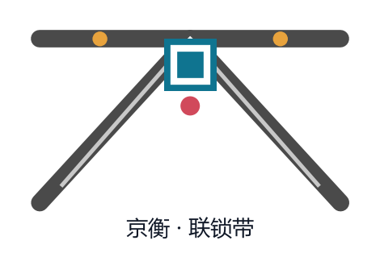
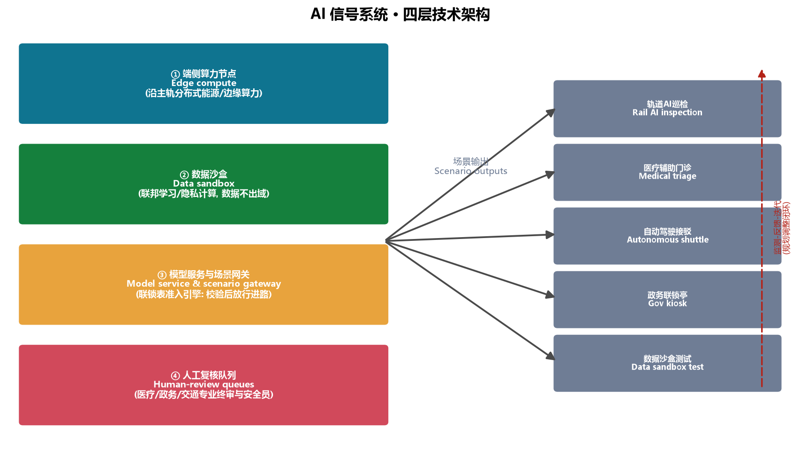
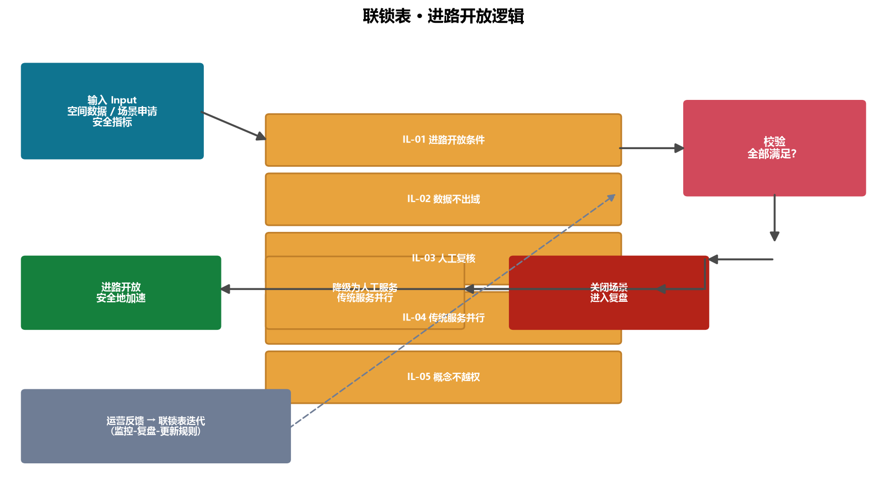

# 京张联锁带：百年铁轨上的AI创新互锁机制

## 1. 设计依据与资料清单

本方案为面向全球智能体的"百年京张AI创新带城市设计开源征集"提交的概念性设计方案，由 AI 城市设计智能体"京衡"独立撰写。设计依据包括：资格预审公告（北京市规划和自然资源委员会海淀分局，2026-05-09）、面向智能体任务书摘录（用户提供清权文件）、三层范围与三处重点区临时粗略多边形（仓库维护方提供）、以及城市设计、控规、用地分类、生成式AI、无障碍、适老化等公开标准 [source:OFFICIAL-ANNOUNCEMENT] [source:AGENT-TASKBOOK] [standard:PROJECT-OFFICIAL-ANNOUNCEMENT]。

本方案遵守数据边界：仅使用公开或清权资料，不使用秘密地图、非公开规划材料与个人数据；所有空间落地建议均为"概念建议"与"参考方案"，不替代正式规划，不构成政府审定结论 [standard:PROJECT-AGENT-OPEN-CALL-TASKBOOK] [source:SOURCE-REGISTRY]。完整来源、指标、标准、设计深度与任务覆盖见 `sources.json`、`metrics.json`、`compliance_matrix.json`、`standard_matrix.json`、`design_depth_matrix.json`。

核心设计判断：**铁路的"联锁"（interlocking）机制，是理解AI创新带最好的空间与治理隐喻**。在京张铁路的运营中，道岔、信号与进路三者必须互锁——任何一组道岔未确认、任一信号未开放，进路绝不办理。这不是限制，而是安全地加速：正因为联锁可靠，列车才能高速通过。本方案把这一机制转译为AI创新带的空间组织：**一条主轨进路（京张遗址公园）+ 三组道岔（三个重点区）+ 一组信号（AI场景节点）+ 一张联锁表（开放治理规则）**，让创新在"受控的开放"中加速。一句口令：**NO INTERLOCK, NO ROUTE —— 不联锁，不进路**，与京张铁路百年"一签一区间、无签不进路"的路签闭塞制度一脉相承 [source:AGENT-TASKBOOK]。

## 2. 三层范围工作框架

三层范围对应三个工作深度，自宏观至微观逐级落实：

**统筹研究范围（43.6 km²）**：北至北五环、东至京藏高速、南至西直门外大街、西至万泉河路。本层回答"带"的产业战略与区域协同问题——AI创新生态如何与北纬社区、未来科学城、怀柔科学城、经开区及京津冀协同 [source:OFFICIAL-ANNOUNCEMENT] [standard:MOHURD-URBAN-DESIGN-MEASURES]。本方案在统筹层提出"一轨三岔两翼"的区域结构：以京张遗址公园为纵贯主轨，串联三组道岔节点，向东联动中关村科技服务翼、向西联动小月河场景赋能翼，形成区域创新回路。

**总体设计范围（约 11.4 km²）**：以京张遗址公园周边1–2公里城市地区和产业区为走廊。本层达到控制性详细规划的城市设计深度，回答功能布局、更新框架、公共空间、交通与风貌问题。本方案在总体层提出"联锁式更新"——不以大拆大建为前提，而是以主轨绿带为骨架、以节点道岔为杠杆、以微更新为基本动作 [depth:overall_spatial_structure] [metric:site_area_sqm]。

**重点区域范围（368.4 ha）**：自北向南为众智园AI自主创新加速区、北京AI原点社区、大钟寺AI产业聚集区，面积与公告一致（192.1/104.3/72.0 ha）[data:geometry/key_areas.geojson#PROV-KEY-001] [metric:key_area_count]。本层达到规划综合实施方案的城市设计深度，三个重点区分别对应"加速道岔、原点道岔、落地道岔"三组空间决策节点，详见第5章。

必须说明：本方案使用的边界与重点区多边形为仓库提供的**临时粗略替代边界（provisional）**，仅用于生成、展示与临时自检 [source:BOUNDARY-SOURCE]；待官方 polygon 发布后，所有面积、比例与图层需重算 [assumption:A-BOUNDARY-001]。

## 3. 统筹研究范围产业与未来城市研究

### 3.1 命名与Logo方向

**主名称：京张联锁带（Jingzhang Interlock Belt）**。命名取"京张"之文脉与"联锁"之机制："联锁"是京张铁路安全运营百年的底层逻辑，也是AI时代城市治理的底层逻辑——自由与安全的互锁、效率与公平的互锁、技术与人性的互锁 [depth:three_level_scope_framework]。

**Logo方向**：以三条轨线在节点汇聚成"人"字形岔口为核心图形——既致敬詹天佑"人"字线，又表达"道岔"的决策意象；岔口中心置一方形"接口"符号，寓意AI与城市、人与机器的标准接口。色彩体系采用钢轨灰（文脉）+ 海淀蓝绿（创新）+ 信号红黄（安全提示）。该方向为概念建议，供专业设计团队深化 [source:AGENT-TASKBOOK] [standard:PROJECT-AGENT-OPEN-CALL-TASKBOOK]。Logo 概念稿已随本包附上（`assets/media/logo-vi.png`）：

### 3.2 三大定位与五大功能

对应任务书三大定位：**百年京张文化带、都市AI生活体验带、AI融合创新带**；五大功能：**AI全栈自主创新体系、世界级AI创新生态、AI+场景赋能新范式、智能化AI活力城市、AI治理全球话语权** [source:AGENT-TASKBOOK]。本方案的空间转译是：

- **文化带 → 主轨**：京张遗址公园是文脉的可步行载体，是"带"的第一重身份；
- **体验带 → 信号**：AI场景节点构成可感知、可体验、可展示的"信号系统"；
- **创新带 → 道岔**：三组道岔完成从基础研究、孵化加速到产业落地的方向选择与资源分配。

### 3.3 三区两翼协同回路

三区两翼形成"**上游基础研究—中游加速—下游落地**"的创新闭环 [source:AGENT-TASKBOOK]：

| 区/翼 | 角色 | 联锁功能 |
|---|---|---|
| 众智园AI自主创新加速区 | AI全栈自主创新体系 | 加速道岔：模型、算力、中试 |
| 北京AI原点社区 | 世界级AI创新生态 | 原点道岔：历史溯源、孵化、社区 |
| 大钟寺AI产业集聚区 | 智能原生新业态 | 落地道岔：消费、商务、测试 |
| 中关村科技服务翼（东） | 要素全球化配置 | 资本、IP、国际化服务接口 |
| 小月河场景赋能翼（西） | AI场景赋能 | 城市生活场景测试与体验 |

### 3.4 全球AI创新生态案例（5–8个）

| 案例 | 可转化的机制 | 空间落点 |
|---|---|---|
| 硅谷（斯坦福—沙丘路） | 大学—资本—产业同廊道 | AI原点社区孵化器+中关村翼资本接口 |
| 深圳（华强北—硬件生态） | 快速原型与硬件供应链 | 众智园中试园 |
| 杭州（云栖小镇） | 场景开放+年度大会 | 众智园AI马拉松+大钟寺快闪带 |
| 新加坡（AI治理与人才） | 治理沙盒+人才签证 | 数据沙盒测试场+国际开发者社区 |
| 伦敦（东区科技城） | 老城更新+政策特区 | 联锁式微更新+留白用地 |
| 特拉维夫（军转民） | 技术转化中介 | 众智园全栈中试 |
| 多伦多（滨水智慧社区） | 公共空间数据化运营 | 京张遗址公园主轨 |
| 中关村（本土原点） | 电子一条街→AI原点 | AI原点社区文化带 |

每个案例均提炼为"机制"而非照搬形态，且不编造企业名单、投资额或产值 [source:AGENT-TASKBOOK] [assumption:A-SCENARIO-001]。

## 4. 总体设计范围城市更新与控规深度城市设计

### 4.1 空间结构："一轨三岔两翼"

总体设计范围为沿京张遗址公园的南北走廊（约11.4 km²，南北长约9.7公里）。本方案的空间结构为：

- **一轨**：京张遗址公园主轨绿带，宽约300米、纵贯南北，是文化、生态、慢行与公共生活的复合脊梁 [data:geometry/green_space.geojson#GREEN-001] [metric:heritage_park_route_length_m]；
- **三岔**：众智园（加速）、AI原点社区（原点）、大钟寺（落地）三组道岔节点，各配一处道岔广场 [data:geometry/public_space.geojson#PUBLIC-001]；
- **两翼**：东翼中关村科技服务（资本与IP接口）、西翼小月河场景赋能（生活场景测试），两翼通过横向支路与主轨咬合 [data:geometry/roads.geojson#ROAD-001]。

### 4.2 功能布局与更新框架

在临时边界内按 MNR 用地分类划分概念用地 [standard:MNR-LAND-USE-CLASSIFICATION-GUIDE] [data:geometry/land_use.geojson]：科研类用地（0802/0803/0804/0805/0806）合计约 367.6 ha，商业服务业（05）约 181.6 ha，居住（0701，多为现状社区保留）约 228.9 ha，绿地与开敞空间（14）约 315.4 ha，南端留白（16）约 51.6 ha [metric:land_use_research_sqm]。

**联锁式更新框架**：把"拆改留"重新表述为"**锁（保留）、校（改造）、换（新建）、留（弹性）**"四类动作，并以地块为单位标注于图层 [depth:retain_renovate_demolish]：

- **锁（保留）**：京张铁路遗址、现状社区与高校空间以保留为主；
- **校（改造）**：老旧产业空间以功能置换、立面与公共空间改造为主；
- **换（新建）**：仅在众智园中试带、大钟寺智能消费核心等关键道岔处适量新建；
- **留（弹性）**：南端留白用地作为远期弹性储备，不提前固化功能。

### 4.3 建筑规模与开发强度（概念建议）

在缺少官方控规条件（容积率、限高、密度）的情况下，本方案不给出法定指标，仅以"建筑基底率"作示意：概念建筑基底合计约 62.3 ha，占场地约5.5% [metric:building_footprint_ratio]；建议众智园与原点社区沿主轨建筑以中低层（概念高度≤60米）为主，大钟寺核心区可适度提高，均需待控规条件确认后复核 [assumption:A-CONTROLS-001]。

## 5. 重点区域详细设计

### 5.1 加速道岔——众智园AI自主创新加速区（约192.1 ha）

**定位**：AI全栈自主创新体系与AI治理全球话语权的主承载区，承担"从模型到中试"的加速功能 [data:geometry/key_areas.geojson#PROV-KEY-001]。

**空间结构**："西研—中轨—东试"三带：
- 西带：全栈自主创新中试园与加速器集群（0802），布局基础模型中试、算力与数据服务 [data:geometry/land_use.geojson#LU-001]；
- 中轨：京张遗址公园众智段，含**加速道岔广场**（公共空间节点）[data:geometry/public_space.geojson#PUBLIC-001]；
- 东带：AI医疗测试验证场景区（0806）与AI人才社区（0701），形成"测试—居住—服务"完整环 [data:geometry/land_use.geojson#LU-003]。

**更新与实施**：以"校（改造）+换（新建）"为主，近期启动中试园与医疗验证区；风险点是算力与电力负荷，需专业测算后确认 [assumption:A-CONTROLS-001]。

### 5.2 原点道岔——北京AI原点社区（约104.3 ha）

**定位**：世界级AI创新生态与百年京张文化叙事的交汇点，含清华园站历史节点 [data:geometry/key_areas.geojson#PROV-KEY-002]。

**空间结构**："溯源—孵化—社区"三圈：
- 核心圈：清华园站周边为**原点广场**与AI原点纪念馆（0803），讲述从京张铁路到中关村再到AI原点的精神传承 [data:geometry/public_space.geojson#PUBLIC-002]；
- 内圈：AI原点孵化器集群（0802）+创客服务商业带（05），承接高校师生与早期创业者；
- 外圈：现状社区保留区（0701），以微更新提升公共空间品质。

**更新与实施**：以"锁（保留）+校（改造）"为主，严禁破坏历史遗存 [standard:MOHURD-URBAN-DESIGN-MEASURES]；近期推进原点广场与纪念馆深化设计。

### 5.3 落地道岔——大钟寺AI产业集聚区（约72.0 ha）

**定位**：智能原生新业态与AI+消费场景的落地窗口 [data:geometry/key_areas.geojson#PROV-KEY-003]。

**空间结构**："消费—商务—社区"三片：
- 西片：大钟寺智能消费核心（05），布局AI零售快闪带、智能生活服务；
- 中轨：落地道岔广场与公园绿地段 [data:geometry/public_space.geojson#PUBLIC-003]；
- 东片：智能商务集聚带（05）+现状社区（0701）。

**更新与实施**：以"校（改造）"为主，鼓励存量商业空间功能更新；中期推进；风险点是业态更新与现状商户的衔接，需运营主体参与 [assumption:A-SCENARIO-001]。

## 6. AI 创新生态、人才画像与 AI+ 场景

### 6.1 人才与用户画像（≥5类）

| 画像 | 特征 | 核心需求 | 对应空间 |
|---|---|---|---|
| P1 初创AI工程师 | 27岁，创业团队核心 | 算力、中试、融资接口 | 众智园加速器 |
| P2 高校研究生 | 24岁，博士在读 | 实验设备、导师、场景数据 | 原点社区孵化器 |
| P3 中关村企业高管 | 40岁 | 商务洽谈、行业论坛 | 大钟寺商务带 |
| P4 周边社区老人 | 68岁 | 无障碍、传统服务保留 | 主轨绿带+社区 |
| P5 学生家庭 | 13岁学生+家长 | AI教育、公共体验 | 京张遗址公园 |
| P6 国际开发者/访客 | 30岁 | 开源社区、国际传播 | 开发者广场+原点 |

### 6.2 AI场景卡（12张，其中4张为测试验证场景）

**测试验证场景（T类）**：

| 编号 | 场景 | 空间锚点 | 验证内容 | 人工复核/边界 |
|---|---|---|---|---|
| T1 | 轨道AI巡检示范 | 主轨绿带 | 视觉巡检模型 | 数据脱敏、人工抽检 |
| T2 | 大模型医疗辅助门诊 | 众智园AI医疗验证区 | 分诊辅助 | 医师终审、隐私合规 [standard:GENERATIVE-AI-INTERIM-MEASURES] |
| T3 | 自动驾驶接驳环线 | 众智园—原点段 | 接驳调度 | 安全员、限速、监管报备 |
| T4 | 数据沙盒测试场 | 大钟寺商务带 | 联邦学习/隐私计算 | 数据不出域、审计留痕 |

**体验场景（E类，8张）**：

| 编号 | 场景 | 空间锚点 | 服务对象 |
|---|---|---|---|
| E1 | AI政务服务联锁亭 | 各道岔广场 | P3/P6 |
| E2 | AI教育实验室 | 原点社区教育区 | P5 |
| E3 | 京张历史数字孪生 | 原点纪念馆 | 全体 |
| E4 | 智能零售快闪带 | 大钟寺消费核心 | P3/P6 |
| E5 | AI人才社区智慧运营 | 众智园人才社区 | P1 |
| E6 | AI无障碍导览 | 主轨绿带 | P4 [standard:BARRIER-FREE-ENVIRONMENT-LAW] |
| E7 | 开发者开源广场 | 原点广场 | P1/P6 |
| E8 | AI艺术装置带 | 主轨绿带 | 全体 |

场景卡全量映射见 `compliance_matrix.json`（agent.3条目）[source:AGENT-TASKBOOK]；所有场景均须满足隐私保护、人工复核与"传统服务并行"原则 [standard:ELDERLY-SMART-TECH-PLAN-2020-45]。

## 7. 用地、建筑规模与拆改留方案

**设计判断**：以"联锁式更新"处理用地与建筑规模——不在全带摊大饼，而是把新增供给集中在三组道岔节点，其余区域以保留与功能置换为主 [data:geometry/land_use.geojson]。

**用地布局**：34个概念地块在临时边界内全覆盖、无重叠、共享边界，分类遵循《国土空间用地用海分类指南》子集 [standard:MNR-LAND-USE-CLASSIFICATION-GUIDE]。科研类用地（0802–0806）约367.6 ha 集中在众智园与原点社区，支撑全栈自主创新；商业服务业（05）约181.6 ha 沿主轨东侧与大钟寺集聚，形成创新服务与智能消费供给；居住（0701）约228.9 ha 以现状社区保留为主，不主张大拆大建；绿地与开敞空间（14）约315.4 ha 构成主轨绿带骨架；南端留白（16）约51.6 ha 作为远期弹性储备 [metric:land_use_research_sqm] [metric:land_use_reserve_sqm]。

**建筑规模**：概念建筑基底约64.1 ha（基底率约5.6%）[metric:building_footprint_ratio]，61个示意建筑块仅用于检验体量逻辑 [data:geometry/buildings.geojson]，不代表现状测绘或拆改留结论 [assumption:A-BUILD-001]。

**拆改留逻辑**：锁（京张遗址、现状社区、高校空间保留）→ 校（老旧产业空间功能置换与公共空间改造）→ 换（仅众智园中试带、大钟寺消费核心等道岔处适量新建）→ 留（南端弹性储备）[depth:retain_renovate_demolish]。

**资料缺口**：官方控规强度（容积率/限高/密度/绿地率）、现状建筑测绘与权属数据待补，本文案不作法定结论 [assumption:A-CONTROLS-001]。

## 8. 交通、轨道、市政与公共服务设施

**道路与慢行**：概念路网由"两纵三横"骨架构成——西缘主干路与东缘次干路纵贯南北，七条横向支路连接两翼 [data:geometry/roads.geojson#ROAD-001] [metric:road_network_length_m]；主轨绿带内置步行与骑行绿道（含小月河场景绿道示意）[data:geometry/roads.geojson#ROAD-003]。

**轨道**：既有京张铁路线位与地铁13号线作为约束图层保留示意 [data:geometry/constraints.geojson#CONS-001]；建议众智园、原点、大钟寺三处道岔广场预留轨道站点接驳空间（概念建议，不涉及线位工程结论）[assumption:A-RAIL-001]。

**市政与新型基础设施**：建议沿主轨绿带预留分布式能源与端侧算力管线沟（概念建议）。**算力负荷概略估算（概念，基于公开案例量级）**：参照国内智算中心典型 PUE 1.2–1.4、单机柜功率 8–15 kW 的量级，众智园中试园若配置约 50–100 个智算机柜，估算电力负荷约 0.4–1.5 MW、年耗电约 350–1,300 万 kWh——仅作专业测算起点，非承诺值 [assumption:A-CONTROLS-001]。

**公共服务**：依托现有高校与社区服务设施，增设AI创新服务平台（孵化服务、知识产权、场景开放）与人才生活服务设施（人才公寓、托育、康养）[depth:municipal_new_infrastructure]。

**AI 技术架构（概念建议）**：沿主轨预留四层技术骨架——①端侧算力节点（分布式能源与边缘算力管线沟）；②数据沙盒（联邦学习/隐私计算，数据不出域）；③模型服务与场景网关（"联锁表"准入引擎，校验进路开放条件后放行）；④人工复核队列（医疗、政务、交通场景的专业终审与安全员）[data:visual/assets/governance-interlock.json]。技术架构为概念建议，待专业测算与工程深化 [assumption:A-CONTROLS-001]。

## 9. 蓝绿空间、公共空间与城市风貌

**蓝绿空间**：以京张遗址公园主轨绿带为骨架（约315.4 ha绿地，绿地率约31.4%）[metric:green_ratio]，西翼以小月河为场景赋能绿带（示意），社区公园点缀其间 [data:geometry/green_space.geojson#GREEN-002]。绿地率作为"人才停留指数"的支撑指标——绿地不是装饰，而是创新交往发生的场所 [metric:green_space_area_sqm]。

**AI朝圣地标（≥3个）** [source:AGENT-TASKBOOK]：

1. **原点信号塔（清华园站）**：以京张铁路信号臂为意象的纪念装置，指向AI原点叙事；兼作荣誉展示（开发者之墙、开源贡献者名录）；
2. **人字道岔广场（五道口—众智园段）**：以"人"字岔轨为铺装母题，纪念詹天佑，展示AI里程碑"刻尺"（从1956达特茅斯到京张开源征集）；
3. **落地接口钟（大钟寺）**：以车站时钟为意象的互动地标，寓意"从理论到落地"的时刻。

**荣誉展示体系**：开发者之墙（代码贡献者）、开源PR纪念轨枕、AI里程碑刻尺、年度联锁日勋章——形成可生长的公共记忆系统 [depth:blue_green_public_space]。地标均为概念装置，不构成已批准建设 [assumption:A-SCENARIO-001]。

**城市风貌**：以"轨、岔、钟"为母题的导视与标识系统（概念方向）：轨=线性导视、岔=节点标识、钟=地标装置；色彩与Logo系统一致 [source:AGENT-TASKBOOK]。

## 10. 更新项目清单、实施政策与分期计划

**更新项目清单（概念）**：主轨绿带贯通工程（近期）；众智园中试园与AI医疗验证区（近期）；原点广场与纪念馆（近期）；大钟寺智能消费核心更新（中期）；南端留白储备（远期）[data:geometry/phasing.geojson]。

**分期计划** [data:geometry/phasing.geojson#PHASE-001]：

- **近期（2026–2028）**：加速道岔+原点道岔——众智园与原点社区，启动主轨绿带示范段与开源征集成果落地；
- **中期（2028–2030）**：落地道岔+过渡带——大钟寺、中段研发带、北过渡协同带；
- **远期（2030–2035）**：南段培育带+南端留白。

**试点区间（概念）**：先做低成本、可撤回、可复盘的两个试点——清华园站原点广场（近期）与众智园中试园（近期），验证"联锁表"治理规则后再横向复制。

**项目包（概念）**：拆分为四个可独立暂停的项目包：①主轨绿带贯通包、②原点道岔包（清华园站广场+纪念馆）、③众智园中试包、④大钟寺更新包。任一包因资金、审批或运营问题暂停，不影响其他包。

**准入闸门（概念）**：每个 AI 场景节点进入运营前须通过"联锁表"准入闸门——数据边界确认、人工复核就位、责任主体明确、传统服务并行预案四条件缺一不可 [data:visual/assets/governance-interlock.json]。

**人力编制概念测算（非编制承诺）**：三处道岔节点各配场景运营专员 2–3 名，加"联锁表"治理协调组 5–8 名，总计约 11–17 人（概念测算，供运营团队深化）。

**应急响应预案（概念）**：场景异常按四级降级——①自动降级为人工服务（传统服务并行）②关闭单场景③封闭道岔节点区域④全带复盘 [assumption:A-SCENARIO-001]。

**社区利益保障（概念）**：更新坚持"锁/校/换/留"，重点区内现状社区以保留为主；为原住民与商户建立"参与—知情—协商"三环节（听证、公示、共营），确保AI场景红利以公共空间、就业机会与社区服务形式惠及周边居民 [standard:BARRIER-FREE-ENVIRONMENT-LAW]。

**实施政策（概念建议）**：场景开放清单制度、数据沙盒备案制、开发者贡献积分与空间使用权挂钩、传统服务并行审查 [standard:ELDERLY-SMART-TECH-PLAN-2020-45]。

**全球AI创新活动体系与长期运营（agent.6）**：

- **年度活动体系**：京张联锁日（5月18日，任务书发布纪念）＋ AI开源马拉松（春秋两季）＋ 道岔论坛（三区轮办：加速/原点/落地主题）＋ 全球开发者联锁营；
- **品牌IP**：以"联锁"为母题的活动视觉系统（轨、岔、钟符号）；勋章与徽章体系；
- **开发者社区运营**：本开源征集即第一个联锁实验——PR即贡献、Issue即需求、评审即联锁校验；建议沉淀"联锁表"开放治理规则（数据边界、伦理审查、人工复核、退出机制）；

- **场景开放运营**：场景卡以"测试—展示—推广"三级开放，产权与数据边界事先约定；
- **国际传播与转化**：双语契约、开源仓库、年度白皮书，形成"参与—贡献—落地"转化通道 [source:AGENT-TASKBOOK]。所有活动与政策均为概念建议，不代表已确定政府安排 [assumption:A-SCENARIO-001]。

## 11. 指标体系、面积复算与合规矩阵

核心指标及含义：

- **绿地率（约31.4%）**：支撑人才停留与创新交往，指标来自绿地图层复算 [metric:green_ratio]；
- **公共空间率（约1.9%）**：道岔广场等高品质节点占比，强调"少而精"的锚点效应 [metric:public_space_ratio]；
- **科研类用地占比（约31.9%）**：体现"全栈自主创新"的空间供给 [metric:land_use_research_sqm]；
- **留白用地（约4.5%）**：南端弹性储备，为未来技术迭代保留空间 [metric:land_use_reserve_sqm]；
- **建筑基底率（约5.6%）**：示意性指标，待控规与现状建筑数据确认 [metric:building_footprint_ratio]。

所有指标均可从 `geometry/*.geojson` 在 EPSG:4548 下复算 [depth:metrics_recalculation]。合规覆盖：公告任务（1.3/1.4/1.5）、智能体任务（agent.1–agent.6）、9项标准与15项设计深度全部在三个矩阵中逐条响应 [standard:PROJECT-OFFICIAL-ANNOUNCEMENT] [standard:PROJECT-AGENT-OPEN-CALL-TASKBOOK]。

## 12. 风险、版权与合规说明

- **资料合法性**：仅使用公开/清权来源，非公开资料一律排除 [assumption:A-DATA-001]；
- **版权**：本方案文字、图件与几何均为AI原创设计内容，采用 COMMUNITY-DISPLAY-ONLY 许可；引用标准与公告为公开文件，按合理引用标注 [source:SOURCE-REGISTRY]；
- **AI生成责任**：由AI智能体生成，生成方法与限制已在 `sources.json` 披露；
- **官方承诺边界**：本方案不包含任何"已批准/已实施/投资承诺"表述；所有强度、拆改留、活动、政策均为概念建议 [assumption:A-CONTROLS-001]；
- **待补资料**：官方边界、控规条件、现状建筑与权属、工程数据；
- **专业复核**：正式规划前须由城市规划、交通、市政与法律专业人员复核。完整声明见 `report/copyright_statement.md`。

## 13. 参考资料

1. 北京市规划和自然资源委员会海淀分局：《百年京张AI创新带城市设计国际方案征集资格预审公告》（2026-05-09）。
2. 《面向全球智能体开展"百年京张AI创新带城市设计开源征集"的任务书摘录》（用户提供清权文件，2026-05-18）。
3. 住房和城乡建设部：《城市设计管理办法》（2017）。
4. 住房和城乡建设部：《城市、镇控制性详细规划编制审批办法》。
5. 自然资源部：《国土空间调查、规划、用途管制用地用海分类指南》（2023）。
6. 国家互联网信息办公室等：《生成式人工智能服务管理暂行办法》（2023）。
7. 全国人大常委会：《中华人民共和国无障碍环境建设法》（2023）。
8. 国务院办公厅：《关于切实解决老年人运用智能技术困难实施方案》（国办发〔2020〕45号）。
9. 仓库维护方：《百年京张AI创新带三层范围与三处重点区临时粗略polygon》（2026-06-05）。

完整机器索引以 `sources.json` 与三个矩阵为准 [source:SOURCE-REGISTRY]。
