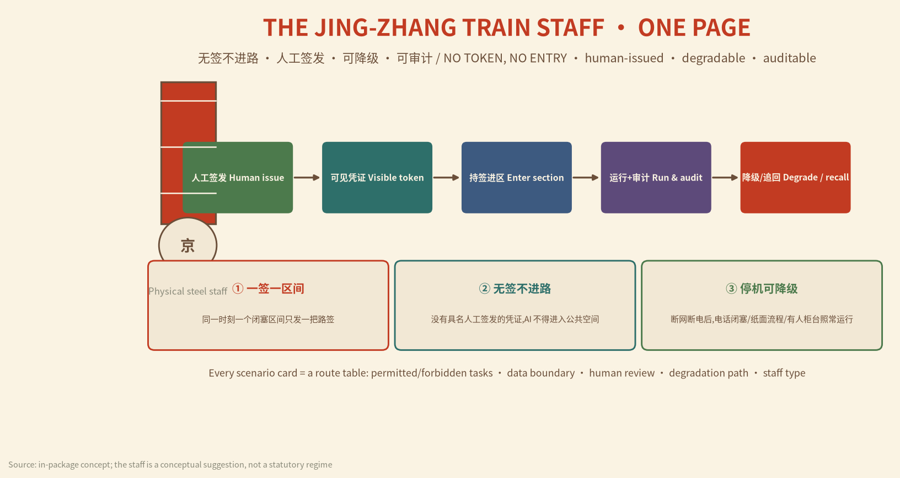
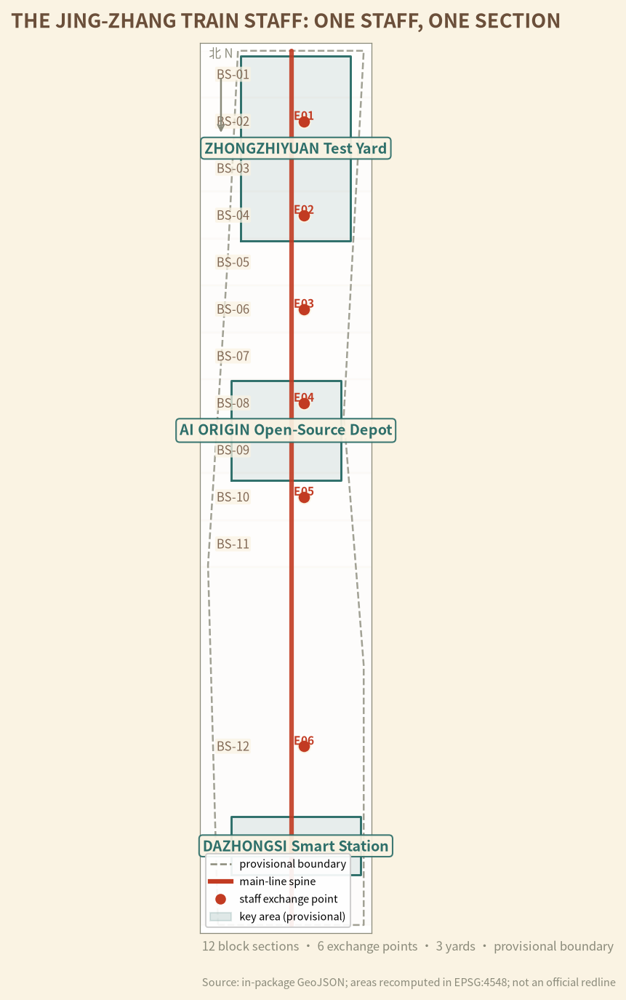
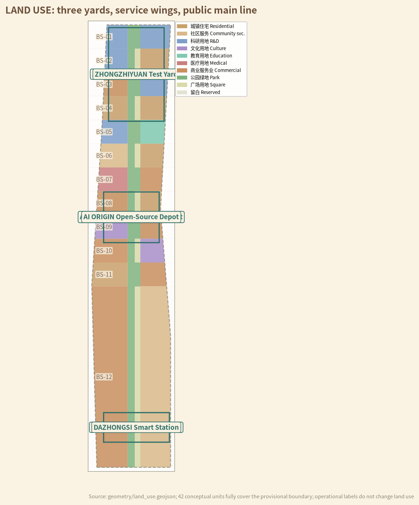
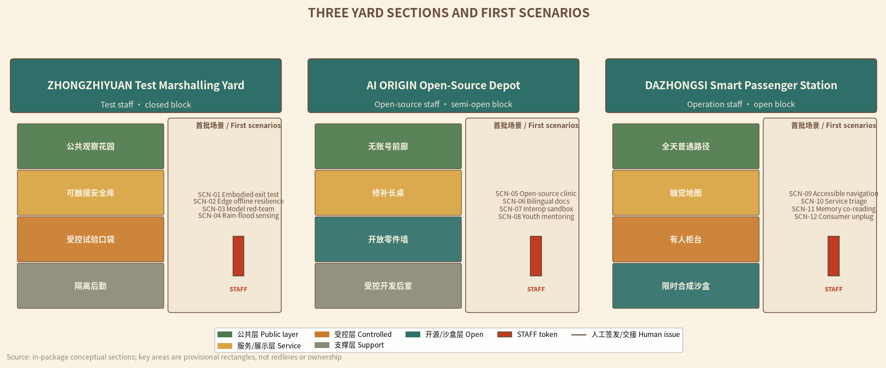
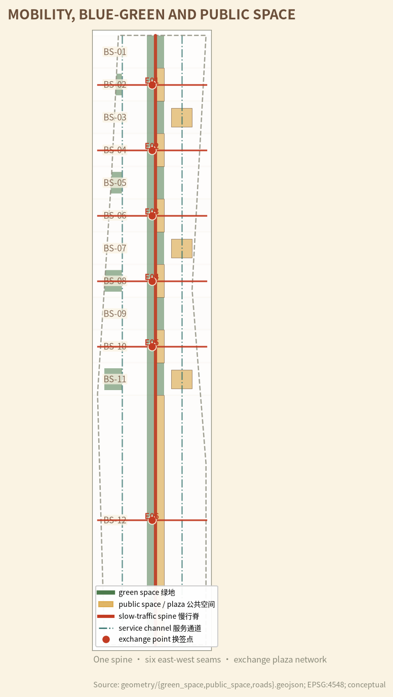
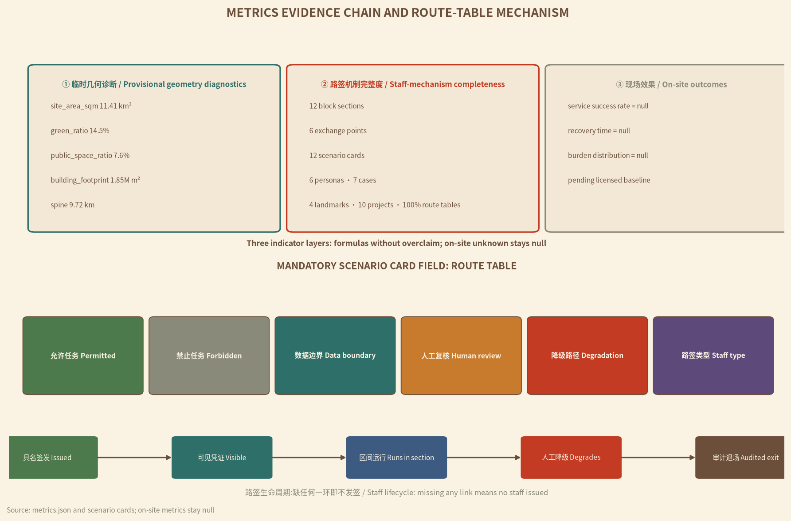

# THE JING-ZHANG TRAIN STAFF: ONE STAFF, ONE SECTION

> **ONE STAFF, ONE SECTION — NO TOKEN, NO ENTRY.** On early single-track railways, a train was not allowed to enter the next block section until the station duty officer handed the driver the "train staff" token; only one train held the staff for one section at a time, so conflict was physically impossible. This proposal translates that century-old block discipline into a protocol for the AI Innovation Belt: **no AI service enters public space without a named, human-issued "city staff"; one staff per section, no token no entry, graceful degradation on shutdown, fully auditable.** [assumption:A-STAFF-001] [assumption:A-STAFF-HISTORY-001] [source:STAFF-HISTORY-REF]

## Executive Summary

The Jing-Zhang Railway, built 1905–1909 under chief engineer Zhan Tianyou, was China's first trunk line constructed entirely with its own strength, and operated as a typical single-track railway [source:OFFICIAL-JINGZHANG-HISTORY]. Part of this century-old main line has already become the Jing-Zhang Railway Heritage Park: Phase 1, 2.5 km long and 16.8 ha, between Qinghua East Road and Zhichun Road, restoring the old alignment, repairing the Qinghuayuan station house, and using rails, switches and locomotives to stitch the city back together [source:OFFICIAL-PARK-PHASE1-2023]. Our question is: **when new models, robots and scenarios enter the AI Innovation Belt every day, what guarantees that they do not conflict, cross boundaries, or turn public space into private territory?** The answer is not more systems, but an older credential: the train staff.

This proposal uses the train staff as the core mechanism and organizes the whole belt as **ONE MAIN LINE, THREE YARDS, SIX EXCHANGE POINTS, TWELVE BLOCK SECTIONS**: a public spine along the old railway (one main line); the three key areas reinterpreted as three functional yards — Zhongzhiyuan = Test Marshalling Yard, AI Origin Community = Open-Source Locomotive Depot, Dazhongsi = Smart Passenger Station (three yards); six "staff exchange points" that stitch east-west seams and transfer authority (six points); and the whole line divided into twelve "block sections", each holding one staff (twelve sections) [data:geometry/constraints.geojson#BS-01] [metric:block_section_count] [metric:exchange_point_count]. Each block section is the minimal governance unit of "space + data + service": who enters and exits in space, who stores and reads data, who stops and swaps services — all decided by one tangible, verifiable, recoverable staff.

The staff is not a new system but trust made visible: **paper, metal and electronic staffs coexist in three levels, issued by named humans, inspectable by the public, traceable in audit.** Whether a scenario is permitted, where the data boundary lies, who reviews, and how the city keeps running when AI shuts down — all are written into each scenario card's "route table" [metric:staff_route_table_coverage_ratio]. AI is the train, not the track; without a staff, the fastest train stays in the station.

Spatially, the proposal divides the provisional boundary into 42 conceptual land-use units covering the full ~11.4 km² provisional site (recomputed in EPSG:4548) [data:geometry/land_use.geojson] [metric:land_use_parcel_count] [metric:site_area_sqm]. The conceptual green ratio is ~14.5% and public space ratio ~7.6% [metric:green_ratio] [metric:public_space_ratio]. Twelve block sections, six exchange points and a ~9.7 km public slow-traffic spine form the spatial skeleton [metric:spine_length_m]. All geometry is based on the repository's provisional rough boundary; full recalculation is triggered when official polygons are published [data:geometry/site_boundary.geojson#SITE-001] [assumption:A-BOUNDARY-001].

Implementation starts with three pilot block sections rather than the whole line at once: Zhongzhiyuan first opens two closed test sections, Dazhongsi opens one open experience section; the AI Origin open-source section runs "model documentation and maintenance clinic" in shadow mode [metric:phasing_stage_count]. Every stage accepts "no token, no entry" as its test sentence: scenarios without a named human issuer, a visible credential, a degraded manual process and an audit record receive no staff and enter no section [data:risk.json].

This is not an anti-AI proposal. On the contrary, it turns "how to be trusted" into a sellable capability for AI companies: products prove not only performance, but also that they can enter with a credential, degrade to manual operation, and exit without leaving locks behind. The maturity of a world-class AI district is marked not by devices that never go offline, but by a city that can safely dispatch and reliably brake in any technology cycle — precisely what single-track railways taught the modern city [depth:overall_spatial_structure] [depth:three_level_scope_framework].

## Design Basis and Source Inventory

Evidence is organized in four layers.

The first layer is the official announcement and the agent taskbook, which define the scopes, positioning statements, five functions, three areas and two wings, and six tasks; it is the controlling basis for task response [source:OFFICIAL-ANNOUNCEMENT] [source:AGENT-TASKBOOK] [standard:PROJECT-OFFICIAL-ANNOUNCEMENT].

The second layer is official public facts from Beijing and Haidian authorities on park construction and railway heritage, used to establish the "what exists, why renew" context [source:OFFICIAL-PARK-PHASE1-2023] [source:OFFICIAL-JINGZHANG-HISTORY]; AI-industry and agentic-AI policy information serves as industrial context only and is not inferred down to parcels [source:OFFICIAL-AGENTIC-AI-2026] [source:OFFICIAL-AI-ORIGIN-2026].

The third layer is the repository site package, source registry and provisional geometry, used for reproducible calculation [source:SITE-PACKAGE] [source:SOURCE-REGISTRY].

The fourth layer is the train-staff mechanism reference and overseas cases, used only for transferable authorization, degradation and audit mechanisms — not to transplant foreign institutions or figures [source:STAFF-HISTORY-REF] [source:CASE-NIST-AI-RMF]; the remaining cases serve mechanism comparison only [source:CASE-AMSTERDAM-SENSING] [source:CASE-UNHABITAT-PEOPLE].

| Evidence status | What this version can do | What this version never does | Trigger for next version |
|---|---|---|---|
| Official announcement and taskbook | Define scope, tasks, depth and language | Infer current ownership, investment or approvals | Official supplements and tender attachments |
| Official public facts (park phase 1, railway history, AI industry) | Establish "what exists, why renew" context | Infer down to parcels or engineering alignments | Official survey and project data |
| Provisional boundary and nine GeoJSON layers | Topology checks, conceptual zoning, area recomputation | Official redline, ownership, demolition or engineering conclusions | Official polygons and survey results |
| Train-staff mechanism and overseas cases | Extract authorization, degradation and audit mechanisms | Transplant foreign institutions or figures | Chinese legal and professional deepening |

The historical facts of the train staff come from a public science-popularization entry: the staff is a rod-shaped credential permitting a train to occupy a block section; a train cannot pass a station without receiving it; electronic staff systems further encode "one section, one train at a time" in data logic [source:STAFF-HISTORY-REF] [assumption:A-STAFF-HISTORY-001]. This proposal borrows only the mechanism; it claims no current railway regulation applies to AI services, and does not write the city staff as a statutory approval system [assumption:A-STAFF-001].

Complete sources, metrics, standards, depth items and task coverage are stored in `sources.json`, `metrics.json` and the three matrices; the prose keeps only near-verifiable citations. The current boundary and key areas remain provisional geometry, with precision limits and replacement conditions disclosed [data:geometry/site_boundary.geojson#SITE-001] [assumption:A-BOUNDARY-001].

## Three-Level Scope Framework

The three levels are not three independent plans, but one chain conducting the same staff logic from industrial strategy through space to pilots [depth:three_level_scope_framework].

| Level | Core question | This version delivers | Boundary that cannot be crossed |
|---|---|---|---|
| Coordinated research area | How AI industry, talent, public problems and regional partners recognize each other's credentials | Staff ecosystem, 7 cases, 5 regional interfaces, annual event system | No fabricated partners, firms, funds or commitments |
| Overall design area | How the corridor keeps "paid passage, no ticket means stop" order across technology cycles | One main line, three yards, six points, twelve sections, 42 land-use units | Provisional SITE-001 is not an official redline |
| Key detailed design areas | How one AI trial enters with a credential, degrades out, and leaves public assets | 12 scenario route tables, three yard-type sections, 10 project packages | Provisional rectangles are not parcels, ownership or engineering scope |

Every level uses the same acceptance sentence: **who issues the staff; whether the credential is visible; whether the city runs without the token; who recovers and how audits happen after shutdown.** A coordinated level with no real public problem and receiver does not enter the overall level; an overall level with no ordinary manual path does not enter the key-area level; a key-area level with no degradation process, maintenance owner and exit mechanism does not enter pilots [depth:risk_missing_data].

The provisional overall site is ~11.4 km² [metric:site_area_sqm]; the three key areas are positioned as rough rectangles from the announcement's names, north-south order and approximate areas [data:geometry/key_areas.geojson#PROV-KEY-001] [assumption:A-KEYAREA-001]. When official polygons arrive, all layers must be re-clipped, all areas and ratios recomputed, scenarios and projects reassigned, bilingual figures and PDFs updated, and a difference log published [depth:metrics_recalculation] [assumption:A-BOUNDARY-001].

## Coordinated Research Area: Industry and Future-City Study

The three positioning statements are translated into three "staff types" [source:AGENT-TASKBOOK] [standard:PROJECT-AGENT-OPEN-CALL-TASKBOOK]:

| Positioning | Staff translation | Five functions anchored |
|---|---|---|
| Centennial Jing-Zhang culture belt | From "building the first railway on our own" to "building trustworthy AI infrastructure on our own" | AI governance global voice |
| Urban AI lifestyle experience belt | The public compares no-token ordinary services with staffed AI services in the same section | AI+ scenario empowerment paradigm, intelligent vibrant AI city |
| AI integration innovation belt | R&D, testing, open source, conversion and public use run in "route—exchange—exit" order | Full-stack independent AI innovation system, world-class AI ecosystem |

**The three-areas-two-wings staff loop.** The Zhongzhiyuan Test Marshalling Yard issues "test staffs" and validates embodied intelligence, edge computing and safety degradation in closed sections [source:OFFICIAL-AI-TESTFIELD-2026] [source:OFFICIAL-EMBODIED-PARK-2025]; the AI Origin Open-Source Locomotive Depot issues "open-source staffs" and releases validated models, adapters and documentation as reusable public components [source:OFFICIAL-AI-ORIGIN-2026]; the Dazhongsi Smart Passenger Station issues "operation staffs" and runs public-facing industrial experience and life services in open sections. The Zhongguancun technology-service wing provides legal, standards, capital and professional-service directions; the Xiaoyuehe scenario-empowerment wing provides public problems, ecology and life feedback. Neither wing bypasses the three yards' issuance gates [depth:three_key_area_detailed_design].

Regional synergy proposes only agreed "inputs—shareable outputs" without fabricating partnerships: the Beiwu community may raise resident problems, the Future Science City may share testing-method directions, the Huairou Science City may share measurement and calibration directions, the Economic-Technological Development Area may feed back engineering-manufacturing experience, and the Beijing-Tianjin-Hebei region receives only de-located protocols, failure packages and version diffs. No coordinates, personal data, approval conclusions or partnership names flow across regions by default [assumption:A-PRIVACY-001].

**Seven global ecosystem cases compressed into seven transferable mechanisms** [metric:ai_ecosystem_case_count] [assumption:A-ECOSYSTEM-001]:

| Case / framework | Transferable mechanism | Jing-Zhang translation | Explicitly not copied |
|---|---|---|---|
| Punggol Digital District [source:CASE-SINGAPORE-PUNGGOL] | Open platform, industry-academia-city mix, living-lab environment | Three yards typed as closed/semi-open/open validation | Not its scale, investment or central platform |
| NIST AI RMF [source:CASE-NIST-AI-RMF] | Full-lifecycle risk and decommissioning records | Staff lifecycle = route—run—degrade—exit | Not a substitute for professional safety duty |
| Amsterdam Responsible Sensing [source:CASE-AMSTERDAM-SENSING] | Design sensors from freedom, control and privacy | Sensors need visible purpose, credential and unplug right | Public space is not a default data source |
| UN-Habitat People-Centred [source:CASE-UNHABITAT-PEOPLE] | Digital public goods, inclusion, small pilots | No-token ordinary services run parallel to staffed AI | Non-binding guidance is not approval basis |
| Seoul Oil Tank Culture Park [source:CASE-SEOUL-OIL-TANK] | Industrial heritage as public cultural space | Staffs, switches and switchmen become touchable memory | Not its building forms or renovation conclusions |
| Single-track staff block system [source:STAFF-HISTORY-REF] | One staff per section, human handover, degraded running | City staff = named human-issued credential of space+data+service | Railway regulations are not claimed to apply directly |
| Jing-Zhang construction history [source:OFFICIAL-JINGZHANG-HISTORY] | Self-built, precise survey, team coordination | "Build AI on our own" engineering discipline narrative | History is not extrapolated into engineering conclusions |

**Naming, logo and visual identity** revolve around "one credential": Chinese primary name "京张路签", English primary name `THE JING-ZHANG TRAIN STAFF`, international slogan `ONE STAFF, ONE SECTION — NO TOKEN, NO ENTRY`. The logo direction is the end face of a steel staff: a circular face with three grooves and a seal-style abbreviation of "京张", where the grooves represent the three authorization layers of space, data and service; colors use sleeper brown, signal vermilion, ticket cream and steel cyan — red only for stop, cyan for passage, cream for manual credentials. Naming and logo are conceptual directions and do not imitate official marks [assumption:A-VERB-001].

## Overall Design Area: Urban Renewal at Regulatory-Plan Urban Design Depth

The overall structure is "**ONE MAIN LINE, THREE YARDS, SIX POINTS, TWELVE SECTIONS**": a public slow-traffic spine along the old railway connecting the three functional yards; twelve block sections numbered BS-01 to BS-12 from north to south, each holding one staff [data:geometry/constraints.geojson#BS-01] [metric:block_section_count]. Six staff exchange points prioritize east-west stitching while transferring authority [metric:exchange_point_count]; the overall spatial structure is directly supported by the constraints layer [depth:overall_spatial_structure].

The 42 conceptual land-use units use official classification codes and fully cover provisional SITE-001 without gaps or overlaps [data:geometry/land_use.geojson#LU-001] [metric:land_use_parcel_count] [standard:MNR-LAND-USE-CLASSIFICATION-GUIDE]. Research, industry and public services sit near the three yards, housing and community services occupy the east and west wings, and the main line stays continuously public with parkland and squares [depth:land_use_layout] [standard:MOHURD-URBAN-DESIGN-MEASURES]. "Block sections" and "exchange points" are operational overlay labels and do not change land use.

**The twelve block sections are typed by risk:** BS-01–03 are Zhongzhiyuan "test blocks" — robots and sensors appear only in physically controlled closed pockets, and ordinary paths, accessible clearances and fire lanes are never test variables [assumption:A-DELIVERY-001]; BS-04–07 are AI Origin "semi-open open-source blocks" — the front hall holds only publishable, reusable, recallable versions, with IP and trade secrets kept in a controlled back room; BS-08–12 are "open operation blocks" — AI services only add gain, never make final decisions; real payments, medical, legal, enforcement and scoring decisions remain with humans [depth:traffic_rail_slow_parking] [assumption:A-AI-001].

**Six exchange points E01–E06** double as east-west seams and authority handover points: each seam connects surrounding neighborhoods and parks on a pedestrian-first basis, and the exchange plaza hosts "credential display—human handover—public inquiry" [data:geometry/public_space.geojson#PUBLIC-001] [metric:exchange_point_count]. An exchange point is not a security checkpoint but "trust made visible": the physical staff is displayed, the issuer is named, and the inquiry screen shows only credential status and validity — no personal data of passers-by is collected [depth:blue_green_public_space] [assumption:A-PRIVACY-001].

**The renewal sequence** is: preserve existing public value → repair passage, shade, drainage and manual services → install reversible components → shadow-run staffed AI → audit → decide keep, modify or remove. FAR, height, density, setbacks, parking, municipal capacity and demolition volumes are registered as unknown; conceptual volumes are not statutory controls [assumption:A-CONTROLS-001] [depth:development_intensity_controls]. Specific FAR, height and statutory green-ratio values await official conditions; they are not back-calculated or estimated [metric:floor_area_ratio] [metric:building_height_control_m] [metric:green_ratio_statutory].

## Key Area Detailed Design

All three key areas use the organizer's provisional rough polygons; rectangle edges do not represent roads, parcels or ownership [data:geometry/key_areas.geojson#PROV-KEY-001] [assumption:A-KEYAREA-001].

| Key area | Yard type | Staff type | Spatial section | First scenarios |
|---|---|---|---|---|
| Zhongzhiyuan AI Acceleration Area | Test Marshalling Yard | Test staff (closed) | Public observation garden—touchable safety library—controlled test pockets—isolated logistics | SCN-01–04 |
| Beijing AI Origin Community | Open-Source Locomotive Depot | Open-source staff (semi-open) | No-account front hall—repair table—open parts wall—controlled dev back room | SCN-05–08 |
| Dazhongsi AI Industry Cluster | Smart Passenger Station | Operation staff (open) | All-day ordinary path—tactile map—staffed counter—time-limited synthetic sandbox | SCN-09–12 |

**Zhongzhiyuan = Test Marshalling Yard.** Embodied intelligence, edge computing and red-team testing happen only in closed sections with physical boundaries, manual emergency stops and isolated logistics; the public observation garden is a "safety library", not a brand grandstand, where people can touch test obstacles, read failure causes and compare offline modes [source:OFFICIAL-AI-TESTFIELD-2026] [source:OFFICIAL-EMBODIED-PARK-2025]. Passing a test is not regulatory or product approval; energy capacity, platform qualifications, responsible bodies and ecological conditions are separately verified [depth:three_key_area_detailed_design].

**AI Origin = Open-Source Locomotive Depot.** Space centers on repair, not showcase: one public table hosts open-source issue clinics, interface adaptation, bilingual model documentation and youth reverse-mentoring; model cards, adapters, failure archives and repair manuals are standing contents of the open parts wall [source:OFFICIAL-AI-ORIGIN-2026] [source:OFFICIAL-AGENTIC-AI-2026]. When AI shuts down, the table, tools, manuals, paper processes and human networks still run.

**Dazhongsi = Smart Passenger Station.** Start with ground floor, first floor and static information; do not replace site investigation with engineering imagination about bridges, tunnels or underground connections; tactile maps, staffed counters and the Jing-Zhang memory trail are available all day, while consumer agents appear only in synthetic transactions with step-by-step human confirmation [source:OFFICIAL-PARK-PHASE1-2023] [depth:height_massing_character]. Whenever the ordinary path is blocked, real payments are connected, the counter is unmanned or appeals are unavailable, the scenario stops immediately and returns its staff.

## AI Innovation Ecosystem, Talent Personas and AI+ Scenarios

Six persona classes are not marketing labels but design inputs for staff permissions [metric:persona_count]: R&D and open-source maintainers, startups and product teams, park users and residents, elderly and disabled users, frontline operations and maintenance staff, and international visitors and regional partners. No class can consent for another; passage, quiet and ordinary services of non-participants come first [assumption:A-AI-001].

**12 scenario cards, each bound to a route table** [metric:scenario_card_count] [metric:staff_route_table_coverage_ratio]:

| ID | Scenario | Yard/section | Permitted tasks | Data boundary | Human review | Degradation path | Type |
|---|---|---|---|---|---|---|---|
| SCN-01 | Embodied AI exit test | Zhongzhiyuan BS-01 | Multi-agent safety and takeover drills | Synthetic test-yard data only | Named safety officer | Paper safety boundary + emergency stop | Industry test |
| SCN-02 | Edge compute offline resilience | Zhongzhiyuan BS-02 | Offline/degraded/energy comparison | Aggregated energy readings | Operator reviews envelope | Manual run sheet + telephone block | Industry test |
| SCN-03 | Model red-team and failure archive | Zhongzhiyuan BS-02 | Synthetic prompts and version re-tests | No personal data | Disclosure responsibility review | Failure cards + repaired versions archived | Industry test |
| SCN-04 | Rain-flood sensing with manual gauge | Zhongzhiyuan BS-03 | Public environment reading assists maintenance | Environment sensors only | Maintainer compares manual gauge | Manual gauge + maintenance card | Industry test |
| SCN-05 | Open-source maintenance clinic | AI Origin BS-05 | Issue triage, dependency checks | Public code only | Maintainer sign-off | Repair manual + issue tickets | Public |
| SCN-06 | Bilingual model documentation workshop | AI Origin BS-05 | Draft plain-language explanations | No training-data upload | Professional review before release | Bilingual glossary templates | Public |
| SCN-07 | City-service interoperability sandbox | AI Origin BS-06 | Synthetic ticket checks and referral | Synthetic data only | Service desk reviews referral | Open adapters + paper process | Public |
| SCN-08 | Youth reverse-mentoring class | AI Origin BS-06 | Voluntary learning partner matching | Minimal necessary, opt-out anytime | Guardian consent (minors) | Paper task cards + tool catalog | Public |
| SCN-09 | Accessible dual-track navigation | Dazhongsi BS-09 | Temporary obstacle and route assistance | No location retention | On-site verification of ordinary routes | Tactile static map + hotline | Public |
| SCN-10 | Public-service triage counter | Dazhongsi BS-10 | Public catalog search and material hints | No sensitive material retained | Staffed counter review | Paper catalog + phone path | Public |
| SCN-11 | Jing-Zhang memory co-reading | Dazhongsi BS-11 | Cleared-history search and multilingual explanation | Cleared public history only | Historical accuracy review | Physical timeline + recall cards | Public |
| SCN-12 | Consumer-agent unplug sandbox | Dazhongsi BS-12 | Synthetic budgeting with stepwise confirmation | No real payment connection | Human confirmation per step | Manual comparison board + appeal entry | Public |

The route table is a mandatory field of every scenario card: permitted tasks, forbidden tasks, data boundary, human review, degradation path and staff type — missing any one means no staff is issued. Generative AI scenarios comply with the Interim Measures for the Management of Generative AI Services [standard:GENERATIVE-AI-INTERIM-MEASURES] [source:DATA-SRC-GENERATIVE-AI-INTERIM-MEASURES]; concrete touchpoints: SCN-06 documentation workshop completes content verification and source disclosure before release, and SCN-07 interoperability sandbox forbids generating transfer instructions without human review. Accessibility scenarios follow the Barrier-Free Environment Law and the State Council's No. 45 (2020) plan on digital-age-friendly services for the elderly, with ordinary paths, paper processes and staffed counters always retained [standard:BARRIER-FREE-ENVIRONMENT-LAW] [standard:ELDERLY-SMART-TECH-PLAN-2020-45]; concrete touchpoints: SCN-09 navigation publishes a tactile static map with on-site verified routes, and SCN-10 triage keeps paper catalogs and phone paths [source:DATA-SRC-BARRIER-FREE-ENVIRONMENT-LAW] [source:DATA-SRC-ELDERLY-SMART-TECH-PLAN-2020-45].

**Electronic staff and AI technical architecture (conceptual direction).** The electronic staff is suggested to use a "digital credential + versioned record" structure: issuance generates a credential number carrying the issuer identity and a hash chain; verification collects no personal identity; recall writes a block record; specific cryptography, anti-tamper and mutual-recognition protocols are to be designed by data and information-security professionals under current standards [assumption:A-STAFF-001]. Model deployment follows a tiered strategy of "edge-first, cloud-on-file, edge-can-disconnect": test sections run mainly on edge and on-device inference, with offline drills as mandatory tests; model admission requires performance baselines, safety tests and a failure archive, and version updates go through the C0–C7 gates [depth:municipal_new_infrastructure]. Performance baselines should include at least two testable indicators: edge inference response latency (e.g., a P95 target of no more than 500 ms) and peak energy consumption (e.g., no more than 80% of rated device power); exact thresholds are calibrated by professional teams per device and scenario. Safety tests cover at least fault modes (offline, disconnection, anomalous input) with manual takeover drills. Data pipelines handle only public or authorized data, with cleaning, anonymization and deletion processes written into the route table [assumption:A-PRIVACY-001].

**Electronic staff field prototype (example).** For engineering evaluation, the electronic staff is suggested to carry at least: `staff_id`, `issuer`, `issued_at`, `expires_at`, `section_id`, `model_hash`, `route_table_ref`, `degrade_trigger`, `recall_status`. This field set is a conceptual draft; the exact format and cryptography are designed by data-security professionals under current standards [assumption:A-STAFF-001].

**Protocol outline of the electronic staff (for technical teams to deepen).** The credential structure is suggested in three layers: 1) credential header (issuing section, section ID, validity period, issuer role); 2) payload (authorized service scope, data-field whitelist, degradation level); 3) witness chain (hash chain of issuance, handover and recall events, appended chronologically). The hash chain stores digests only, never raw text; verification runs on-device, and chain records serve post-hoc audit rather than real-time authorization. Interconnection with existing government data platforms is suggested to start with "minimal mutual recognition": exchanging admission status via CSV whitelists and signed digests first, without sharing databases; the mutual-recognition protocol expands only after data and information-security teams design it under current standards [assumption:A-STAFF-001] [depth:municipal_new_infrastructure].

**Suggested protocol validation path (conceptual).** To advance the protocol from direction to a reviewable technical specification, a three-step validation is suggested: first, run a 12-week tabletop exercise in the staff sandbox (PRJ-01) with a simulated issuance environment to verify the reproducibility of credential generation, handover and recall records; second, run an on-device verification pilot in one pilot section comparing the "hash-chain digest check" and "manual running sheet + telephone block" paths on handover latency and failure rate; third, consolidate the results into a technical-specification recommendation for data and information-security professionals. None of the three steps collects personal identity; verification data stores aggregated digests only [assumption:A-STAFF-001] [depth:phasing_implementation].

**Staff boundary for non-spatial AI services.** For pure data services that occupy no public space (remote inference, background models), the staff mechanism applies as a "data staff": only authorized public datasets may enter and leave; personal sensitive data never flows across regions; if a service's output eventually reaches public space display or interaction, it upgrades to the spatial staff of the corresponding section [assumption:A-STAFF-001] [assumption:A-PRIVACY-001]. Data-staff issuance and tracing should register: dataset identifier and hash, purpose statement, consumer identity, and data deletion or archival time; any unregistered data flow is unauthorized by default, and audits can trace back through the data-staff ledger [assumption:A-PRIVACY-001].

Each card also registers "shutdown conditions and staff-return process": how equipment is powered off, how data is deleted or archived, how manual processes take over, and where failure archives are kept [depth:municipal_new_infrastructure] [depth:retain_renovate_demolish]. On-site performance metrics stay null until a licensed baseline exists; they are not filled with 0, 100% or estimates [metric:live_service_success_rate] [assumption:A-METRICS-001].

## Land Use, Building Scale and Retain/Renovate/Demolish

The 42 conceptual land-use units close within provisional SITE-001 and are not statutory areas [data:geometry/land_use.geojson#LU-001] [metric:site_area_sqm]. Land use is layered along the main line: research and industry land near the three yards, housing, education and community services on both wings, parkland (1401) and squares (1403) keeping the main line publicly continuous, and small reserved areas (16) at exchange points for test buffers [standard:MNR-LAND-USE-CLASSIFICATION-GUIDE] [depth:land_use_layout].

The building layer contains only conceptual footprints, with a total footprint of ~1,853,000 m² used for internal relationship diagnostics [data:geometry/buildings.geojson#BLDG-001] [metric:building_footprint_area_sqm] [assumption:A-BUILDING-001]. Before any real building enters the plan, surveys of current condition, age, structure, ownership, fire safety, heritage, leases, ground-floor accessibility and maintenance are required; the decision tree has only four exits — keep as-is, repair, reversible adaptive reuse, or justify separately — defaulting to retention when evidence is insufficient, and producing no demolition lists [depth:retain_renovate_demolish] [metric:construction_demolition_scale].

All three yard types place the public layer on the outside and ground floor: the test yard's observation garden does not cross the testing zone; the open-source yard's public table does not enter the controlled data back room; the passenger station's tactile map and staffed counter do not depend on commercial tenants. Smart devices mount only on reversible plug rails and are removed with cables, bases and data at expiry — leaving no fences, broken paths, blank screens or unattended "digital ruins" [depth:height_massing_character].

## Transport, Rail, Municipal and Public-Service Facilities

Only two transport measures can stand on current evidence: keep one ordinary public slow-traffic spine along the main line, and prioritize repairing six east-west seams [data:geometry/roads.geojson#ROAD-001] [metric:spine_length_m]. The flank service channels are conceptual connectors, not engineering alignments [metric:flank_road_length_m]; specific traffic organization is professional judgment, and this package expresses only connective intent [depth:traffic_rail_slow_parking]. They are connective intentions, not engineering alignments; rail safety, road redlines, ridership, intersections, parking, bridges and underground connections require separate traffic and rail professional review [assumption:A-CONTROLS-001].

Low-speed robots appear only in Zhongzhiyuan's physically controlled test sections, where named safety officers can stop, push or isolate them; ordinary park paths, accessible clearances and fire lanes are never "smart-logistics efficiency" test variables [assumption:A-DELIVERY-001]. SCN-09 navigation must publish a tactile static map and on-site verified routes together; algorithmic suggestions do not replace traffic-safety responsibility [standard:BARRIER-FREE-ENVIRONMENT-LAW].

Municipal and digital infrastructure follows "ordinary systems first, smart plugins after": rain, lighting, emergency, communications, power and fire functions run independently to professional standards; sensors, edge computing, robots and models connect through unified reversible plug rails registering power, network, data, maintainer and unplug actions [depth:municipal_new_infrastructure]. After network, power or vendor failure, offline lights, manual rain gauges, paper catalogs and staffed counters continue minimum service — the city-level "telephone block".

Public services keep four parallel paths: on-site human, paper materials, phone, and no-account digital entry. AI may search and translate, but cannot make medical, legal, welfare-eligibility, credit, enforcement or real-payment decisions [assumption:A-AI-001] [standard:GENERATIVE-AI-INTERIM-MEASURES]. Staffing, shifts, maintenance, insurance and ongoing budgets of any pilot remain unknown before authorization [assumption:A-RESOURCES-001].

## Blue-Green Space, Public Space and City Character

Within the provisional boundary, conceptual green space is ~1,658,000 m² (~14.5%) and conceptual public space ~863,000 m² (~7.6%), used for internal recalculation only [data:geometry/green_space.geojson#GREEN-001] [metric:green_ratio]. The public-space ratio and blue-green design depth are documented in the corresponding layer and depth item [data:geometry/public_space.geojson#PUBLIC-001] [metric:public_space_ratio] [depth:blue_green_public_space]. Ecology, trees, soil, stormwater, waterways, maintenance and heritage conditions have not yet formed special conclusions.

The blue-green system is the carrier of "no-token public dividends": continuous shade and rest, readable stormwater, quiet boundaries, ordinary walking and repairable materials — none dependent on AI. After SCN-04 sensors are removed, manual rain gauges, overflow paths, maintenance cards and rain gardens still work; no automated control may write unverified data directly into drainage or ecological actions [assumption:A-DELIVERY-001].

**Four AI pilgrimage landmarks** [metric:landmark_count], all reversible and without presupposed new buildings; any action attached to heritage bodies requires heritage review [source:OFFICIAL-PARK-PHASE1-2023] [depth:height_massing_character]:

| Landmark | Location | Content | Meaning |
|---|---|---|---|
| Staff Tower | Zhongzhiyuan BS-01 observation garden | Touchable staff wall + failure archive | Trust tested |
| Exchange Bell | AI Origin BS-05 public table | Old station bell + exchange timetable + contributor list | Rhythm of human handover |
| Switchman Memory Gallery | Mid-line exchange point | Oral histories and tools of railway switchmen/dispatchers | Memory of ordinary workers |
| Signal Light Array | Dazhongsi BS-11 platform | Reversible signal lights, red-stop cyan-go matching staff status | Authorization status as public language |

The honor display system records not only successes but also repairs, retirements, negative results, maintenance labor and public corrections — the core of staff culture: a credential's value lies in the fact that it can be reclaimed. The character uses sleeper brown, weathering steel, light wood, mineral paving and replaceable metal parts; interfaces are low-brightness, switchable and free of giant screens [standard:MOHURD-URBAN-DESIGN-MEASURES]. AI-generated concept imagery expresses material mood and human scenarios only and proves nothing about buildings, boundaries, vegetation, people or outcomes [source:IMAGEGEN-CONCEPT-STAFF] [assumption:A-CULTURE-001].

## Renewal Project List, Policy and Phasing

Ten project packages are independently pausable [metric:renewal_project_count] [depth:renewal_project_list]:

| Project | Core delivery | Entry condition | Default action on failure |
|---|---|---|---|
| PRJ-01 Staff-system sandbox | Route-table schema, samples and issuance process | Legal, data, public review | Archived, no field entry |
| PRJ-02 Main-line public spine audit | Ordinary passage, rest, static guidance, human-help baseline | Official scope and site walkthrough | Publish gaps, no AI |
| PRJ-03 Zhongzhiyuan test sections | Two closed test block sections | Liability, energy, ecology, safety | Stop, restore, publish failure |
| PRJ-04 Dazhongsi open section | One open experience section with staffed counter | Transport, ownership, consumer rights, accessibility | Ordinary services only |
| PRJ-05 Exchange-point seams | Six east-west stitches with credential displays | Ownership, transport, heritage, accessibility review | Maintain status quo, isolate risk |
| PRJ-06 AI Origin shadow clinic | Open-source maintenance clinic and documentation workshop | Site, IP, fire safety, operations | Fall back to paper clinic |
| PRJ-07 Reversible component kit | Plug rails, offline lights, manual gauges, etc. | G0–G5 | Remove and restore |
| PRJ-08 Four pilgrimage landmarks | Reversible landmarks with contribution/failure archives | Provenance, copyright, heritage, maintenance | No permanent display |
| PRJ-09 Staff issuance monitoring | Credential lifecycle and audit records | Data, legal, independent evaluation | Stop issuance and publish |
| PRJ-10 Staff Exchange Festival | Annual degradation drill and open review | Permits, staffing, budget, safety | Scale down, postpone or cancel |

**Implementation phasing** [data:geometry/phasing.geojson#PHASE-01] [metric:phasing_stage_count] [depth:phasing_implementation]: Near term (test first) — Zhongzhiyuan's two test sections plus Dazhongsi's one open section move first, with the staff system and audit running in the sandbox; medium term (open-source through-link) — AI Origin's open-source clinic, documentation workshop and exchange-point seams fill in, and all 12 sections complete the ordinary-baseline audit; long term (normal operation) — all sections enter staffed operation, publishing a quarterly "staff exchange report" (issuance, degradation, recall and failure-archive statistics).

**Staff governance organization (conceptual).** Staff operation is suggested to be shared by four named roles, and issuance stops if any role is missing: issuer (reviews the route table and issues the credential), exchange officer (verifies handover at exchange points), auditor (independently reviews issuance/recall records), and section guardian (maintains ordinary services and manual degradation paths). The four roles may be held by existing public, community and professional staff; for example, the section guardian may attach to existing park-management, sub-district or urban-management institutions, adding an "ordinary-service and degradation-path guardianship" duty within current mandates, with no presupposed new staffing; specific duties, authority and legal responsibility are designed by professional teams under current institutions [assumption:A-STAFF-001].

**Automatic suspension clause for block sections.** Any block section automatically enters a "suspended and not re-scheduled" state — not merely paused — when any of the following occurs: no named issuer for a sustained period, a route table that repeatedly fails review, or two consecutive failed degradation drills. A suspended section keeps only no-token ordinary services until all conditions are restored, publicly announced, and re-application is made [assumption:A-STAFF-001].

**Scenario admission gates C0–C7.** Staff issuance follows seven progressive levels: route table registered → no-token ordinary baseline runs → staffed shadow run → limited authorization under named human duty → routine operation → independent audit passed → annual exchange credential issued. Each level requires the previous level's evidence loop; any failure returns to the previous level — no skipping, no parallel endorsement [depth:phasing_implementation].

**Pilot staffing and budget scale (conceptual estimate).** The minimum operating staffing for the three pilot sections is suggested as: one issuer per section (may double as exchange officer), one section guardian, and one part-time auditor, about 6–9 full-time-equivalent posts in year one; the minimum startup condition of the staff sandbox (PRJ-01) is a route-table schema, one simulated issuance environment and one 12-week tabletop run, with budget scale estimated by reference to ordinary public-consultation and digital projects. These figures are conceptual estimates only and constitute no investment, procurement or fiscal commitment [assumption:A-RESOURCES-001].

**Rationale and references for the estimates (conceptual).** The staffing configuration references common configurations of public-space operation at comparable scale: a single attended public-service point usually runs 1–2 on-site staff per shift, three shifts requiring about 4–6 people, plus rotation and part-time audit, consistent with the 6–9 full-time-equivalent magnitude; issuance and exchange functions follow the "one-window handling" rotation convention of government service counters rather than dedicated standing posts. The budget magnitude references two public project ranges: street-level digital-pilot projects (hundreds of thousands of yuan) and district-level public-consultation projects (under one million yuan); the staff sandbox PRJ-01 takes the lower of these magnitudes. Formal investment and procurement budgets must be prepared by professional teams after authorization; this package commits to no figures [assumption:A-RESOURCES-001] [depth:phasing_implementation].

**Cost and scale boundaries.** Pilot staffing, shifts, maintenance, insurance and budgets remain unknown before authorization [assumption:A-RESOURCES-001]; this package commits only to an independently pausable package structure, with no investment estimates or fiscal commitments [assumption:A-VERB-001].

Project maturity gates G0–G7 and scenario admission gates C0–C7 are two independent gate systems: one scenario's pass does not endorse another, and a project with budget still cannot bypass "no token, no entry". Annual operations have four rhythms: a weekly open-source maintenance clinic; a monthly section degradation drill (12 drills per year belt-wide) [metric:fallback_drill_count]; a quarterly staff exchange report co-published by independent evaluators, maintainers and affected publics; and an annual "Staff Exchange Festival" — bilingual display of issuance, retirement, recall and repair, making the open review the belt's most durable brand event. The festival's annual review includes a mandatory "public inquiry session": affected residents, community representatives and developers may question the year's issuance and recall records on site, and the summarized inquiries feed the next year's issuance decisions as reference; exact duration and organization are designed by the operations team, with no automatic adoption commitment [assumption:A-EVENT-001]. The developer and enterprise conversion path is not "roadshow—recruitment" but "public problem—ordinary baseline—staffed gain—degradation drill—open asset—professional adoption" [source:CASE-UNHABITAT-PEOPLE] [assumption:A-EVENT-001].

## Indicators, Area Recalculation and Compliance Matrix

Indicators are in three layers.

- **Provisional geometry diagnostics**: scope, green and public-space ratios have formulas but no statutory force [metric:site_area_sqm] [metric:green_ratio] [metric:public_space_ratio]. Conceptual building footprint is recomputed from geometry [metric:building_footprint_area_sqm] [metric:spine_length_m].
- **Key areas and channels**: flank channels and key-area extent are covered by their metrics [metric:flank_road_length_m] [metric:key_area_total_sqm].

- **Staff-mechanism completeness**: sections, exchange points and scenario cards are countable from in-package JSON [metric:block_section_count] [metric:exchange_point_count] [metric:scenario_card_count]. Persona classes are covered in the persona chapter [metric:persona_count].

- **Cases and landmarks**: ecosystem cases and pilgrimage landmarks are covered in the ecosystem and character chapters [metric:ai_ecosystem_case_count] [metric:landmark_count]. Renewal projects and land-use units are counted in the project-list chapter [metric:renewal_project_count] [metric:land_use_parcel_count].

- **Mechanism acceptance**: route-table coverage and industry-test scenarios are mechanism acceptance metrics [metric:industry_test_scenario_count] [metric:staff_route_table_coverage_ratio]. Annual drills and phasing are covered in the operations chapter [metric:fallback_drill_count] [metric:phasing_stage_count].

- **On-site outcomes**: service success rate, recovery time, burden distribution — all null for now [metric:live_service_success_rate].

Spatial metrics are recomputed in EPSG:4548 with source, formula, unit and confidence recorded per item and closed-loop validated against the spatial-review script [depth:metrics_recalculation].

The compliance matrix covers 17 announcement tasks (1.3/1.4/1.5) and six agent tasks (agent.1–agent.6), with the announcement and the taskbook as the controlling bases [standard:PROJECT-OFFICIAL-ANNOUNCEMENT] [standard:PROJECT-AGENT-OPEN-CALL-TASKBOOK].

The standard matrix covers five mandatory and four extended standards, with urban-design and regulatory-planning frameworks registered separately [standard:MOHURD-URBAN-DESIGN-MEASURES] [standard:MOHURD-CONTROL-DETAILED-PLANNING]; land-use classification and architectural design-depth standards are also responded to item by item [standard:MNR-LAND-USE-CLASSIFICATION-GUIDE] [standard:MOHURD-ARCH-DESIGN-DEPTH-2016]. The design-depth matrix covers 15 professional items [depth:existing_conditions_diagnosis] [depth:metrics_recalculation].

When official polygons arrive, full recalculation is required — not just editing headline numbers [assumption:A-BOUNDARY-001]; on-site indicators stay null until a licensed baseline exists — not filled with 0, 100% or estimates [assumption:A-METRICS-001].

## Risk, Copyright and Compliance

The worst failure is not model output errors, but **AI services continuing to occupy public space without a credential after the staff system fails**. The following are hard stops: no named human issuer; no visible credential; no degraded manual process; personal sensitive data crossing boundaries; AI making final decisions without human review; ordinary paths, accessible clearances or fire lanes occupied by testing; devices that cannot be physically removed; heritage, green-space, blue-line or traffic-safety constraints not yet reviewed [data:risk.json] [depth:risk_missing_data].

**Emergency response for three high-risk scenarios (conceptual).** Credential system failure: switch immediately to the telephone-block manual process, suspend all AI services in the affected sections, let physical staffs and paper ledgers take over, complete the audit within 48 hours and publish it; the manual-block operation checklist includes at least: a paper ledger template (section/credential number/handler/time), a communication tree (guardian → issuer → auditor → duty supervisor), and broadcast and on-site announcement command examples, with exact templates drafted by the operations team. AI service crossing a boundary: the section guardian isolates physically, disconnects data writes, freezes outputs, archives under the failure-file process and recalls the staff. Vendor exit or supply interruption: power off and remove reversible plug rails, let open adapters and repair manuals take over, and delete or archive data per the route table. Independent auditors are suggested to be professionals from third-party bodies with data, operations and planning qualifications, auditing at least quarterly and additionally after major failures [assumption:A-STAFF-001].

Information and assets are used only within publicly reviewable data boundaries [assumption:A-PRIVACY-001]; privacy, copyright, authorization and implementation risks are reviewed by named humans, and any item with insufficient evidence stays `pending` rather than being filled in by model inference. All spatial suggestions are conceptual proposals, reference schemes or material for professional teams to deepen; they do not replace formal planning and do not constitute government approval, project approval, procurement, cooperation, investment or implementation commitments [assumption:A-VERB-001].

The text, structured assets, five core figures, HTML, PDFs and interactive arrangement are original works for this submission; three concept experience images were generated by built-in GPT Image 2, reviewed by humans for embedded text, then re-cropped, re-graded and re-arranged, with model, date, prompt, use, transformation, rights and limitations recorded per asset [source:IMAGEGEN-CONCEPT-STAFF]. Generated images are concept/presentation only and count as no evidence of current conditions, maps, figures, engineering or public opinion. Fonts, code, media, sources and third-party rights are registered in `report/copyright_statement.md` and `visual/assets/rights-ledger.json`.

The offline pages load no CDN, remote fonts, map tiles, APIs, iframes, forms or trackers; interaction is keyboard-operable, reduced-motion friendly and has static fallbacks; video never autoplays and provides posters, WebVTT captions and Markdown transcripts. The Chinese and English prose, core figures, HTML and PDFs are independently isomorphic and consistent with each other.

## References

1. Beijing Municipal Commission of Planning and Natural Resources, Haidian Branch, "Pre-qualification Announcement for the International Open Call for the Centennial Jing-Zhang AI Innovation Belt Urban Design," 2026-05-09.
2. National Museum of China, "Zhan Tianyou's surveying instruments for the Jing-Zhang Railway" collection note, 2021-03-30.
3. Beijing Municipal Forestry and Parks Bureau, "Jing-Zhang Railway Heritage Park (Phase 1) fully opened," 2023-06-26.
4. Beijing Municipal Commission of Planning and Natural Resources, public interpretation of the Jing-Zhang Railway Heritage Park plan, 2021-12-16.
5. Haidian District Government / Zhongguancun Science City, public information on the Beijing AI Origin Community, 2026-01-05.
6. Beijing Municipal Science and Technology Commission / Zhongguancun Administrative Committee, public information on the Beijing Embodied Intelligence Industrial Park, 2025-02-28.
7. Beijing Municipal People's Government, public policy documents on agentic AI (AI Agent), 2026-07-23.
8. Baidu Baike (reviewed by China Science Popularization), "Train Staff" entry, accessed 2026-08-11.
9. JTC Corporation Punggol Digital District; NIST AI RMF Playbook; Amsterdam Responsible Sensing; UN-Habitat People-Centred Smart Cities; Seoul Oil Tank Culture Park — mechanism comparison only.
10. Repository site package: brief/site-package/, data/source_registry.json, brief/site-package/geometry/provisional_boundaries.geojson.

The complete machine index is in `sources.json` and the three matrices; this package does not scrape or embed source pages' images, map tiles, logos, videos, fonts or long quotations — only factual summaries and mechanism comparisons [source:SITE-PACKAGE] [source:SOURCE-REGISTRY].
