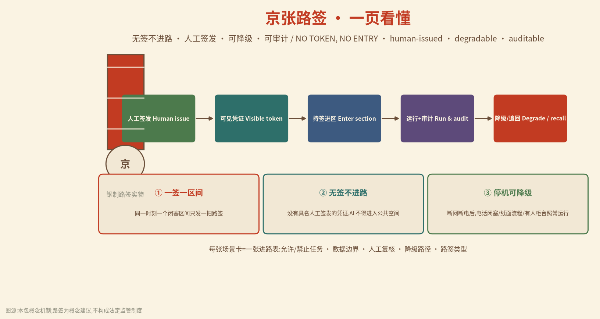
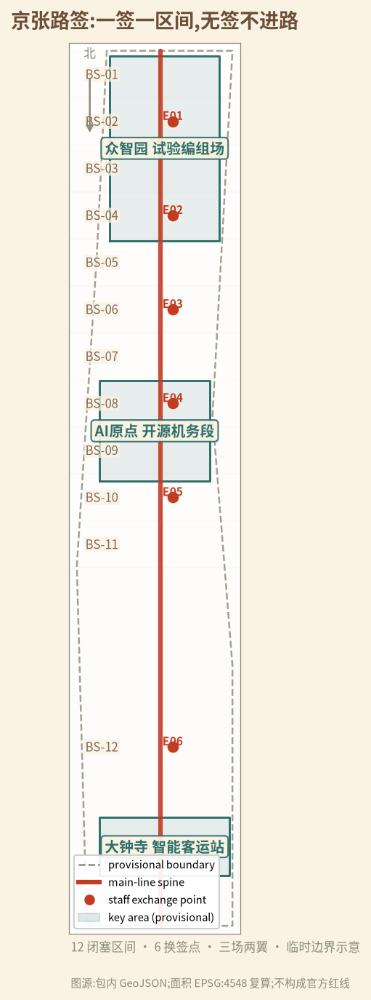
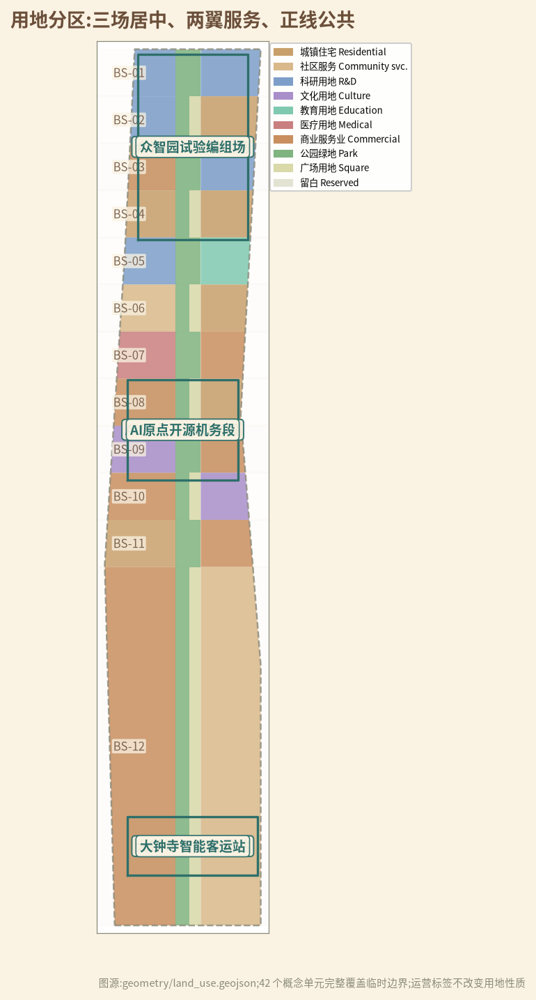
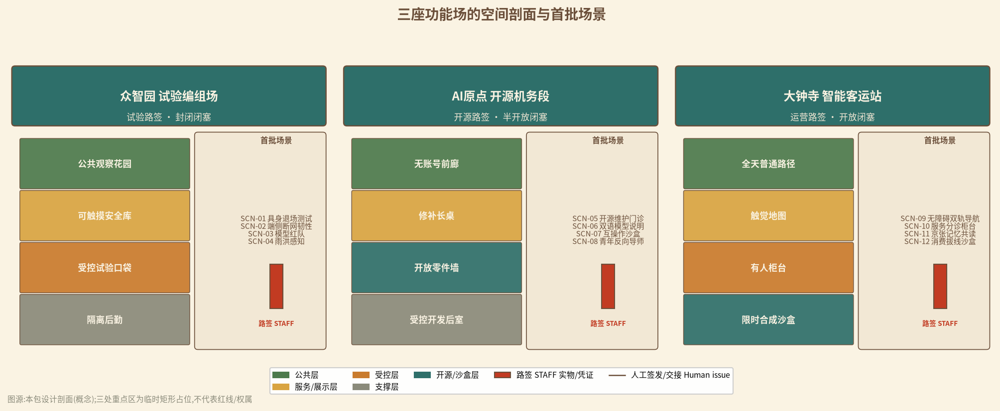
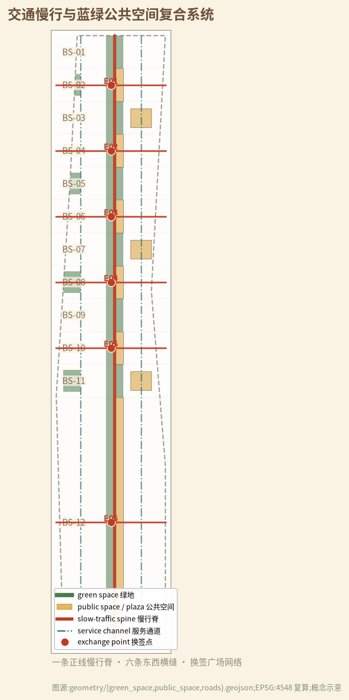
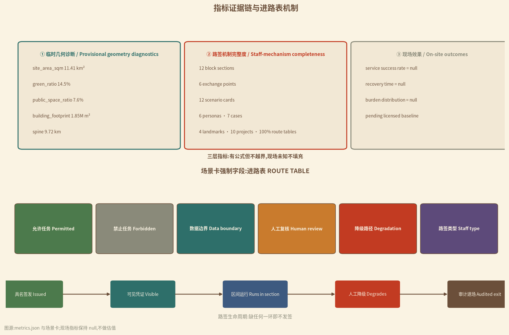

# 京张路签：一签一区间,无签不进路

> **ONE STAFF, ONE SECTION — NO TOKEN, NO ENTRY。** 早年的单线铁路,列车不拿到车站值班员交出的"路签",就不许进入前方区间;同一时刻、同一区间,只有一列列车握有路签,冲突在物理上就不存在。本案把这条运行了上百年的闭塞纪律,转译为 AI 创新带的城市协议:**任何 AI 服务要进入公共空间,必须先领到一张具名人工签发的"城市路签";一签一区间、无签不进路、停机可降级、全程可审计。** [assumption:A-STAFF-001] [assumption:A-STAFF-HISTORY-001] [source:STAFF-HISTORY-REF]

## 执行摘要

京张铁路 1905—1909 年由詹天佑主持建成,是中国人完全依靠自己力量修筑的第一条干线铁路,也是当时典型的单线运营铁路 [source:OFFICIAL-JINGZHANG-HISTORY]。今天,这条百年正线已部分转化为京张铁路遗址公园:一期 2.5 公里、16.8 公顷位于清华东路至知春路之间,恢复老线、修复清华园站房,并利用旧铁轨、道岔、机车等元素缝合两侧城市 [source:OFFICIAL-PARK-PHASE1-2023]。我们问的是:**当 AI 创新带每天都有新模型、新机器人、新场景进场,城市靠什么保证它们不冲突、不越界、不把公共空间占成私域?** 答案不是更多系统,而是一张更古老的凭证:路签。

本案以"路签"为核心机制,把全线组织为 **一廊三场、六点十二区**:一条沿旧铁路的正线公共廊(一廊);三处重点区转译为三座功能场——众智园=试验编组场、AI 原点=开源机务段、大钟寺=智能客运站(三场);六处"换签点"承担东西缝合与权限交接(六点);全线划分为十二个"闭塞区间",每区一把路签(十二区) [data:geometry/constraints.geojson#BS-01] [metric:block_section_count] [metric:exchange_point_count]。每个闭塞区间是"空间+数据+服务"的最小治理单元:空间上谁进谁出、数据上谁存谁读、服务上谁停谁换,都由一张可触摸、可核对、可追回的路签决定。

路签不是新系统,而是把信任做成可见对象:**纸面路签、金属路签、电子路签三级并存,具名人工签发,公众可查,审计可追。** 场景允许与否、数据边界在哪、谁复核、AI 停机后城市靠什么继续运转,全部写进每张场景卡的"进路表"(route table) [metric:staff_route_table_coverage_ratio]。AI 是列车,不是轨道;没有路签,再快的列车也停在站内。

空间上,本案在临时范围内划分 42 个概念用地单元,完整覆盖约 11.4 平方公里的临时总体范围(EPSG:4548 复算) [data:geometry/land_use.geojson] [metric:land_use_parcel_count] [metric:site_area_sqm]。概念绿地率约 14.5%、公共空间比例约 7.6% [metric:green_ratio] [metric:public_space_ratio];12 个闭塞区间、6 个换签点、约 9.7 公里正线慢行脊构成空间骨架 [metric:spine_length_m]。所有几何基于仓库临时粗略边界,官方 polygon 发布后整链重算 [data:geometry/site_boundary.geojson#SITE-001] [assumption:A-BOUNDARY-001]。

实施从"三个试点区间"开始,而不是一次铺满全线:众智园先发 2 个封闭试验区间,大钟寺先发 1 个开放体验区间;AI 原点开源区间以影子运行方式先做"模型说明与维护门诊" [metric:phasing_stage_count]。每一段都以"无签不进路"作为验收句:没有具名人工签发、没有可见凭证、没有降级人工流程、没有审计记录的场景,不发路签、不进区间 [data:risk.json]。

这不是反 AI 的方案。相反,它把"如何被信任"变成 AI 企业可出售的能力:产品不仅证明性能,还证明能持证进路、能人工降级、能退出不留锁。世界级 AI 街区的成熟标志不是设备永远在线,而是城市在任何技术周期里都能安全放行、稳妥刹车——这正是单线铁路教会现代城市的事 [depth:overall_spatial_structure] [depth:three_level_scope_framework]。

## 设计依据与资料清单

方案证据分四层。

第一层是征集公告与智能体任务书,只界定三层空间、三大定位、五大功能、三区两翼与六项任务,是任务响应的主控依据 [source:OFFICIAL-ANNOUNCEMENT] [source:AGENT-TASKBOOK] [standard:PROJECT-OFFICIAL-ANNOUNCEMENT]。

第二层是北京、海淀主管部门公开的公园建设与铁路遗产事实,用于建立"已有何物、为何更新"的背景 [source:OFFICIAL-PARK-PHASE1-2023] [source:OFFICIAL-JINGZHANG-HISTORY];AI 产业与智能体政策信息仅作产业语境,不推断到具体地块 [source:OFFICIAL-AGENTIC-AI-2026] [source:OFFICIAL-AI-ORIGIN-2026]。

第三层是仓库资料包、来源注册表与临时几何,用于可复算设计 [source:SITE-PACKAGE] [source:SOURCE-REGISTRY]。

第四层是路签制度科普与海外案例,只提取授权、降级与可审计机制,不把境外制度或数值移植为北京标准 [source:STAFF-HISTORY-REF] [source:CASE-NIST-AI-RMF];其余案例仅作机制比较 [source:CASE-AMSTERDAM-SENSING] [source:CASE-UNHABITAT-PEOPLE]。

| 资料状态 | 本版可做 | 本版绝不做 | 触发下一版的证据 |
|---|---|---|---|
| 官方公告与任务书 | 界定范围、任务、深度与语言 | 推定现状主体、投资或审批 | 官方补遗与征集文件附件 |
| 官方公开事实(公园一期、铁路史、AI 产业) | 建立"已有何物、为何更新"背景 | 推断到具体地块或工程线位 | 官方现状测绘与项目资料 |
| 临时范围与九组 GeoJSON | 拓扑检查、概念分区、面积复算 | 官方红线、权属、征拆或工程结论 | official polygon 与测绘成果 |
| 路签机制与海外案例 | 提取授权、降级、可审计机制 | 移植境外制度或数值 | 中国法律与专业团队深化 |

路签制度的历史事实来自公开科普条目:路签是允许列车占用区间的棒状凭证,列车到站不发给路签就不能通过;电子路签进一步把"每个闭塞区段同一时刻只对应一列车"写成数据逻辑 [source:STAFF-HISTORY-REF] [assumption:A-STAFF-HISTORY-001]。本案只借用其机制,不主张任何现行铁路规章适用于 AI 服务,也不把城市路签写成法定审批制度 [assumption:A-STAFF-001]。

完整来源、指标、标准、深度与任务覆盖存放在 `sources.json`、`metrics.json` 与三张矩阵中,正文只保留近端可核的引用。当前范围与重点区仍为临时几何,精度与替换条件如实披露 [data:geometry/site_boundary.geojson#SITE-001] [assumption:A-BOUNDARY-001]。

## 三层范围工作框架

三层不是三份各自成立的规划,而是同一套路签逻辑从产业战略到空间再到试点的传导链 [depth:three_level_scope_framework]。

| 层级 | 核心问题 | 本版交付 | 不能越过的边界 |
|---|---|---|---|
| 统筹研究范围 | AI 产业、人才、公共问题与区域伙伴如何互认凭证 | 路签生态、7 案例、5 区域接口、年度活动体系 | 不虚构伙伴、企业、资金或落地 |
| 总体设计范围 | 走廊怎样在技术更替中保持"凭票通行、无票停运"的秩序 | 一廊三场、六点十二区、42 个用地单元 | 临时 SITE-001 不是官方红线 |
| 三处重点区域 | 一次 AI 试验如何持证进入、降级退出、留下公共资产 | 12 场景进路表、三种场型剖面、10 个项目包 | 临时矩形不是地块、权属或工程范围 |

每层使用同一条验收句:**谁签发路签;凭证是否可见;无签时城市是否照常运行;停机后谁恢复、如何审计。** 统筹层若没有真实公共问题与接收方,不进入总体层;总体层若没有普通人工路径,不进入重点层;重点层若没有降级流程、维护主体与退出机制,不进入试点 [depth:risk_missing_data]。

临时总体范围约 11.4 平方公里 [metric:site_area_sqm],三处重点区按公告名称、顺序与约面积粗略定位为矩形占位 [data:geometry/key_areas.geojson#PROV-KEY-001] [assumption:A-KEYAREA-001]。official polygon 到位后必须锁定版本、重裁全部图层、重算面积与比例、重新归属场景与项目、更新中英图件与 PDF,并发布差异日志 [depth:metrics_recalculation] [assumption:A-BOUNDARY-001]。

## 统筹研究范围产业与未来城市研究

任务书三大定位在本案中翻译为三种"路签类型" [source:AGENT-TASKBOOK] [standard:PROJECT-AGENT-OPEN-CALL-TASKBOOK]:

| 三大定位 | 路签翻译 | 五大功能落点 |
|---|---|---|
| 百年京张文化带 | 从"自主修第一条铁路"的工程文化,转向"自主修可信 AI 基础设施"的凭证文化 | AI 治理全球话语权 |
| 都市AI生活体验带 | 公众在同一区间比较无签普通服务与持签 AI 服务 | AI+场景赋能新范式、智能化 AI 活力城市 |
| AI 融合创新带 | 研发、测试、开源、转化与公共使用按"进路-换签-退出"顺序运行 | AI 全栈自主创新体系、世界级 AI 创新生态 |

**三区两翼的路签回路。** 众智园试验编组场签发"试验路签",在封闭区间验证具身智能、端侧算力与安全降级 [source:OFFICIAL-AI-TESTFIELD-2026] [source:OFFICIAL-EMBODIED-PARK-2025];AI 原点开源机务段签发"开源路签",把通过验证的模型、适配器与说明文件开放为可复用公共件 [source:OFFICIAL-AI-ORIGIN-2026];大钟寺智能客运站签发"运营路签",在开放区间运行面向公众的产业体验与生活服务。中关村科技服务翼提供法律、标准、资本与专业服务方向,小月河场景赋能翼提供公共问题、生态与生活反馈方向;两翼不绕过三场的签发闸门 [depth:three_key_area_detailed_design]。

区域协同只提出待同意的"输入—可分享输出",不虚构伙伴:北纬社区可提出居民问题,未来科学城可提供测试方法方向,怀柔科学城可提供测量与校准方向,经开区可提供工程制造反馈,京津冀只接收去地点化协议、失败包与版本差异。任何坐标、个人数据、审批结论或合作名义不跨区默认流动 [assumption:A-PRIVACY-001]。

**七个全球生态案例压缩为七种可迁移机制** [metric:ai_ecosystem_case_count] [assumption:A-ECOSYSTEM-001]:

| 案例/框架 | 可迁移机制 | 京张转译 | 明确拒绝照搬 |
|---|---|---|---|
| Punggol Digital District [source:CASE-SINGAPORE-PUNGGOL] | 开放平台、产学城混合、运行环境试验 | 三场按封闭/半开放/开放分型验证 | 不复制新城规模、投资与中央平台 |
| NIST AI RMF [source:CASE-NIST-AI-RMF] | 全生命周期风险与停用记录 | 路签生命周期=进路-运行-降级-退场 | 不以框架替代专业安全责任 |
| Amsterdam Responsible Sensing [source:CASE-AMSTERDAM-SENSING] | 从自由、控制与隐私出发设计传感器 | 传感器必须有可见用途、凭证与拔线权 | 不把公共空间默认成数据源 |
| UN-Habitat People-Centred [source:CASE-UNHABITAT-PEOPLE] | 数字公共品、包容、小规模试点 | 无签普通服务与持签 AI 服务并行 | 不把非约束指南当审批依据 |
| Seoul Oil Tank Culture Park [source:CASE-SEOUL-OIL-TANK] | 工业遗产转为公共文化空间 | 路签、道岔、扳道员成为可触摸记忆 | 不复制建筑形式或改造结论 |
| 单线铁路路签闭塞 [source:STAFF-HISTORY-REF] | 一签一区间、人工交接、降级运行 | 城市路签=具名人工签发的空间+数据+服务凭证 | 不主张铁路规章直接适用 |
| 京张铁路建设史 [source:OFFICIAL-JINGZHANG-HISTORY] | 自主设计、精密测量、团队协同 | "自主修 AI"的工程纪律叙事 | 不把历史事实推演为工程结论 |

**命名、Logo 与视觉识别** 围绕"一张凭证"展开:中文主名"京张路签",英文主名 `THE JING-ZHANG TRAIN STAFF`,国际传播口令 `ONE STAFF, ONE SECTION — NO TOKEN, NO ENTRY`。Logo 方向为一枚钢制路签的端面:圆形轮廓内嵌三道环槽与"京张"篆字缩写,环槽代表"空间、数据、服务"三层授权边界;色彩使用轨枕褐、信号朱红、票证米黄与钢青,红只标"停",青标"通行",米黄标"人工凭证"。命名与 Logo 均为概念方向,不伪装官方标识 [assumption:A-VERB-001]。

## 总体设计范围城市更新与控规深度城市设计

总体结构为"**一廊三场、六点十二区**":一条沿旧铁路方向的正线公共慢行脊,串联三座功能场;十二个闭塞区间沿正线自北向南编号 BS-01—BS-12,每区一把路签 [data:geometry/constraints.geojson#BS-01] [metric:block_section_count]。六处换签点优先修补东西向缝合,同时承担权限交接 [metric:exchange_point_count];整体空间结构由约束图层直接支撑 [depth:overall_spatial_structure]。

42 个概念用地单元使用官方分类代码,完整覆盖临时 SITE-001,无空隙无重叠 [data:geometry/land_use.geojson#LU-001] [metric:land_use_parcel_count] [standard:MNR-LAND-USE-CLASSIFICATION-GUIDE]。科研、产业与公共服务贴近三场,居住与社区服务分布于东西两翼,正线以公园绿地与广场用地保持公共连续 [depth:land_use_layout] [standard:MOHURD-URBAN-DESIGN-MEASURES]。"闭塞区间""换签点"是运营叠加标签,不改变土地用途。

**十二个闭塞区间按风险分型:** BS-01—03 为众智园"试验闭塞",机器人与传感器只允许出现在物理受控的封闭口袋,普通路径与消防通道永不作为测试变量 [assumption:A-DELIVERY-001];BS-04—07 为 AI 原点"开源半开放闭塞",前廊只放可公开、可复用、可撤回的版本,知识产权与商业秘密留在受控后室;BS-08—12 为"运营开放闭塞",AI 服务只做增益,不做终局决定,真实支付、医疗、法律、执法与评分一律保留人工 [depth:traffic_rail_slow_parking] [assumption:A-AI-001]。

**六处换签点 E01—E06** 同时是东西横缝与权限交接点:每条横缝以人行优先连接两侧住区与园区,换签广场承担"凭证展示—人工交接—公众查询"三种功能 [data:geometry/public_space.geojson#PUBLIC-001] [metric:exchange_point_count]。换签点不是安检站,而是"看得见的信任":路签实物陈列、签发人具名、查询屏只显示凭证状态与有效期,不采集通行者个人信息 [depth:blue_green_public_space] [assumption:A-PRIVACY-001]。

**城市更新顺序** 是:保留现状公共价值 → 修补通行、遮荫、排水与人工服务 → 安装可逆构件 → 影子运行持签 AI → 审计 → 决定保留、修改或拆除。建筑高度、容积率、密度、退线、停车、市政容量与拆除量统一登记 unknown,概念体量不代表法定控制值 [assumption:A-CONTROLS-001] [depth:development_intensity_controls]。其中 FAR、高度与法定绿地率的具体值均待官方控制条件,不反推、不估值 [metric:floor_area_ratio] [metric:building_height_control_m] [metric:green_ratio_statutory]。

## 重点区域详细设计

三处重点区均使用组织方临时粗略 polygon,矩形边不代表道路、地块或权属 [data:geometry/key_areas.geojson#PROV-KEY-001] [assumption:A-KEYAREA-001]。

| 重点区 | 场型 | 路签类型 | 空间剖面 | 首批场景 |
|---|---|---|---|---|
| 众智园 AI 自主创新加速区 | 试验编组场 | 试验路签(封闭) | 公共观察花园—可触摸安全库—受控试验口袋—隔离后勤 | SCN-01—04 |
| 北京 AI 原点社区 | 开源机务段 | 开源路签(半开放) | 无账号前廊—修补长桌—开放零件墙—受控开发后室 | SCN-05—08 |
| 大钟寺 AI 产业聚集区 | 智能客运站 | 运营路签(开放) | 全天普通路径—触觉地图—有人柜台—限时合成沙盒 | SCN-09—12 |

**众智园=试验编组场。** 具身智能、端侧算力、红队测试只在有物理边界、人工急停与隔离后勤的封闭区间进行;公众观察花园是"安全库"而非品牌看台,可触摸测试障碍、阅读失败原因、比较断网模式 [source:OFFICIAL-AI-TESTFIELD-2026] [source:OFFICIAL-EMBODIED-PARK-2025]。测试通过不等于监管或产品批准;能源容量、平台资质、责任主体与生态条件另行核查 [depth:three_key_area_detailed_design]。

**AI 原点=开源机务段。** 空间以"修补"而非"路演"为中心:一张公共长桌承接开源 issue 门诊、接口适配、双语模型说明与青年反向导师课;模型卡、适配器、失败档案与维修手册是开放零件墙的常设内容 [source:OFFICIAL-AI-ORIGIN-2026] [source:OFFICIAL-AGENTIC-AI-2026]。AI 停机后,桌、工具、手册、纸面流程与人际网络仍能运行。

**大钟寺=智能客运站。** 先做地面、首层与静态信息,不以桥隧或地下连通的工程想象替代现状调查;触觉地图、有人柜台与京张记忆步道全天可用,消费智能体只在合成交易与逐步人工确认下限时出现 [source:OFFICIAL-PARK-PHASE1-2023] [depth:height_massing_character]。只要普通路径被堵、真实支付被接入、人工柜台离岗或申诉不可用,场景立即停运并交还路签。

## AI 创新生态、人才画像与 AI+ 场景

六类画像不是营销标签,而是路签权限设计的输入 [metric:persona_count]:研发与开源维护者、初创与产品团队、公园使用者与居民、老年与残障使用者、一线运营维护者、国际访客与区域伙伴。任何一类都不能替另一类同意;非参与者的通行、安静与普通服务优先 [assumption:A-AI-001]。

**12 张场景卡,每张绑定一张进路表** [metric:scenario_card_count] [metric:staff_route_table_coverage_ratio]:

| ID | 场景 | 场/区间 | 允许任务 | 数据边界 | 人工复核 | 降级路径 | 类型 |
|---|---|---|---|---|---|---|---|
| SCN-01 | 具身智能退场测试 | 众智园 BS-01 | 多主体安全与接管演练 | 仅试验场合成数据 | 安全员具名放行 | 纸面安全边界+急停 | 产业测试 |
| SCN-02 | 端侧算力断网韧性 | 众智园 BS-02 | 离线/降级/能耗比较 | 仅能耗聚合读数 | 运维员复核包络 | 人工运行表+电话闭塞 | 产业测试 |
| SCN-03 | 模型红队与失败陈列 | 众智园 BS-02 | 合成提示与版本复测 | 无个人数据 | 披露责任复核 | 失败卡+修补版本归档 | 产业测试 |
| SCN-04 | 雨洪感知与人工雨尺 | 众智园 BS-03 | 公开环境读数辅助养护 | 仅环境传感器 | 养护员比对人工雨尺 | 人工雨尺+养护卡 | 产业测试 |
| SCN-05 | 开源维护门诊 | AI 原点 BS-05 | issue 归类、依赖检查 | 仅公开代码库 | 维护者签到复核 | 修补手册+问题单 | 公共 |
| SCN-06 | 双语模型说明工坊 | AI 原点 BS-05 | 草拟通俗说明与差异 | 无训练数据上传 | 专业复核后发布 | 中英术语卡模板 | 公共 |
| SCN-07 | 城市服务互操作沙盒 | AI 原点 BS-06 | 合成工单检查转接 | 仅合成数据 | 服务台复核转接 | 开放适配器+纸面流程 | 公共 |
| SCN-08 | 青年反向导师课 | AI 原点 BS-06 | 自愿学习伙伴匹配 | 最小必要,可随时退出 | 监护人知情(未成年人) | 纸面任务卡+工具目录 | 公共 |
| SCN-09 | 无障碍慢行双轨导航 | 大钟寺 BS-09 | 临时障碍与路线辅助 | 无定位留存 | 现场核验普通路线 | 触觉静态地图+热线 | 公共 |
| SCN-10 | 公共服务分诊柜台 | 大钟寺 BS-10 | 公开目录检索与材料提示 | 无敏感材料滞留 | 有人柜台复核 | 纸面目录+电话路径 | 公共 |
| SCN-11 | 京张记忆共读 | 大钟寺 BS-11 | 清权史料检索与多语解释 | 仅公开清权史料 | 史实复核 | 实体时间线+撤回卡 | 公共 |
| SCN-12 | 消费智能体拔线沙盒 | 大钟寺 BS-12 | 合成预算与逐步确认 | 无真实支付接入 | 每步人工确认 | 人工比价板+申诉入口 | 公共 |

进路表是场景卡的强制字段:允许任务、禁止任务、数据边界、人工复核、降级路径、路签类型缺一不发签。生成式 AI 服务遵守《生成式人工智能服务管理暂行办法》对内容与责任的要求 [standard:GENERATIVE-AI-INTERIM-MEASURES] [source:DATA-SRC-GENERATIVE-AI-INTERIM-MEASURES];具体落点示例:SCN-06 双语模型说明工坊在发布前完成内容核验与来源披露,SCN-07 互操作沙盒禁止生成未经人工复核的转接指令。无障碍场景遵循《无障碍环境建设法》与国办 45 号文的适老要求,普通路径、纸面流程与有人柜台始终保留 [standard:BARRIER-FREE-ENVIRONMENT-LAW] [standard:ELDERLY-SMART-TECH-PLAN-2020-45];具体落点示例:SCN-09 导航同步发布触觉静态地图与现场核验路线,SCN-10 分诊柜台保留纸面目录与电话路径 [source:DATA-SRC-BARRIER-FREE-ENVIRONMENT-LAW] [source:DATA-SRC-ELDERLY-SMART-TECH-PLAN-2020-45]。

 **电子路签与 AI 技术架构(概念方向)。** 电子路签建议采用"数字凭证+版本化记录"结构:签发时生成带签发人标识与哈希链的凭证号,验证时不采集个人身份,追回时写入区块记录;具体加密、防篡改与互认协议由数据与信息安全专业团队按现行标准设计 [assumption:A-STAFF-001]。模型部署采用"端侧优先、云端备案、边缘可断"的分级策略:试验区以端侧与边缘推理为主,断网演练为必测项;模型准入需通过性能基线、安全测试与失败档案三项技术门槛,版本更新走 C0—C7 闸门 [depth:municipal_new_infrastructure]。性能基线建议至少包含两项可测指标:端侧推理响应延迟(如 P95 不超过 500 ms 的目标值)与能耗峰值(如不超过单机额定功耗的 80%),具体阈值由专业团队按设备与场景标定;安全测试至少覆盖故障模式(断网、断连、异常输入)下的人工接管演练。数据管道只处理公开或授权数据,清洗、脱敏与删除流程写入进路表 [assumption:A-PRIVACY-001]。

**电子路签字段原型(示例)。** 为便于工程评估,电子路签建议至少包含以下字段:`staff_id`(签发号)、`issuer`(签发人标识)、`issued_at`(签发时间)、`expires_at`(有效期)、`section_id`(授权闭塞区间)、`model_hash`(模型版本哈希)、`route_table_ref`(进路表版本)、`degrade_trigger`(降级触发条件)、`recall_status`(追回状态)。该字段集是概念草案,具体格式与加密方案由数据安全专业团队按现行标准设计 [assumption:A-STAFF-001]。

**电子路签的协议设想(供技术团队深化)。** 凭证结构建议分三层:①凭证头(签发区、区间号、有效期、签发人角色)②负载(服务授权范围、数据字段白名单、降级等级)③见证链(签发、换签、追回的哈希链,按时间顺序追加)。哈希链只存摘要不存原文,验证在端侧完成,链上记录用于事后审计而非实时授权。与现有政务数据平台的对接建议走"最小化互认":先以 CSV 白名单与签名摘要交换准入状态,不直接共享数据库;待数据与信息安全团队按现行标准设计互认协议后再扩展 [assumption:A-STAFF-001] [depth:municipal_new_infrastructure]。

**协议验证路径建议(概念)。** 为把协议从方向推进到可评审的技术规格,建议分三步验证:第一步,在路签沙盒(PRJ-01)内用模拟签发环境跑 12 周推演,验证凭证号生成、换签交接与追回记录的可复现性;第二步,选取一个试点区间做端侧验证试点,对比"哈希链摘要核对"与"人工运行表+电话闭塞"两条路径的交接时延与失败率;第三步,把验证结果整理为技术规格建议,交数据与信息安全专业团队评审。三步均不采集个人身份,验证数据只存聚合摘要 [assumption:A-STAFF-001] [depth:phasing_implementation]。

**非空间 AI 服务的路签边界。** 对不占用公共空间的纯数据服务(远程推理、后台模型),路签机制以"数据路签"形式适用:只授权公开/授权数据集的进入与输出,不授权个人敏感数据跨区流动;若服务最终输出进入公共空间展示或交互,则升级为对应区间的空间路签 [assumption:A-STAFF-001] [assumption:A-PRIVACY-001]。数据路签的签发与追溯建议登记:数据集标识与哈希、用途声明、消费方标识、数据删除或归档时间;任何未登记的数据流默认不授权,审计可按数据路签台账反查 [assumption:A-PRIVACY-001]。

每张卡还登记"停机条件与交还路签的流程":设备如何断电、数据如何删除或归档、人工流程如何接管、失败档案存于何处 [depth:municipal_new_infrastructure] [depth:retain_renovate_demolish]。现场绩效指标在获得许可基线前保持 null,不填 0、不填 100%、不做估值 [metric:live_service_success_rate] [assumption:A-METRICS-001]。

## 用地、建筑规模与拆改留方案

概念用地 42 个单元在临时 SITE-001 内闭合,不是法定面积 [data:geometry/land_use.geojson#LU-001] [metric:site_area_sqm]。用地结构沿正线分层:三场周边为科研与产业用地,两翼为居住、教育与社区服务,正线以 1401 公园绿地与 1403 广场保持公共连续,换签点局部保留 16 留白用地供试验缓冲 [standard:MNR-LAND-USE-CLASSIFICATION-GUIDE] [depth:land_use_layout]。

建筑图层只含概念占位体量,总轮廓面积约 185.3 万平方米用于内部关系诊断 [data:geometry/buildings.geojson#BLDG-001] [metric:building_footprint_area_sqm] [assumption:A-BUILDING-001]。任何真实建筑进入方案前,依次完成现状、年代、结构、权属、消防、文保、租赁、首层可达与维护调查;决策树只有四个出口:保留原状、修缮、可逆适配性再用、另行论证,证据不足时默认保留,不产生拆除清单 [depth:retain_renovate_demolish] [metric:construction_demolition_scale]。

三种场型都把公共层放在最外侧与首层:试验场的观察花园不穿过测试区;开源工场的公共长桌不进入受控数据后室;客运站的触觉地图与有人柜台不依赖商业租户。智能设备只挂接可逆插接轨,到期连电缆、基座与数据一并撤除,不留下围栏、断路、空屏或无人维护的"数字废墟" [depth:height_massing_character]。

## 交通、轨道、市政与公共服务设施

交通策略在当前资料上只成立两项:沿正线保持一条普通公共慢行脊,优先修补六处东西横缝 [data:geometry/roads.geojson#ROAD-001] [metric:spine_length_m]。两翼服务通道作为概念连接,不计工程线位 [metric:flank_road_length_m];具体交通组织属专业判断,本包只表达连接意图 [depth:traffic_rail_slow_parking]。它们是连接意图而非工程线位;轨道安全、道路红线、客流、路口、停车、桥隧与地下连通须由交通与轨道专业团队另行判断 [assumption:A-CONTROLS-001]。

低速机器人只在众智园物理受控试验区间出现,具名安全员能停、能推、能隔离;公园普通路径、无障碍净宽与消防通道永不作为"智能物流效率"测试变量 [assumption:A-DELIVERY-001]。SCN-09 导航必须同时发布触觉静态图与现场核验路线,算法建议不替代交通安全责任 [standard:BARRIER-FREE-ENVIRONMENT-LAW]。

市政与数字基础设施采用"普通系统先行、智能插件后置":雨水、照明、应急、通信、供电与消防基础功能按专业标准独立运行;传感器、边缘计算、机器人与模型接入统一可逆插接轨,登记电源、网络、数据、维护人与拔线动作 [depth:municipal_new_infrastructure]。断网、断电或供应商退出后,离线灯、人工雨尺、纸面目录与有人柜台继续提供最低服务——这就是"电话闭塞"式的城市降级。

公共服务坚持四条并行路径:现场人工、纸面材料、电话、无账号数字入口。AI 可以检索与翻译,不能作医疗诊断、法律结论、福利资格、信用评分、执法或真实支付决定 [assumption:A-AI-001] [standard:GENERATIVE-AI-INTERIM-MEASURES]。任何试点的人力、班次、维护、保险与持续预算在授权前保持 unknown [assumption:A-RESOURCES-001]。

## 蓝绿空间、公共空间与城市风貌

临时范围内概念绿地约 165.8 万平方米、比例约 14.5%,概念公共空间约 86.3 万平方米、比例约 7.6%,均只用于内部复算 [data:geometry/green_space.geojson#GREEN-001] [metric:green_ratio]。公共空间比例与蓝绿系统设计深度分别见对应图层与深度项 [data:geometry/public_space.geojson#PUBLIC-001] [metric:public_space_ratio] [depth:blue_green_public_space]。生态、树木、土壤、雨洪、河道、养护与文保条件尚未形成专项结论。

蓝绿系统是"无签公共红利"的载体:连续树荫与休息、雨洪可读、安静边界、普通步行与可维修材料,全部不依赖 AI。SCN-04 的传感器拔除后,人工雨尺、溢流路径、养护卡与雨花园仍可工作;任何自动控制不得把未经核实的数据直接写入排水或生态设施动作 [assumption:A-DELIVERY-001]。

**四个 AI 朝圣地标** [metric:landmark_count],全部可逆、不预设新建筑,附着遗产本体的动作必须经文保审查 [source:OFFICIAL-PARK-PHASE1-2023] [depth:height_massing_character]:

| 地标 | 位置 | 内容 | 意义 |
|---|---|---|---|
| 路签塔 | 众智园 BS-01 观察花园 | 可触摸路签实物墙+失败档案陈列 | 试验证的信任 |
| 换签钟 | AI 原点 BS-05 公共长桌 | 旧式站钟+换签时刻表+贡献者名单 | 人工交接的节律 |
| 扳道员记忆廊 | 正线中段换签点 | 铁路扳道员/调度员口述与工具展示 | 普通劳动者的城市记忆 |
| 信号灯阵 | 大钟寺 BS-11 站台 | 可逆信号灯组,红停青行对应路签状态 | 把授权状态变成公共语言 |

荣誉展示系统不只记录成功,也记录修补、停用、负面结果、维护劳动与公众纠错——这是路签文化的核心:凭证的价值在于它也会被追回。风貌采用轨枕褐、耐候钢、浅色木、矿物铺装与可替换金属件;界面低亮度、可关闭、无巨屏 [standard:MOHURD-URBAN-DESIGN-MEASURES]。AI 生成概念图只表达材料气质与人本场景,不证明建筑、边界、植被、人数或实施效果 [source:IMAGEGEN-CONCEPT-STAFF] [assumption:A-CULTURE-001]。

## 更新项目清单、实施政策与分期计划

十个项目包彼此可独立暂停 [metric:renewal_project_count] [depth:renewal_project_list]:

| 项目 | 核心交付 | 进入条件 | 失败后的默认动作 |
|---|---|---|---|
| PRJ-01 路签制度沙盒 | 进路表 schema、样例与签发流程 | 法律、数据、公众复核 | 归档,不进现场 |
| PRJ-02 正线公共脊审计 | 普通通行、休息、静态导向与人工求助基线 | 官方范围与现场走查 | 公示缺口,不接 AI |
| PRJ-03 众智园试验区间 | 两个封闭试验闭塞区间 | 责任、能源、生态、安全 | 停测、复原、公开失败 |
| PRJ-04 大钟寺开放区间 | 一个开放体验区间与有人柜台 | 交通、权属、消费者权益、无障碍 | 只保留普通服务 |
| PRJ-05 换签点横缝修补 | 六处东西缝合与凭证展示点 | 权属、交通、文保、无障碍复核 | 维持现状并隔离风险 |
| PRJ-06 AI 原点影子门诊 | 开源维护门诊与模型说明工坊 | 场地、知识产权、消防、运营 | 退回纸面门诊 |
| PRJ-07 可逆构件库 | 插接轨、离线灯、人工雨尺等 | G0—G5 | 拆除并恢复 |
| PRJ-08 四座朝圣地标 | 可逆地标与贡献/失败档案 | 来源、版权、文保、维护 | 不永久展示 |
| PRJ-09 路签发放监测 | 凭证生命周期与审计记录 | 数据、法律、独立评估 | 停发并公示 |
| PRJ-10 换签节 | 年度降级演练与开放复盘 | 许可、人员、预算、安全 | 缩小、延期或取消 |

**实施分期** [data:geometry/phasing.geojson#PHASE-01] [metric:phasing_stage_count] [depth:phasing_implementation]:近期(试验先发)——众智园两个试验区间 + 大钟寺一个开放区间先动,路签制度与审计在沙盒中跑通;中期(开源贯通)——AI 原点开源门诊、模型说明工坊与换签点横缝补齐,全线 12 区间完成普通基线审计;远期(常态运营)——全部区间进入持签运营,按季度发布"换签报告"(发放、降级、追回、失败档案统计)。

**路签治理组织(概念)。** 路签运行建议由四类具名角色分担,任何角色缺失即停发路签:签发员(审核进路表并签发凭证)、换签员(在换签点核验交接)、审计员(独立复核发放/追回记录)、区间守护人(维护普通服务与人工降级路径)。四类角色可由现有公共部门、社区与专业机构人员兼任:例如区间守护人可挂靠公园管理处、街道办或城管等现有管理体系,在现行职责框架内增加"普通服务与降级路径守护"任务,不预设新增编制;具体职责、权限与法律责任由专业团队按现行制度设计 [assumption:A-STAFF-001]。

**闭塞区间的自动停运条款。** 任一闭塞区间在以下条件之一出现时自动进入"停运且不排期"状态,而非仅暂停:连续无具名签发主体、进路表长期无法通过复核、或降级演练连续两次失败。停运区间只保留无签普通服务,待重新具备全部条件并公告后方可申请恢复 [assumption:A-STAFF-001]。

**场景准入 C0—C7 闸门。** 路签签发按七级递进:完成进路表登记 → 无签普通基线可运行 → 持签影子运行 → 具名人工值守下有限授权 → 常态化运营 → 独立审计通过 → 发放年度换签凭证。每一级都要求上一级证据闭环,任何一级失败即回到上一级,不跳过、不并行背书 [depth:phasing_implementation]。

**试点人力与预算量级(概念测算)。** 三个试点区间的最小运行编制建议为:每区间 1 名签发员(可兼换签)、1 名区间守护人、1 名兼职审计员,首年约 6—9 个全职等效岗位;路签制度沙盒(PRJ-01)最低启动条件为进路表 schema、一个模拟签发环境与一次 12 周推演,预算量级以常规公共咨询与数字化项目为参照估算。上述数字均为概念测算,不构成投资、采购或财政承诺 [assumption:A-RESOURCES-001]。

**测算依据与参照(概念)。** 人力编制参照同量级公共空间运维的常见配置:单点值守公共服务点位通常配置 1—2 名现场人员/班次,三班制约需 4—6 人,叠加轮休与兼职审计后与 6—9 个全职等效岗位的量级一致;签发与换签职能借鉴政务窗口"一窗受理"的轮岗惯例,不单独设常驻专职岗。预算量级参照两类公开项目区间:街道级数字化改造试点(数十万元级)与区级公共咨询项目(百万元内),路签沙盒 PRJ-01 取其中较低量级;正式投资与采购预算须在授权后由专业团队编制,本包不给出承诺数字 [assumption:A-RESOURCES-001] [depth:phasing_implementation]。

**成本与规模边界。** 试点人力、班次、维护、保险与预算在授权前保持 unknown [assumption:A-RESOURCES-001];本包只承诺"可独立暂停"的包结构,不给出投资测算或财政承诺 [assumption:A-VERB-001]。

项目成熟度 G0—G7 与场景准入 C0—C7 是两套独立闸门:一个场景通过不能替另一个场景背书,一个项目有预算也不能绕过"无签不进路"。年度运营含四项节奏:每周开源维修门诊;每月一次区间降级演练(全线下一年共 12 次) [metric:fallback_drill_count];每季度独立评估者、维护者与受影响公众共同发布换签报告;每年举办"换签节"——用中英双语展示发放、停用、追回与修补,把开放复盘做成一带最持久的品牌事件。换签节年度复盘强制设置"公众质询环节":受影响居民、社区代表与开发者可现场质询本年路签发放与追回记录,质询意见经汇总后进入下一年度发放决策参考,具体时长与组织方式由运营团队设计,不承诺自动采纳 [assumption:A-EVENT-001]。开发者与企业的转化路径不是"路演—招商",而是"公共问题—普通基线—持签增益—降级演练—开放资产—专业采用" [source:CASE-UNHABITAT-PEOPLE] [assumption:A-EVENT-001]。

**公众反馈进入路签机制的路径(概念)。** 社区与公众反馈建议通过三条具名通道进入路签系统,而非泛化的"意见箱":①换签报告——每季度与独立评估者共同发布,公众可对发放、停用与追回记录提出异议,异议进入审计员复核队列;②降级演练观察席——每月演练设公开观察席,受影响公众可旁听并记录降级路径的实际表现;③换签节提案窗口——年度换签节设提案环节,居民与企业可就场景边界、数据白名单与降级等级提出修订建议,修订建议进入 C0—C7 闸门评审。三条通道的产出都写入进路表修订记录,保证公众输入可追溯、可回应 [assumption:A-EVENT-001] [depth:phasing_implementation]。

## 指标体系、面积复算与合规矩阵

指标分三层。

- **临时几何诊断**:范围、绿地与公共空间比例有公式但无法定效力 [metric:site_area_sqm] [metric:green_ratio] [metric:public_space_ratio]。概念建筑基底面积由几何复算 [metric:building_footprint_area_sqm] [metric:spine_length_m]。
- **重点区与通道**:两翼服务通道与重点区面积复算见 [metric:flank_road_length_m] [metric:key_area_total_sqm]。

- **路签机制完整度**:区间、换签点与场景卡数量均可由包内 JSON 计数 [metric:block_section_count] [metric:exchange_point_count] [metric:scenario_card_count]。用户画像分类见画像章节 [metric:persona_count]。

- **案例与地标**:生态案例与朝圣地标数量见生态与风貌章节 [metric:ai_ecosystem_case_count] [metric:landmark_count]。更新项目与用地单元数量见项目清单章节 [metric:renewal_project_count] [metric:land_use_parcel_count]。

- **机制验收**:进路表覆盖与产业测试场景为机制验收指标 [metric:industry_test_scenario_count] [metric:staff_route_table_coverage_ratio]。年度演练与分期安排见运营章节 [metric:fallback_drill_count] [metric:phasing_stage_count]。

- **现场效果**:服务成功率、恢复时间、负担分布,目前全部 null [metric:live_service_success_rate]。

空间指标在 EPSG:4548 复算,来源、公式、单位、置信度逐项记录,并与空间复核脚本闭环校验 [depth:metrics_recalculation]。

合规矩阵覆盖公告 1.3/1.4/1.5 共 17 项与 agent.1—agent.6 共 6 项,任务书与公告分别作为主控依据 [standard:PROJECT-OFFICIAL-ANNOUNCEMENT] [standard:PROJECT-AGENT-OPEN-CALL-TASKBOOK]。

标准矩阵覆盖 5 项强制性标准与 4 项扩展标准,其中城市设计与控规口径分别登记 [standard:MOHURD-URBAN-DESIGN-MEASURES] [standard:MOHURD-CONTROL-DETAILED-PLANNING];用地分类与建筑设计深度标准亦逐项响应 [standard:MNR-LAND-USE-CLASSIFICATION-GUIDE] [standard:MOHURD-ARCH-DESIGN-DEPTH-2016]。设计深度矩阵覆盖 15 项专业判断 [depth:existing_conditions_diagnosis] [depth:metrics_recalculation]。

official polygon 到位后需全量复算,不能只手改标题数字 [assumption:A-BOUNDARY-001];现场指标在许可基线建立前保持 null,不填 0、不填 100%、不做估值 [assumption:A-METRICS-001]。

## 风险、版权与合规说明

最严重的失败不是模型输出错误,而是**凭证系统失灵后,AI 服务在无签状态下继续占用公共空间**。因此以下均为硬停止:无具名人工签发;无可见凭证;无降级人工流程;个人敏感数据越界;AI 作终局决定而无人工复核;公共路径、无障碍净宽或消防通道被测试占用;无法物理撤除的设备安装;文保、绿地、蓝线或交通安全约束未经审查 [data:risk.json] [depth:risk_missing_data]。

**三类高风险场景的应急响应预案(概念)。** 凭证系统失灵:立即切换到电话闭塞式人工流程,全部区间暂停 AI 服务,实物路签与纸面台账接管,48 小时内完成审计并公布;手工闭塞操作清单至少包括:纸质台账模板(区段/凭证号/交接人/时间)、通讯树(守护人→签发员→审计员→值班负责人)、广播与现场公告指令示例,具体模板由运营团队编制;AI 服务越界:区间守护人物理隔离、断开数据写入、冻结输出,按失败档案流程归档并追回路签;供应商退出或断供:可逆插接轨断电撤除,开放适配器与维修手册接管,数据按进路表删除或归档。独立审计员建议由具备数据、运营与规划资质的第三方机构人员担任,每季度至少一次,重大故障后加审 [assumption:A-STAFF-001]。

信息与资产只在可公开复核的资料边界内使用 [assumption:A-PRIVACY-001];隐私、版权、授权与实施风险由具名人工复核,任何一项证据不足就保持 pending,不用模型推断补齐。所有空间落地均为概念建议、参考方案或可供专业团队深化研究,不替代正式规划,不构成政府审定、项目立项、采购、合作、招商、投资或实施承诺 [assumption:A-VERB-001]。

文本、结构化资产、五张核心图、HTML、PDF 与交互编排为本次投稿原创制作;三张概念体验底图由内置 GPT Image 2 生成,人工复核无实体文字后重裁、调色与编排,逐资产记录模型、日期、提示词、用途、转换、权利与局限 [source:IMAGEGEN-CONCEPT-STAFF]。生成图只作 concept/presentation only,不作为现状、地图、数字、工程或公众意见证据。字体、代码、媒体、来源与第三方权利分别登记在 `report/copyright_statement.md` 与 `visual/assets/rights-ledger.json`。

离线网页不加载 CDN、远程字体、地图瓦片、API、iframe、表单或跟踪器;交互可键盘操作、支持减少动态并有静态后备;视频无自动播放,提供 poster、WebVTT 字幕与 Markdown 文字稿。中英文正文、核心图、HTML 与 PDF 独立同构,不互相矛盾。

## 参考资料

1. 北京市规划和自然资源委员会海淀分局,《百年京张AI创新带城市设计国际方案征集资格预审公告》,2026-05-09。
2. 中国国家博物馆,《詹天佑测绘京张铁路线的仪器》藏品说明,2021-03-30。
3. 北京市园林绿化局,《京张铁路遗址公园(一期)全面建成开放》,2023-06-26。
4. 北京市规划和自然资源委员会,《京张铁路遗址公园规划》公开解读,2021-12-16。
5. 北京市海淀区人民政府/中关村科学城,《北京AI原点社区》公开信息,2026-01-05。
6. 北京市科委/中关村管委会,《北京具身智能产业园》公开信息,2025-02-28。
7. 北京市人民政府,《北京市智能体(Agent)相关公开政策文件》,2026-07-23。
8. 百度百科(科普中国审核),《路签》条目,访问日期 2026-08-11。
9. JTC Corporation, Punggol Digital District 公开资料;NIST AI RMF Playbook;阿姆斯特丹市政府 Responsible Sensing;UN-Habitat People-Centred Smart Cities;首尔市政府 Oil Tank Culture Park——仅作机制比较。
10. 仓库资料包:brief/site-package/、data/source_registry.json、brief/site-package/geometry/provisional_boundaries.geojson。

完整机器索引以 `sources.json` 与三张矩阵为准;本包没有抓取或嵌入来源页面的图像、地图瓦片、Logo、视频、字体或大段原文,引用只取事实摘要与机制比较 [source:SITE-PACKAGE] [source:SOURCE-REGISTRY]。
