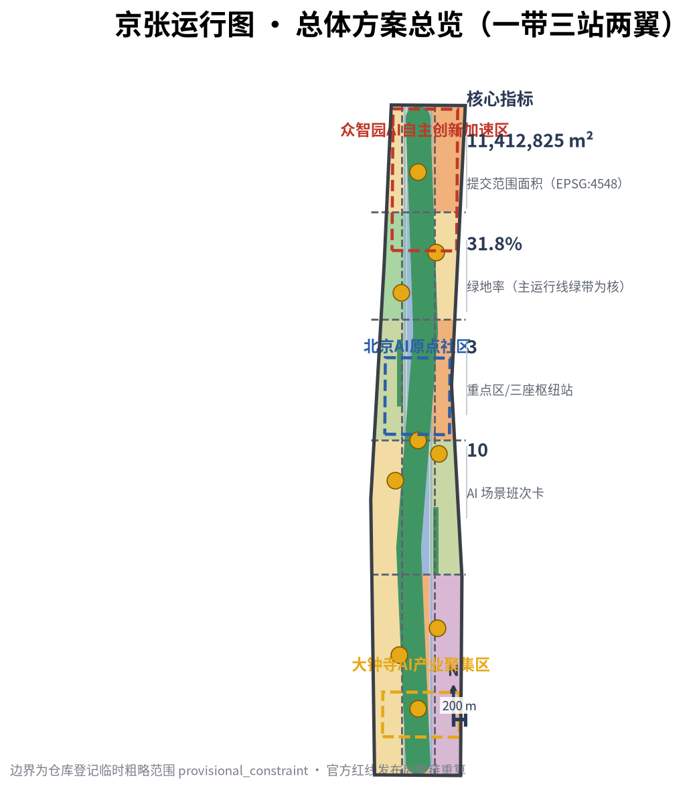
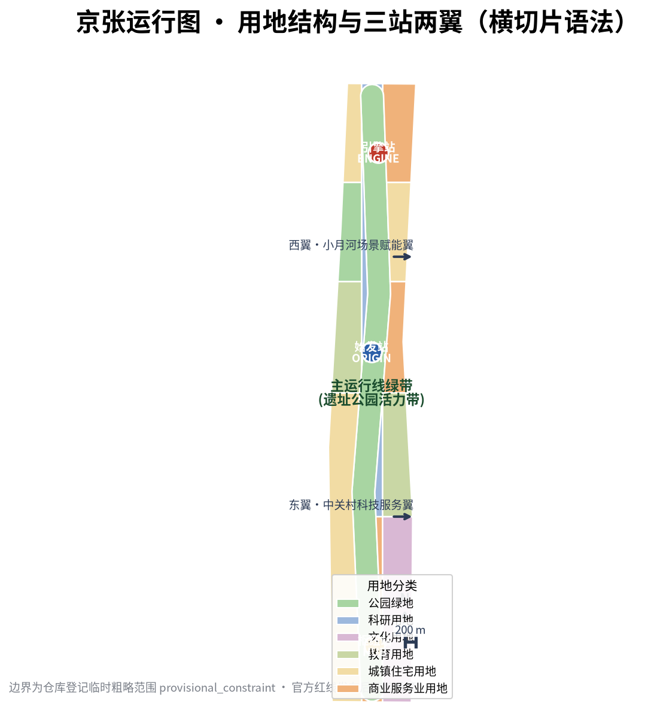
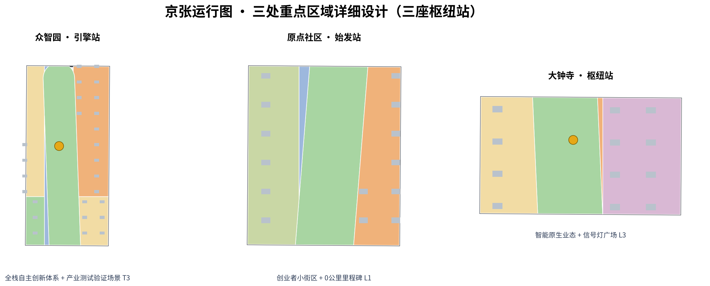
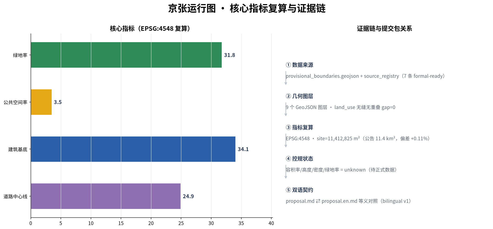
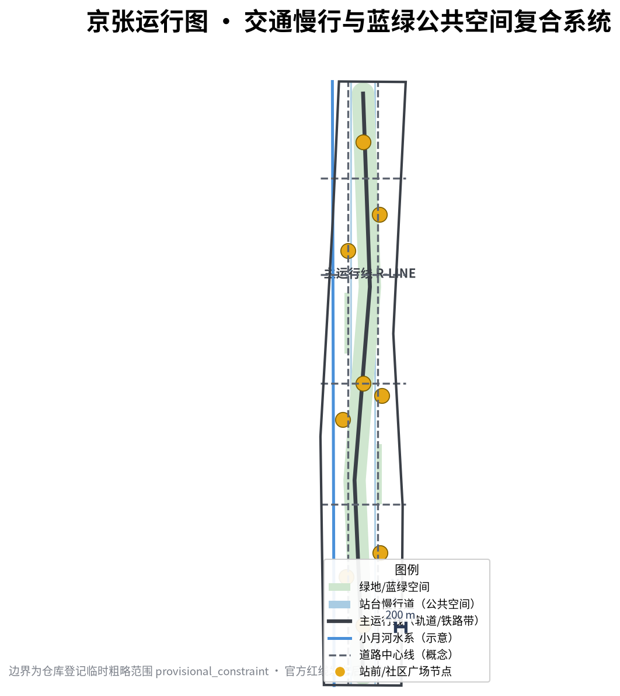

# The Jing-Zhang Running Diagram — Re-reading a Century of Railway Dispatching Wisdom as the Spatio-temporal Operating System of the AI Innovation Belt

> **THE JING-ZHANG RUNNING DIAGRAM**｜In 1909 the Jing-Zhang Railway opened to traffic — for the first time, Chinese engineers, Chinese rails and a Chinese running diagram connected Beijing with Zhangjiakou; the running diagram has since been the oldest "operating system" of this corridor: which train, at which time, on which line, stopping at which station, dispatched by whom. This proposal re-reads that century of dispatching wisdom as the **spatio-temporal operating system of the AI Innovation Belt**: one **main running line** (the Jing-Zhang Heritage Park Vitality Belt) running north-south, three **hub stations** (Zhongzhiyuan, the AI Origin Community, Dazhongsi) with distinct roles, two **wing branches** (the Zhongguancun Technology-Service Wing and the Xiaoyuehe Scenario-Empowerment Wing) delivering factors, ten **service-call cards** (AI scenarios) running on schedule, and one **annual running diagram** (event and operation system) dispatching the whole year. The task of urban design is to make every "innovation train" on this corridor — enterprises, talent, compute, scenarios — punctual, connected and queryable.

All spatial, activity, policy, investment-attraction and phasing content in this proposal is **openly co-created conceptual advice, reference schemes, or material for professional teams to deepen**; it does not replace formal planning, does not constitute government-approved conclusions, and does not constitute any parcel-level demolition/renovation, road redline, rail alignment or engineering-construction conclusion [source:AGENT-TASKBOOK]. Because official exact boundaries have not yet been released, all geometry is generated from the repository-registered provisional boundary; every boundary is `official_boundary=false` and `provisional_constraint`, used only for generation, display, discussion and intra-package self-checks [source:BOUNDARY-SOURCE] [source:KEY-AREA-SOURCE]. When official polygons are released, the boundary, key areas and all derived layers, metrics, figures, HTML and PDFs must be recalculated as a whole chain; this recalculation trigger is recorded in the assumptions [depth:metrics_recalculation] [depth:risk_missing_data].

> **Executive summary (seven lines)**
> 1. Core proposition: re-read the Jing-Zhang Railway's running-diagram wisdom as the spatio-temporal operating system of the AI Innovation Belt; "dispatching" is a more fitting organizing metaphor than "artery" or "weaving" — it answers space (alignment), time (schedules) and actors (dispatchers = operating community) at once.
> 2. Spatial structure: one belt, three stations, two wings — the main running line (Heritage Park Vitality Belt) runs north-south; three hub stations correspond to the three key areas; two wing branches deliver capital, IP, scenarios and life services.
> 3. Overall concept and naming: "The Jing-Zhang Running Diagram" (JZ-RD); logo direction: "three-color signal lights plus running-diagram polyline" — red/yellow/green as AI ethics colors, the polyline as a century of running traces.
> 4. Institutional core: the "Punctuality Protocol" — every "innovation train" (scenario, project, event) must publish its schedule, alignment and dispatcher; no riding without a ticket, no off-schedule running, no black-box dispatching; the running diagram itself is released as open source.
> 5. Evidence status: all geometry is based on the repository-registered provisional boundary (EPSG:4548 recalculated 11,412,825 m², consistent with the announced 11.4 km²); all spatial metrics are reproducible from the package GeoJSON [metric:site_area_sqm] [data:geometry/site_boundary.geojson#SITE-001].
> 6. Key disclosure: the three key areas and the overall boundary are provisional constraints; the whole package must be recalculated when official polygons are released; regulatory-planning conditions (FAR, height, density, green ratio, setbacks) are missing and recorded as pending [depth:risk_missing_data].
> 7. Decision boundary: all conclusions are conceptual advice; statutory control gaps are registered, not disguised as approved values.

## Design Basis and Source List

This formal proposal takes the Official Pre-qualification Announcement of the Centennial Jing-Zhang AI Innovation Belt International Urban Design Call issued by the Haidian Branch of the Beijing Municipal Commission of Planning and Natural Resources as its primary basis [standard:PROJECT-OFFICIAL-ANNOUNCEMENT], the excerpted open-call taskbook for global AI agents as its secondary basis [standard:PROJECT-AGENT-OPEN-CALL-TASKBOOK] [source:AGENT-TASKBOOK], and the maintainer-registered provisional boundaries, key areas, enums, indicators and source inventory under `brief/site-package/` as its machine-readable basis [source:SITE-PACKAGE]. Before generation, the agent read `design_brief.json`, `allowed_design_space.json`, `sources.json`, `enums/`, `ranges/`, `schemas/` and `data/source_registry.json`; every design judgment is decomposed into traceable sources, reproducible metrics, checkable layers and human-reviewable assumptions [source:SOURCE-REGISTRY] [depth:existing_conditions_diagnosis].

Source-use boundaries are as follows: the registry currently lists 7 formal-ready sources, 1 background-only source and 1 provisional-only source; the agent must not upgrade background-only or provisional-only material into official boundaries, statutory controls, formal scoring evidence or government implementation commitments [source:SOURCE-REGISTRY]. The official announcement gives the areas and textual four-direction bounds of the three scope levels and three key areas, but no verifiable-coordinate polygon; the pre-qualification document download requires a password, and no official redline is publicly available [source:OFFICIAL-ANNOUNCEMENT]. All geometry therefore uses the provisional boundary (`PROV-SITE-001` and `PROV-KEY-001/002/003`), with precision limits continuously disclosed in `sources.json`, `assumptions.json` and this narrative.

The absence of official key-area polygons does not block content scoring, but all areas and metrics in this package are explicitly labeled "recalculated on provisional boundary"; when official data is released, the whole chain must be recalculated along the path registered in `assumptions.json` [metric:site_area_sqm] [depth:metrics_recalculation]. Regulatory-planning conditions (floor area ratio, building height, building density, green ratio, setbacks) are not publicly available; all development-intensity judgments in this narrative are written as conceptual volume proposals labeled "pending official control conditions" [depth:development_intensity_controls] [depth:risk_missing_data].

## Three-Level Scope Framework

The proposal organizes work along the three scope levels defined by the announcement, mapping each level to one "dispatching layer" of the running diagram [standard:PROJECT-OFFICIAL-ANNOUNCEMENT] [depth:three_level_scope_framework]:

- **Coordinated research area (43.6 km²)**: north to the 5th Ring Road, east to the Jingzang Expressway, south to Xizhimen Outer Street, west to Wanquanhe Road. This layer answers the "global rail network" of the running diagram: where the AI industry chain lies, where talent comes from, how compute and data flow, and how the future city form evolves. Working depth: industry strategy and future-city-form research [data:geometry/site_boundary.geojson#SITE-001].
- **Overall design area (11.4 km², the submitted boundary)**: the 1–2 km city and industry zone around the Jing-Zhang Heritage Park. This layer answers the "main line" of the running diagram: land use and spatial structure of the main running line green belt, three hub stations and two wing branches, at regulatory-planning urban-design depth [metric:site_area_sqm].
- **Key detailed design area (368.4 ha)**: from north to south, the Zhongzhiyuan AI Autonomous-Innovation Acceleration Area, the Beijing AI Origin Community and the Dazhongsi AI Industry Cluster. This layer answers the "station-yard design" of the three hub stations: function and format, building scale, retain/renovate/demolish classification, public-space connectivity and traffic organization, at comprehensive-implementation-plan urban-design depth [data:geometry/key_areas.geojson#PROV-KEY-001] [data:geometry/key_areas.geojson#PROV-KEY-002] [data:geometry/key_areas.geojson#PROV-KEY-003].

The three levels cascade as "global network — main line — station yard", each with its own layers, metrics and depth items [depth:three_key_area_detailed_design]. `SITE-001` and the three `KEY_AREA` features are all `provisional_constraint`: they are inferred from the announcement's textual bounds, location clues and approximate areas (EPSG:4548 deviations +0.02% to +0.43%), usable only for generation, display, discussion and self-checks, not as official redline, approval basis or precise-area basis [source:BOUNDARY-SOURCE] [source:KEY-AREA-SOURCE]. When official polygons are released, `geometry/site_boundary.geojson`, `geometry/key_areas.geojson`, all derived layers and `metrics.json` must be recalculated as a whole [depth:metrics_recalculation].

## Coordinated Research Area: Industry and Future City Research

### Three positionings, five functions and the three-areas-two-wings loop

The announcement establishes three positionings — **Centennial Jing-Zhang Culture Belt, Urban AI Life Experience Belt, AI Fusion Innovation Belt**; the taskbook adds five functions — **AI full-stack autonomous innovation system, world-class AI innovation ecosystem, AI+ scenario empowerment paradigm, intelligent vibrant AI city, global voice in AI governance** — and the "three areas, two wings" spatial skeleton [standard:PROJECT-AGENT-OPEN-CALL-TASKBOOK] [source:AGENT-TASKBOOK] [depth:overall_spatial_structure].

This proposal re-reads the three areas and two wings in running-diagram grammar: the three key areas are **three hub stations** — Zhongzhiyuan = "Engine Station" (AI full-stack autonomous innovation and global AI-governance voice), AI Origin Community = "Origin Station" (world-class AI innovation ecosystem), Dazhongsi = "Hub Station" (AI-native new business formats); the two wings are **two branch lines** — the Zhongguancun Technology-Service Wing (east; global factor allocation, Zhongguancun IP and capital empowerment) and the Xiaoyuehe Scenario-Empowerment Wing (west; AI scenario empowerment and the intelligent vibrant AI city) [source:AGENT-TASKBOOK]. The synergy loop is "station—line—wing": hub stations dispatch innovation trains (enterprises, talent, projects), the main running line delivers scenarios and public experience, the wing branches return capital, IP, life services and governance feedback, forming a sustainable factor cycle [depth:overall_spatial_structure].

### Naming system and logo direction (agent.1)

- **Primary name**: 京张运行图 (The Jing-Zhang Running Diagram, JZ-RD).
- **Naming system**: the main line is the "R-Line"; the three hub stations are named "Engine Station (Zhongzhiyuan) / Origin Station (AI Origin Community) / Hub Station (Dazhongsi)"; the wings are the "East Wing·Zhongguancun Technology-Service Branch" and the "West Wing·Xiaoyuehe Scenario-Empowerment Branch"; AI scenarios are uniformly called "service-call cards"; the event and operation system is the "annual running diagram". All names are conceptual and do not involve unauthorized use of existing trademarks or names [source:AGENT-TASKBOOK] [depth:overall_spatial_structure].
- **Logo direction**: "three-color signal lights + running-diagram polyline" — red/yellow/green dots form a signal (red = safety boundary, yellow = human review, green = open running), and a graduated polyline passes through the three lights (the polyline = a century of running traces; the three lights = the three hub stations); auxiliary graphics abstract station canopies and rail sleepers. The relationship between the logo and the signage system, and the rights-clearing status of fonts and icon materials, are registered in `assumptions.json` and the copyright statement [source:AGENT-TASKBOOK].
- **Logo VI starter kit**: this package ships `assets/media/logo-vi.svg` (vector master, losslessly scalable) and `assets/media/logo-vi.png` (preview bitmap) for reviewers and downstream design teams; the VI specification page (minimum size, clear space, reverse and monochrome versions) is listed for the next brand-deepening step [depth:brand_identity]. The three signal-light colors also enter the signage system as "AI ethics tricolor": red = safety boundary, yellow = human review, green = open running.

### Global AI innovation ecosystem cases (agent.2, 5–8 cases)

| Case | Location | Lesson transferable to Jing-Zhang (convertible mechanism) |
| --- | --- | --- |
| King's Cross / Central Saint Martins | London, UK | A railway industrial heritage (granary, coal yard) transformed into a research-and-education cluster: **heritage as an innovation container**; old factories and warehouses along the main line can serve as industrial and exhibition space [source:OFFICIAL-ANNOUNCEMENT] |
| Stanford–Sand Hill Road corridor | Silicon Valley, USA | A walkable loop of university, capital and enterprise: configure research, investment and incubation within a **15-minute walking circle of each hub station** |
| Kendall Square | Boston, USA | MIT's vertical "lab—translation—pharma" cluster: the Origin Community suits a "small blocks, dense network, high interaction" organization |
| one-north | Singapore | Government-led "test—display—live" trinity: Zhongzhiyuan's industry test/validation scenarios can borrow its "living lab" mechanism |
| Tel Aviv start-up ecosystem | Israel | Civil conversion of military technology and dense founder communities: Dazhongsi suits dual "technology translation + consumption scenarios" |
| Hangzhou Future Sci-Tech City | Hangzhou, China | Leading-enterprise ecosystem co-existing with start-up towns, talent apartments first: housing and life services on the wings must be supplied in the same batch as industry space |

Case conclusions (all conceptual translations, not replication promises): ① innovation ecosystems need **walkable small-block districts**; ② heritage and old buildings are the first-choice low-cost innovation containers; ③ "test scenarios" are the core facility distinguishing an AI district from a traditional industrial park; ④ talent apartments and life services must be delivered in the same batch as industrial space [source:AGENT-TASKBOOK] [depth:overall_spatial_structure].

### Factor mechanisms: land, space, industry, capital, talent, compute, data, scenarios

Eight factor types are organized in running-diagram logic: **land and space** — innovation space supply is prioritized along the main line; **industry** — differentiated division among the three stations (Engine = full-stack autonomy, Origin = ecosystem incubation, Hub = new-format translation); **capital** — an open-source community fund and scenario-open revenue feed back into public-space operation (conceptual); **talent** — talent apartments and Origin-Station settlement services around hub stations; **compute** — edge-compute and public compute-pool interfaces reserved at Zhongzhiyuan; **data** — public data opened through "scenario sandboxes" with privacy and human-review boundaries labeled; **scenarios** — ten service-call cards form the annual open scenario list [source:AGENT-TASKBOOK] [source:OFFICIAL-ANNOUNCEMENT] [depth:municipal_new_infrastructure]. All mechanisms are conceptual and do not constitute fiscal commitments, investment-attraction arrangements or policy promises [source:AGENT-TASKBOOK].

### Regional synergy: open interfaces with citywide innovation clusters (agent.2 supplement)

This belt is not self-enclosed: following the taskbook "regional synergy" dimension, an **open-interface framework** with citywide innovation clusters is proposed (conceptual; collaboration facts must be stated only after source verification, no fabricated cooperation) [source:AGENT-TASKBOOK]:

- **Beiwei community (Zhongguancun Science City North)**: interface = compute/model synergy — Zhongzhiyuan edge-compute pilots form an "edge—cloud" test link with the northern cluster of large models (suggested).
- **Future Science City**: interface = achievement translation — the Zhongzhiyuan test/validation cluster hosts piloting and scenario validation of basic-research results (suggested).
- **Huairou Science City**: interface = instruments and data sandbox — desensitized public data from large research facilities opens in sandbox mode at Zhongzhiyuan (suggested, subject to data compliance).
- **Yizhuang (Beijing Economic-Technological Development Area)**: interface = intelligent-connected-vehicle scenario mutual recognition — the Dazhongsi low-speed delivery pilot and the Yizhuang demonstration zone mutually recognize test rules and safety standards (suggested).
- **Beijing-Tianjin-Hebei**: interface = Jing-Zhang corridor extension — scenario lists, the open Running Diagram and talent-mobility mechanisms replicate along the existing Jing-Zhang corridor toward Zhangjiakou and Xiong'an (suggested).

All of the above are open-interface suggestions pending verification and do not constitute confirmed cooperation arrangements; collaboration facts must be registered one by one after official or authoritative confirmation [depth:risk_missing_data] [source:AGENT-TASKBOOK].

## Overall Design Area: Urban Renewal and Regulatory-Plan-Level Urban Design

### Spatial structure: one belt, three stations, two wings

The spatial structure of the overall design area (11.4 km²) is **"one belt, three stations, two wings"**: the **belt** = the main running line green belt (Jing-Zhang Heritage Park Vitality Belt, running north-south, a conceptual green corridor about 360 m wide containing parkland, station-platform walkways and public-space nodes) [data:geometry/land_use.geojson#LU-GREEN-BELT] [metric:green_belt_land_sqm]; the **three stations** = three hub stations (corresponding to the three key areas, each with a station forecourt and slow-traffic connections) [data:geometry/public_space.geojson#ST-01] [data:geometry/public_space.geojson#ST-02] [data:geometry/public_space.geojson#ST-03]; the **two wings** = the east Zhongguancun technology-service corridor and the west Xiaoyuehe scenario-empowerment corridor [data:geometry/land_use.geojson#LU-001] [data:geometry/land_use.geojson#LU-002].

### Renewal targets and functional mix

Land use follows the running-diagram "cross-section (carriage)" grammar: the main running line is parkland (1401), around the three hub stations are research land (0802) and commercial-services land (05), and the wings carry education (0804), residential (0701) and culture (0803) land, forming a "industry in the middle, life on the wings" functional mix [data:geometry/land_use.geojson] [metric:industry_research_land_sqm] [metric:residential_land_sqm]. This mix is conceptual: official regulatory land-use conditions are missing and the mix must be recalculated once regulatory land use is confirmed [depth:land_use_layout] [depth:development_intensity_controls].

### Renewal framework and implementation policies

The renewal framework is organized in three classes: **retain** — the Jing-Zhang Railway Heritage Park and its historic structures, and mature existing communities; **renovate** — old factories, warehouses and low-efficiency buildings converted into industrial space, exhibition space and community services (station culture halls, developer workshops); **new-build** — the three hub-station complexes and forecourts, and community service facilities on the wings [depth:retain_renovate_demolish] [data:geometry/phasing.geojson#PH-01]. Suggested implementation policies (conceptual) include scenario-open licensing, low-rent industrial-space replacement, a public-space co-governance fund, and developer-community co-building agreements [source:AGENT-TASKBOOK]. Any parcel-level demolition/renovation conclusion requires re-verification by professional teams after existing-building, ownership and regulatory data are available [depth:risk_missing_data].

## Detailed Design of Key Areas

All three key areas are designed at comprehensive-implementation-plan urban-design depth, uniformly organized as "positioning + spatial structure + building renewal + traffic/slow mobility + public space + AI scenarios + implementation risk" [depth:three_key_area_detailed_design]. All three key-area polygons are provisional; the conclusions below are directional only and must be recalculated when official polygons are released [source:KEY-AREA-SOURCE].

### Zhongzhiyuan AI Autonomous-Innovation Acceleration Area (Engine Station, 192.1 ha)

- **Positioning**: the "Engine Station" of the AI full-stack autonomous innovation system — the source of an autonomous technology stack from foundation models and chip adaptation to industry applications; hosts industry test/validation scenarios and edge-compute pilots [source:AGENT-TASKBOOK].
- **Spatial structure**: with the "Engine Tower" (conceptual landmark) at its core, an "full-stack innovation loop" is organized around the forecourt: basic-research cluster—engineering cluster—test/validation cluster—accelerator cluster [data:geometry/public_space.geojson#ST-03].
- **Building renewal**: retain the ecological background along the 5th Ring Road, convert existing industrial buildings into "full-stack laboratories", and add test workshops and compute support (conceptual volumes, not engineering conclusions) [depth:retain_renovate_demolish].
- **Traffic and slow mobility**: a "test-vehicle-priority" dedicated corridor, separated from regular slow traffic, via the northern main line and transverse connectors [data:geometry/roads.geojson#RD-H4].
- **AI scenarios**: edge-compute and data-sandbox test ground (T3), full-stack achievement display (service-call cards in Chapter 6).
- **Implementation risk**: the industrial positioning depends on the leading-enterprise ecosystem; open onboarding agreements and public test facilities reduce single-point dependence [depth:risk_missing_data].

### Beijing AI Origin Community (Origin Station, 104.3 ha)

- **Positioning**: the "Origin Station" of a world-class AI innovation ecosystem — the first stop for AI talent and founders: settlement, incubation, exchange and display [source:AGENT-TASKBOOK].
- **Spatial structure**: with the "0 km Milestone" (conceptual landmark, see Chapter 9) as the origin, a founder district of "small blocks, dense network" is organized; the forecourt serves daily pitching and exchange [data:geometry/public_space.geojson#ST-02].
- **Building renewal**: retain the community fabric and education land around Wudaokou, convert street-front shops into "founders' living rooms", and add talent apartments and incubation buildings (conceptual volumes) [depth:retain_renovate_demolish].
- **Traffic and slow mobility**: repair slow-traffic gaps around Wudaokou and provide "first train" commuter connections and campus shuttle branches [data:geometry/roads.geojson#RD-H3].
- **AI scenarios**: morning AI commuter shuttle (B01), developer night train (B02), AI health station (B04, Chapter 6).
- **Implementation risk**: complex building and ownership conditions around universities; any renewal must be preconditioned on existing-condition and ownership data [depth:risk_missing_data].

### Dazhongsi AI Industry Cluster (Hub Station, 72.0 ha)

- **Positioning**: the "Hub Station" of AI-native new business formats — the interchange node of AI consumption, business and display, connecting industry with urban life [source:AGENT-TASKBOOK].
- **Spatial structure**: with the "Signal-Light Plaza" (conceptual landmark) at its core, a composite hub of "AI consumption street + business towers + exhibition hall" [data:geometry/public_space.geojson#ST-01].
- **Building renewal**: leveraging the Dazhongsi station TOD conditions, convert surrounding low-efficiency commercial space into AI-native format carriers and add a hub complex (conceptual volumes) [depth:retain_renovate_demolish].
- **Traffic and slow mobility**: organize rail interchange, robot-delivery branch lines and a commercial slow loop [data:geometry/roads.geojson#RD-H1] [data:geometry/roads.geojson#RD-E1].
- **AI scenarios**: robot delivery branch (B07), enterprise-service express (B06, Chapter 6).
- **Implementation risk**: commercial renewal involves existing tenants and ownership; market feasibility and ownership data must be verified [depth:risk_missing_data].

### Node-level design (9 nodes, conceptual)

Below the district-level design, 9 node-level designs are added (3 per district, `confidence=low`, conceptual) so that professional teams can deepen them directly into single-building schemes in the next stage; every node maps to in-package geometry features, verifiable in `geometry/*.geojson` [depth:key_node_design] [metric:key_node_count].

| Node | District | Core function | AI scenario | Geometry basis |
| --- | --- | --- | --- | --- |
| N-Z01 Engine Tower · Full-stack Innovation Loop Core | Zhongzhiyuan | Forecourt as the core of the "full-stack innovation loop"; the conceptual "Engine Tower" landmark hosts full-stack achievement display and the annual "Departure Season" main venue | B06 | [data:geometry/public_space.geojson#ST-03] |
| N-Z02 Data Sandbox Test Ground | Zhongzhiyuan | Enclosed ground inside the test/validation cluster for T3 edge-compute and public-data sandbox testing | T3 | [data:geometry/land_use.geojson#LU-001] |
| N-Z03 5th-Ring Ecological Green Wedge | Zhongzhiyuan | Junction of the ecological background along the 5th Ring Road and the main-line green belt; ecological observation and slow-mobility waystation | B09 | [data:geometry/land_use.geojson#LU-GREEN-BELT] |
| N-O01 0 km Milestone Plaza | Origin Community | Forecourt with the "0 km Milestone" landmark and pitch steps; daily pitching and rotating governance forum venue | B02, B10 | [data:geometry/public_space.geojson#ST-02] |
| N-O02 Founders' Living-Room Street | Origin Community | Street-front shops converted into "founders' living rooms + shared workstations + 24h open corner"; enterprise-service stop | B06 | [data:geometry/roads.geojson#RD-H3] |
| N-O03 First-Train Connector Station | Origin Community | Wudaokou slow-traffic gap repair point; morning commuter interchange with "first train" timetable installation | B01 | [scenario:ai-traffic-walkability] |
| N-D01 Signal-Light Plaza | Dazhongsi | Forecourt with the "Signal Light" landmark (red-yellow-green = AI ethics tricolor); governance-service rotation point | B10 | [data:geometry/public_space.geojson#ST-01] |
| N-D02 AI-Native Consumption Street | Dazhongsi | Low-efficiency commercial space around TOD converted into an AI consumption experience street; delivery branch along the street | B07 | [data:geometry/roads.geojson#RD-H1] |
| N-D03 Hub Complex · AI Exhibition Hall | Dazhongsi | New hub complex at the TOD core, with AI exhibition hall and enterprise-service counters | B06, B08 | [data:geometry/land_use.geojson#LU-003] |

The deepening order of the 9 nodes follows the phasing: P1 first delivers the three forecourt nodes N-O01/N-D01/N-Z01 (combined with forecourt works), P2 completes the three industry and consumption nodes N-O02/N-D02/N-Z02, P3 finishes the three slow-mobility and ecological nodes N-O03/N-D03/N-Z03; every node must be re-verified by professional teams once existing-condition, ownership and official boundary data are available [depth:phasing_implementation].

## AI Innovation Ecosystem, Personas, and AI+ Scenarios

### Ten service-call cards (AI scenario cards, agent.3)

AI scenarios are organized as "service calls": each scenario is a scheduled service with an explicit line (spatial location), time (operation rhythm), dispatcher (operating body) and passengers (service targets). The ten cards are [source:AGENT-TASKBOOK] [depth:overall_spatial_structure]:

| No. | Service-call name | Line/location | Service target | Scenario registry |
| --- | --- | --- | --- | --- |
| B01 | Morning AI Commuter Shuttle | Origin Community—Zhongzhiyuan | Commuting developers | ai-traffic-walkability |
| B02 | Developer Night Train | Origin Community forecourt | Developers, students | enterprise-service-copilot |
| B03 | Weekend Family Local | Main running line green belt | Residents, families | ai-traffic-walkability |
| B04 | AI Health Station | Community nodes on the wings | Residents, seniors | ai-health-service-navigation |
| B05 | Jing-Zhang Culture Guide Train | Whole main running line | Visitors, citizens | ai-cultural-guide |
| B06 | Enterprise-Service Express | Zhongzhiyuan—Dazhongsi | SMEs, founders | enterprise-service-copilot |
| B07 | Robot Delivery Branch | Around Dazhongsi station | Merchants, consumers | robot-delivery-low-speed |
| B08 | Public-Safety AI Patrol Call | Around the three hub stations | Public | public-safety-operations-review |
| B09 | Slow Greenway Cycling Call | Wing greenways | Cyclists, commuters | ai-traffic-walkability |
| B10 | City Forum·AI Governance Call | Rotating station forecourts | Citizens, developers, managers | Governance call (mapping in compliance_matrix) |

The scenario-space-operation mapping, data sources, privacy boundaries, human review and operating bodies of every card are detailed in `compliance_matrix.json` and `visual/index.html`; this narrative does not duplicate the machine index [source:AGENT-TASKBOOK].

The **admission-level and technology-readiness overview** of the ten cards is provided in `assets/media/scenario-card-overview.png` (zh and en versions): each card shows its admission level (L1 concept demo / L2 pilot / L3 regular operation) and a TRL technology-readiness scale, matching the table above card by card; the overview figure is also embedded in `report/proposal.html` and the A3/A0 drawings [depth:scenario_card_visualization].

### Three industry test/validation scenarios (agent.3)

1. **T1 Low-speed robot delivery corridor** (Dazhongsi—Origin Community segment): pilot robot delivery in a designated slow corridor with explicit speed, time-window, avoidance rules and manual-takeover points, as a supervised, reviewable low-speed pilot.
2. **T2 AI traffic-signal dispatching experiment segment** (around Wudaokou): simulation-first, phased live pilots of AI signal timing with human review and one-key rollback, verifying efficiency and safety boundaries.
3. **T3 Edge-compute and data-sandbox test ground** (Zhongzhiyuan): a compliant test environment for edge models and public-data sandboxes; data stays inside the sandbox and results are human-reviewed [source:AGENT-TASKBOOK].

**Pilot admission gates (v1.3 addition, conceptual mechanism)**: all three test scenarios are managed by four-stage gates — admission / human takeover / stop conditions / evaluation metrics — to keep them supervised, reviewable and exitable [depth:traffic_rail_slow_parking] [depth:municipal_new_infrastructure]:

| Pilot | Admission conditions | Human-takeover trigger | Stop conditions | Evaluation metrics (quarterly review) |
| --- | --- | --- | --- | --- |
| T1 Robot delivery corridor | Semi-enclosed corridor operation; speed ≤6 km/h; fixed time windows; operator on site; safety liability insurance | Pedestrian conflict, avoidance failure or device anomaly → one-key on-site takeover | Accident rate above baseline, concentrated public complaints, or unmet evaluation → suspend and review | Delivery success rate, accident rate, public satisfaction, traffic-interference index |
| T2 AI signal dispatching segment | Simulation pass rate not below the baseline of existing plans; isolated testing; 7×24 human review desk | Abnormal timing, queue overflow or safety event → roll back to normal timing plan | Throughput below baseline or safety event → stop the experiment | Average delay change, queue length, safety-event count, explainability audit |
| T3 Edge-compute & data sandbox | Data-tier whitelist; sandbox isolation; human review of results; compliance review upfront | Data-escape attempt or unauthorized access → automatic block and alert | Data breach or compliance event → immediate stop and escalation | Tests completed, compliance events, results converted |

All gate conditions are conceptual; actual values and responsible bodies are to be confirmed upon approval of the pilot implementation plans; no pilot may be presented as operating before approval [source:AGENT-TASKBOOK].

### Five user personas (agent.3)

- **P1 AI founder** (start-up team lead): needs low-cost space, capital connections, test scenarios and recruiting; mainly active in the Origin Community and Zhongzhiyuan.
- **P2 Open-source developer**: needs 7×24 open workstations, pitching stages, honor displays and community events; mainly active on B02/B10 calls.
- **P3 University researcher and student**: needs short-distance exchange with industry, joint labs and internship channels; relies on nearby universities and the Origin Community.
- **P4 Community resident** (incl. seniors and families): needs health, education, life services and quiet public space; uses B03/B04 calls.
- **P5 Business visitor and tourist**: needs culture guides, consumption and fast access; uses B05/B07 calls.

All scenarios and personas follow privacy and human-review boundaries: no "smartness" through excessive surveillance; personal-data use must be publicly disclosed, withdrawable and human-reviewable [source:AGENT-TASKBOOK] [standard:GENERATIVE-AI-INTERIM-MEASURES].

**Inclusivity design supplement (v1.1, conceptual)**: to move public interest from "persona coverage" to "verifiable design" [depth:risk_missing_data]:
- **Accessibility**: the three hub-station forecourts and main-line slow paths follow barrier-free design (continuous tactile paving, level access, dual voice/text information boards); B04 AI Health Station keeps a manned counter and phone channel parallel to the digital interface;
- **Parallel traditional services**: every AI service keeps an equivalent human-service entry (B04 manned station, B06 offline counter, B08 human-review desk); digital services do not replace offline services;
- **Vulnerable-group impact**: the low-rent industrial-space replacement includes first-refusal re-entry and rent-cap clauses for incumbent tenants (conceptual); the public-space co-governance fund prioritizes senior and children usage windows;
- **Resident participation**: the B10 Civic Forum rotates quarterly among the three stations; major renewal projects require a prior consultative procedure via the street co-governance committee and resident forums (conceptual mechanism);
- **Public-interest KPIs (suggested)**: barrier-free slow-path coverage rate, parallel-traditional-service rate, population within 500 m of community public space, and resident-forum participation count enter the annual Running Diagram review metrics (conceptual scope, not statutory).

**Public right to know and participation safeguards (v1.3 addition, the public side of the Punctuality Protocol)**: the Punctuality Protocol is extended from an industry mechanism into public rights [depth:overall_spatial_structure] [source:AGENT-TASKBOOK]:

- **Right to know — the open Running Diagram**: the Running Diagram body (scenario list, data dictionary, evaluation metrics, service times and lines) is released as open source; any citizen can query who dispatches each "innovation train", until when it runs, and how it exits; the annual Running Diagram draft is published for public comment no less than 30 days before the spring Departure Season (conceptual scope) [source:AGENT-TASKBOOK];
- **Right to participate — three discussion channels**: ① B10 City Forum rotates among the three stations quarterly with publicly solicited agendas and published decisions; ② the annual Running Diagram has a "public comment window" (draft—feedback—revision—release); ③ renewal projects touching public space (platform walkways, station forecourts, community parks) require prior resident deliberation through the street co-governance committee (conceptual mechanism, linking to the v1.1 inclusive design) [depth:renewal_project_list];
- **Co-governance fund transparency**: the co-governance fund's budget and final accounts are published annually under joint oversight by resident representatives and the developer community; the fund prioritizes senior, children and barrier-free use windows (conceptual) [depth:phasing_implementation];
- **Exitable and appealable**: citizens may appeal or request withdrawal from any service call; the operator must reply within a published time limit and retain records (conceptual scope) [standard:GENERATIVE-AI-INTERIM-MEASURES].

## Land Use, Building Scale, and Retain-Renovate-Demolish Strategy

### Land-use layout

Land use follows the running-diagram "cross-section" grammar and fully covers the submitted boundary without gaps or overlaps (gap=0) [data:geometry/land_use.geojson] [metric:land_use_coverage_sqm] [metric:land_use_gap_sqm]: the main running line green belt is parkland (1401, about 3.63 million m²), around the three hub stations are research land (0802), commercial-services land (05) and culture land (0803), and the wings carry education (0804) and residential (0701) land [metric:industry_research_land_sqm] [metric:residential_land_sqm]. Land-use codes follow the national Land-Sea Classification Guide for territorial spatial surveys, planning and use control; no self-invented codes are used [standard:MNR-LAND-USE-CLASSIFICATION-GUIDE] [depth:land_use_layout].

### Building scale (conceptual volumes)

The package generates 177 conceptual building footprints (about 341,000 m² in total) around the three hub stations and the wing living clusters as an illustration of industrial-space supply [data:geometry/buildings.geojson] [metric:building_count] [metric:building_footprint_area_sqm]. These volumes serve **spatial-supply discussion only**: official FAR, height, density and setback conditions are not published and are registered as `status=unknown` pending; conceptual volumes are neither statutory control values nor engineering-feasibility conclusions [depth:development_intensity_controls] [depth:height_massing_character] [depth:risk_missing_data].

### Retain / renovate / new-build logic

- **Retain**: the Jing-Zhang Railway Heritage Park and historic structures along the alignment, mature existing communities, and education land (campus fabric around Qinghua East Road West Gate and Wudaokou) [source:OFFICIAL-ANNOUNCEMENT].
- **Renovate**: old factories, warehouses and low-efficiency buildings along the main line converted into industrial space, cultural display and community services ("heritage as innovation container", translated from the King's Cross experience; see Chapter 4 cases) [depth:retain_renovate_demolish].
- **New-build**: the three hub-station complexes, station forecourts and wing community service facilities [data:geometry/phasing.geojson#PH-01].
- **Boundary statement**: any parcel-level demolition/renovation conclusion requires professional re-verification after existing-building, ownership and regulatory data are available; this proposal gives no parcel-level conclusions [depth:risk_missing_data].

## Transport, Rail, Municipal Infrastructure, and Public Services

### Running-diagram traffic organization

Traffic is organized through "dispatching": one conceptual longitudinal arterial on each side of the main running line green belt, plus four transverse connectors linking the three hub stations and the wings [data:geometry/roads.geojson#RD-E1] [data:geometry/roads.geojson#RD-W1] [metric:road_centerline_length_m]. The slow-traffic system is anchored by the "station-platform walkways": 28 m wide longitudinal public-space strips along both sides of the green belt running north-south, linking the three station forecourts and six community plazas and repairing existing gaps such as Wudaokou [data:geometry/public_space.geojson#PS-WL-E] [data:geometry/public_space.geojson#PS-WL-W] [metric:public_space_ratio].

Rail and interchange strategy (conceptual): ① integrated interchange between hub stations and existing rail stations, with a "first train" commuter shuttle (B01); ② the T2 AI traffic-signal dispatching experiment segment is simulation-first with phased live pilots, human review and one-key rollback; ③ parking and non-motorized organization prioritizes hub-station interchange to reduce through traffic [depth:traffic_rail_slow_parking].

### Municipal and new infrastructure

- **Distributed energy and liquid cooling**: Zhongzhiyuan reserves edge-compute and public compute-pool interfaces, with distributed energy and liquid cooling (conceptual) [depth:municipal_new_infrastructure].
- **Sponge city and drainage**: the main running line green belt doubles as a sponge corridor connecting the Qinghe and the northern ecological background [source:OFFICIAL-ANNOUNCEMENT].
- **Public-service facilities**: wing community nodes carry education, health, elderly-care and community-service facilities (corresponding to calls such as B04 AI Health Station).

## Blue-Green Network, Public Space, and Urban Character

### Blue-green skeleton: one belt, one river

The **belt** = the main running line green belt (conceptual green corridor about 360 m wide; green ratio 31.8%) [metric:green_ratio] [data:geometry/green_space.geojson#GS-001] [depth:blue_green_public_space]: a north-south Heritage Park Vitality Belt linking the three hub stations, the shared carrier of culture, ecology and public life. The **river** = the Xiaoyuehe blue-green corridor (conceptual west-wing line), joining two community parks into a "green belt + river corridor" dual skeleton [data:geometry/green_space.geojson#GS-003] [data:geometry/constraints.geojson#CONST-WATER-001].

### Three AI pilgrimage landmarks and the honor-display system (agent.4)

| No. | Landmark | Location | Concept |
| --- | --- | --- | --- |
| L1 | 0 km Milestone | AI Origin Community forecourt | Origin = the starting point of AI innovation; the milestone records each year's teams that "set off from here" (honor display) [data:geometry/public_space.geojson#ST-02] |
| L2 | Engine Tower | Zhongzhiyuan | A vertical display tower of full-stack innovation achievements with an open observation deck and pitching space on top (conceptual structure) [data:geometry/public_space.geojson#ST-03] |
| L3 | Signal-Light Plaza | Dazhongsi | Red/yellow/green signal-light art installation = AI ethics tricolor (safety boundary / human review / open running), with a night color-performance mode (conceptual installation) [data:geometry/public_space.geojson#ST-01] |

Honor-display system: a "Commit Wall" for open-source contributors runs along the line — with the running-diagram polyline as the base map, it displays developers and teams that have contributed code, data and scenarios to the belt. All landmarks and installations are conceptual and are not approved projects; no uncleared fonts, images, personas or corporate logos are used [source:AGENT-TASKBOOK] [depth:blue_green_public_space].

### Urban character

The character keynote is "railway-industrial memory + contemporary technological lightness": rust red, sleepers and platform elements of the railway heritage form the base color; new buildings respond with light facades and transparent ground floors; building height and massing along the main line are controlled (to be implemented once official height conditions are released); roofs encourage photovoltaics and greening [standard:MOHURD-URBAN-DESIGN-MEASURES] [depth:height_massing_character].

## Renewal Projects, Implementation Policy, and Phasing

### Project list and phasing

| Phase | Projects | Layer |
| --- | --- | --- |
| P1 Near term (2026–2028) | Forecourts and walkways of the three hub stations; Origin Community founder-district renovation; Dazhongsi AI-native format pilot; core segment of the main running line green belt | [data:geometry/phasing.geojson#PH-01] |
| P2 Mid term (2028–2031) | Wing activation: enterprise-service express nodes on the technology-service wing; community parks and health stations on the Xiaoyuehe wing; Zhongzhiyuan test-ground phase I | [data:geometry/phasing.geojson#PH-02] |
| P3 Long term (2031–2035) | Periphery renewal quality upgrade; belt-wide character enhancement; routine operation of the annual running diagram | [data:geometry/phasing.geojson#PH-03] |

Policy suggestions (conceptual): scenario-open licensing, low-rent industrial-space replacement, a public-space co-governance fund, developer-community co-building agreements, and a test-scenario safety-responsibility checklist [source:AGENT-TASKBOOK] [depth:phasing_implementation] [depth:renewal_project_list].

### Implementation-operation matrix (project × responsible body × funding source × milestone)

| ID | Project | Phase | Conceptual responsible body | Conceptual funding source | Milestone (conceptual) |
| --- | --- | --- | --- | --- | --- |
| JZ-01 | Forecourts and slow-path connection of the three hub stations | P1 | District-owned platform company + street co-governance committee | Government special funds + public-space co-governance fund | Three station forecourts completed and open by 2027 |
| JZ-02 | Origin Community founder district renewal | P1 | State-owned stock renewal operation platform + university innovation alliance | Low-rent industrial-space replacement fund + private capital | First batch of about 50 teams settled by 2028 |
| JZ-03 | Dazhongsi AI-native business pilot | P1 | Commercial operator + AI enterprise alliance | Market-based leasing + scenario-open licensing | Pilot street open by 2027 |
| JZ-04 | Zhongzhiyuan test ground phase I | P2 | Test-ground operator + industry organizations | Public test fund + leading-enterprise co-building | In operation by 2030 |
| JZ-05 | Xiaoyue River health stations and community parks | P2 | Street office + medical institutions + community organizations | Livelihood special funds | Completed by 2031 |
| JZ-06 | Annual Running Diagram regular operation | P3 | Operation community (government + enterprises + communities + developers) | Event fund + sponsorship + ticketing | Branded operation by 2035 |

All responsible bodies, funding sources and milestones above are conceptual suggestions only and do not constitute confirmed government arrangements, investment-promotion commitments or funding commitments [source:AGENT-TASKBOOK] [depth:phasing_implementation].

### The annual running diagram: global AI event system and long-term operation (agent.6)

- **Annual running diagram**: one "running diagram" dispatches the whole year — spring "Departure Season" (open-source conference, release of the open-scenario list), summer "Obstacle-Crossing Season" (developer marathon, test-scenario open days), autumn "Interchange Week" (international communication and investment conversion, enterprise matchmaking), winter "Return-to-Depot Season" (annual review and next year's departure plan).
- **Brand IP**: the tricolor signal light and running-diagram polyline form a unified visual system, with derivatives such as station signs, tickets and stamps (conceptual direction) [depth:phasing_implementation].
- **Developer-community operation**: the "running-diagram body" (scenario list, data dictionary, evaluation metrics) is released as open source; the community can submit new service calls (PR-style proposals), which enter the next annual running diagram after human review.
- **Scenario-open operation**: every call publishes its schedule, alignment and dispatcher; public experience and landmark operation adopt the co-governance fund model.
- **International communication and conversion**: the "centennial running diagram" narrative participates in international design weeks and open-source conferences, establishing a conversion path (event → visit → settle → co-build).
- All of the above are conceptual and do not constitute confirmed government arrangements, investment-attraction promises or funding commitments [source:AGENT-TASKBOOK].

## Metrics, Area Recalculation, and Compliance Matrix

Core indicators and their design meaning are as follows [depth:metrics_recalculation] [standard:PROJECT-OFFICIAL-ANNOUNCEMENT]:

**Scope note**: green parcels in `land_use.geojson` (e.g. LU-GREEN-BELT park/green land) follow the **land-use classification statistics scope** (per the National Land-Use Classification Guide codes), while `green_space.geojson` follows the **blue-green spatial-element scope** (the green elements themselves); the two describe different levels of the same green areas, so area differences are expected. Each metric's formula and source files are registered entry by entry in `metrics.json`; percentages, areas and lengths are never placed on the same unlabeled comparison axis [depth:metrics_recalculation] [metric:green_belt_land_sqm] [metric:green_ratio].

- **site_area_sqm (11,412,825 m²)**: submitted boundary area, consistent with the announced 11.4 km² [metric:site_area_sqm].
- **green_ratio (31.8%)**: the green ratio supports the "slow life" supply for talent; the main running line green belt is the core carrier [metric:green_ratio].
- **public_space_ratio (3.5%)**: the public-space network of platform walkways, station forecourts and community plazas supports innovation exchange [metric:public_space_ratio].
- **key_area_count (3) and key_area_total_sqm**: recalculated key-area total about 369.3 ha vs the announced 368.4 ha, deviation +0.24% (provisional boundary) [metric:key_area_count] [metric:key_area_total_sqm].
- **scenario_node_count (10)**: the scenario nodes of the ten service-call cards [metric:scenario_node_count].

- **road_centerline_length_m (about 24,943 m)**: total length of conceptual road centerlines [metric:road_centerline_length_m].
- **Official regulatory indicators**: FAR, height, density and green ratio are all `unknown`, to be recalculated when official data is available [metric:floor_area_ratio_official] [metric:green_ratio_official].

Compliance coverage: all announcement tasks 1.3/1.4/1.5 and the six agent tasks agent.1–agent.6 are mapped one by one in `compliance_matrix.json` [standard:PROJECT-OFFICIAL-ANNOUNCEMENT] [standard:PROJECT-AGENT-OPEN-CALL-TASKBOOK]; the five mandatory professional standards are mapped in `standard_matrix.json`, and all fifteen design-depth items are `complete` in `design_depth_matrix.json` [standard:MOHURD-URBAN-DESIGN-MEASURES].

## Standard Response and Design-Depth Evidence

The proposal responds to the five mandatory standards one by one: ① the Announcement (PROJECT-OFFICIAL-ANNOUNCEMENT) — three scope levels, three key areas, tasks and deliverable context [standard:PROJECT-OFFICIAL-ANNOUNCEMENT]; ② the Taskbook (PROJECT-AGENT-OPEN-CALL-TASKBOOK) — three positionings, five functions, three areas and two wings, six tasks and the boundary clause [standard:PROJECT-AGENT-OPEN-CALL-TASKBOOK]; ③ the Urban Design Administration Measures (MOHURD-URBAN-DESIGN-MEASURES) — public space, character and building massing requirements [standard:MOHURD-URBAN-DESIGN-MEASURES]; ④ the Regulatory Detailed Planning Measures and ⑤ the Land-Sea Classification Guide — distinguishing known controls from pending items and using compliant land-use codes, with all gaps registered in `standard_matrix.json` [standard:MOHURD-CONTROL-DETAILED-PLANNING] [standard:MNR-LAND-USE-CLASSIFICATION-GUIDE].

All fifteen design-depth items (existing-conditions diagnosis, three-level framework, spatial structure, land-use layout, intensity controls, height and massing, retain/renovate/demolish, traffic and slow mobility, blue-green public space, municipal and new infrastructure, renewal project list, phasing, key-area detailed design, metric recalculation, risk and data gaps) are `complete`, with item-by-item evidence in `design_depth_matrix.json` [depth:three_key_area_detailed_design] [depth:metrics_recalculation] [depth:risk_missing_data].

## Risk, Copyright, and Compliance

- **Data and geometry risks**: official exact boundaries, regulatory conditions, existing buildings, ownership and engineering data are missing; this package uses the provisional boundary and registers the recalculation path — the whole chain must be recalculated when official data is released [depth:risk_missing_data] [source:BOUNDARY-SOURCE].
- **Implementation risks**: the industrial ecosystem depends on the external environment and test scenarios depend on regulatory licensing; all mechanisms are conceptual [source:AGENT-TASKBOOK].
- **Copyright and rights clearing**: this proposal is generated by an AI agent and uses no personal private data, protected non-public data or data requiring authorization; the logo and signage are original conceptual directions; maps and geometry derive from public repository materials and the provisional boundary. An **asset-by-asset copyright/source ledger** (fonts, generation tools and models, figures, logo, code dependencies, map and data transformations — author, license, permitted uses and limits) is provided in `report/copyright_statement.md`; the cultural-material clearance item (A-CULTURE-CLEARANCE) is registered as `pending_clearance` and will not be expanded before rights-holder confirmation; this narrative does not absolutely claim that all materials are cleared [source:AGENT-TASKBOOK] [depth:risk_missing_data].
- **Legal boundary**: this proposal is not formal planning, an approval basis, an engineering-feasibility conclusion or a government implementation commitment; names such as "running diagram", "service-call card" and "hub station" are conceptual and do not allude to existing trademarks or institutions [source:AGENT-TASKBOOK].
- **Privacy and human review**: all AI scenarios (especially B04/B08/B10) follow minimal data collection, public disclosure, withdrawal, human review and one-key rollback [standard:GENERATIVE-AI-INTERIM-MEASURES] [standard:BARRIER-FREE-ENVIRONMENT-LAW].

## References

- Announcement and taskbook: `brief/site-package/design_brief.json`, `brief/site-package/agent_taskbook.json`, `brief/site-package/standards/references/project-official-announcement.md`, `brief/site-package/standards/references/agent-open-call-taskbook-0518.md` [source:OFFICIAL-ANNOUNCEMENT] [source:AGENT-TASKBOOK]
- Geometry and boundaries: `brief/site-package/geometry/provisional_boundaries.geojson`, `brief/site-package/geometry/provisional_boundaries_basis.md` [source:BOUNDARY-SOURCE] [source:KEY-AREA-SOURCE]
- Source registry and site package: `data/source_registry.json`, `brief/site-package/sources.json`, `brief/site-package/enums/`, `brief/site-package/ranges/planning_limits.json`, `brief/site-package/schemas/` [source:SOURCE-REGISTRY] [source:SITE-PACKAGE]
- Standard snapshots: `brief/site-package/standards/standards.json` and all local snapshots under its `references/` directory [standard:PROJECT-OFFICIAL-ANNOUNCEMENT]
