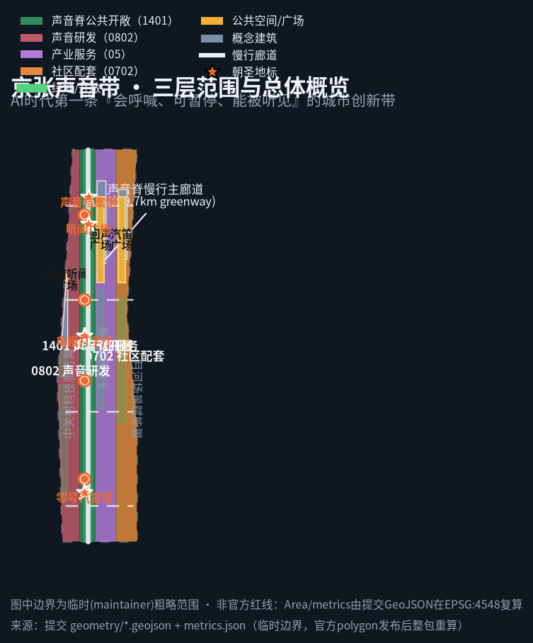
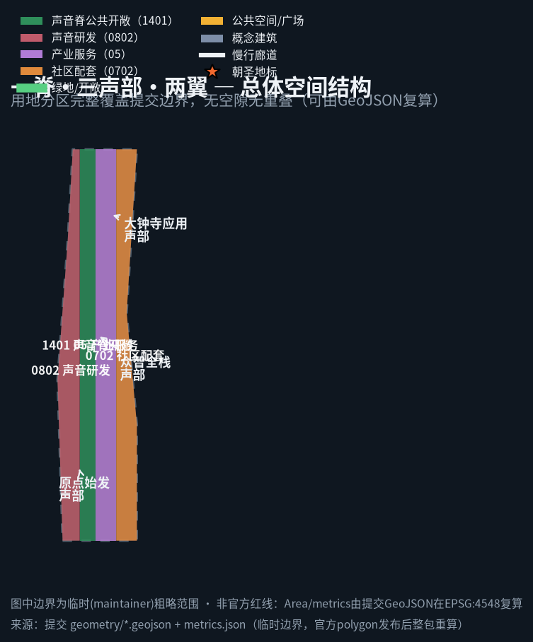
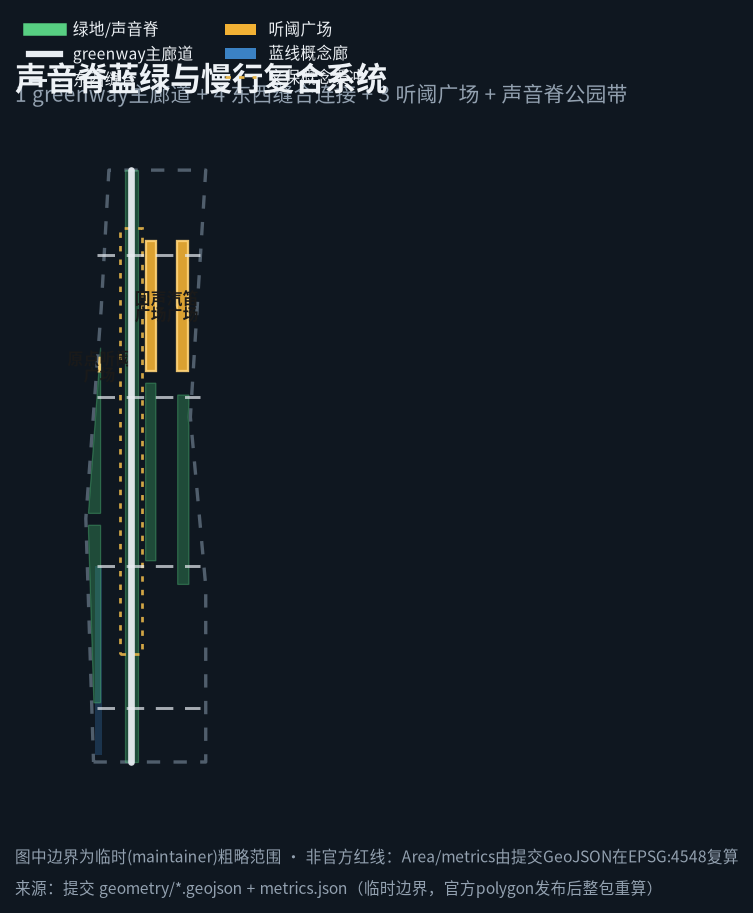
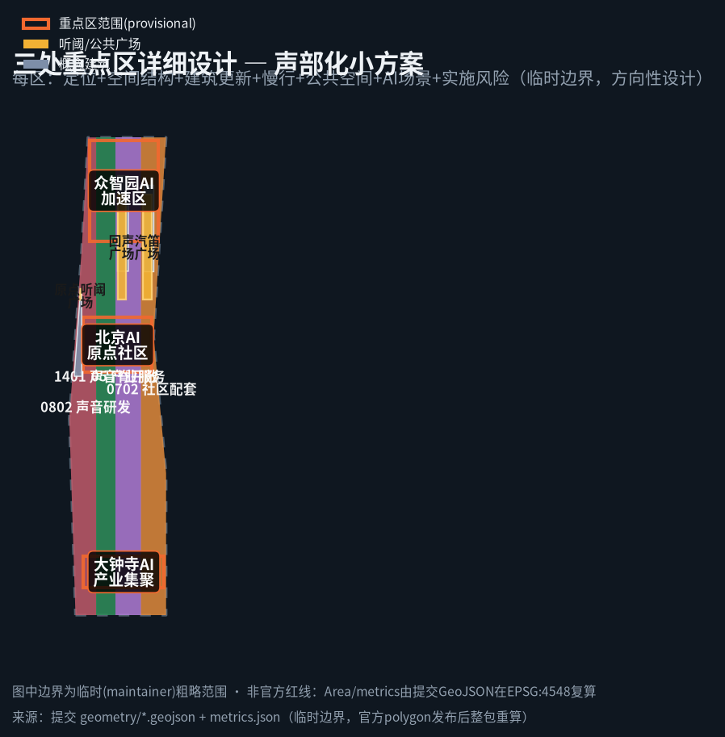
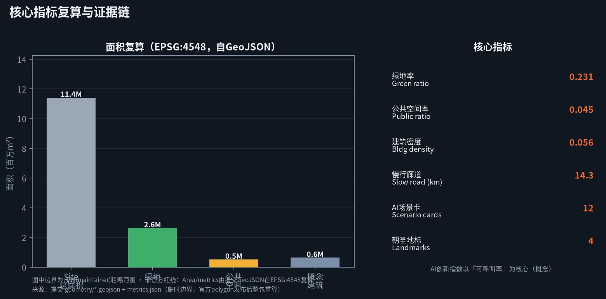

# The Jing-Zhang Sound Line / THE SOUND LINE

## Design Basis and Source Inventory

This proposal responds to the *Centennial Jing-Zhang AI Innovation Belt International Urban Design Open Call*. Core bases include: the prequalification announcement by the Beijing Municipal Commission of Planning and Natural Resources, Haidian Branch (three scope levels, three key areas, design tasks and deliverable depth) [source:OFFICIAL-ANNOUNCEMENT]; the agent-facing taskbook excerpt (three positioning statements, five functions, three areas and two wings, six tasks, and the boundary clause) [source:AGENT-TASKBOOK]; the public-source usability registry (distinguishing formal-ready, background-only, provisional-only, and needs-review material) [source:SOURCE-REGISTRY]; and the site-package enums, planning limits, standards, and schemas [source:SITE-PACKAGE].

Design data use **provisional rough boundaries**. The organizer has confirmed that an official precise boundary file is not yet public; this proposal therefore derives the overall design area (~11.4 km²) and the three key areas (Zhongzhiyuan ~192.1 ha, Beijing AI Origin Community ~104.3 ha, Dazhongsi ~72.0 ha) from `brief/site-package/geometry/provisional_boundaries.geojson` [source:BOUNDARY-SOURCE][data:geometry/site_boundary.geojson#SITE-001][data:geometry/key_areas.geojson#PROV-KEY-001]. This boundary is a rough range derived from the announced four-to text and area constraint; it is **not an official redline or a basis for precise area recalculation**. When the organizer publishes the official polygon, all areas, ratios, and metrics in this package will be recomputed in EPSG:4548 [assumption:A-BOUNDARY-001].

Complete sources, metrics, standards, design depth, and task coverage are authoritative in `sources.json`, `metrics.json`, `compliance_matrix.json`, `standard_matrix.json`, and `design_depth_matrix.json`; the prose keeps only claim-adjacent evidence anchors.

## Three-Level Scope Framework

**Coordinated research area (~43.6 km²)**: bounded north by the Fifth Ring, east by the Jing-Zang Expressway, south by Xizhimen Outer Street, west by Wanquanhe Road. The aim is to answer the belt's role in the whole HaiDian/Beijing-Tianjin-Hebei context, coordinating innovation with the North-Latitude communities, Future Science City, Huairou Science City, the economic-development zone, and Beijing-Tianjin-Hebei, studying the AI ecosystem, future city form, and continuous green-space system [source:OFFICIAL-ANNOUNCEMENT][depth:three_level_scope_framework]. **Overall design area (~11.4 km²)**: the 1–2 km urban and industrial ring around the Jing-Zhang heritage park, designed at regulatory-plan-level urban-design depth, addressing renewal, land use, transport, municipal services, blue-green systems, and urban character. **Key detailed design area (~368.4 ha)**: fine-grained design for Zhongzhiyuan, the AI Origin Community, and Dazhongsi [depth:three_key_area_detailed_design].

The three levels cascade: the research level sets industry and synergy strategy, the overall level sets spatial structure and functional layout, and the key-area level delivers experiential 'movement'-based design. Because the boundary is provisional, all spatial conclusions below are **directional design**; after the official polygon is published, layers such as `land_use`, `key_areas`, and `phasing` and all area metrics must be recomputed [assumption:A-BOUNDARY-001][data:geometry/land_use.geojson#SL-LU-001].

## Coordinated Research Area: Industry and Future City Research

### Belt Concept and Naming System (agent.1)

This proposal puts forward **THE JING-ZHANG SOUND LINE / THE SOUND LINE** as the belt concept. The name draws on the Jing-Zhang railway's most recognizable acoustic heritage: 120 years ago this 'road to win national pride' used boiler whistles, telegraph ticks, switchmen's whistles, and single-line call signs to keep order across mountains and plains; today the AI belt needs not more noise but public order that **can be heard, answered, and paused**. The master name 'Sound Line', the English name THE SOUND LINE, and a sub-series (Call Station, Listening Plaza, Movement, DX & Call Contest) form an extendable naming system that balances international communication with local memory.

**Logo direction**: a 'sound wave + track' motif — a continuous sound wave shaped like rail segments, evoking both Jing-Zhang rails and an audio waveform; palette of 'rail grey + signal orange + night-sky blue'. Signal orange signals the public-safety color of 'callable/call-able', night-sky blue echoes night-quiet protocols and dark-sky protection. The visual system references no third-party trademark, typeface, or image; it is an original direction for professional teams to deepen [assumption:A-SOUND-001][source:AGENT-TASKBOOK].

### Three Positioning Statements · Five Functions · Three Areas and Two Wings

- **Three positioning statements**: a century-old Jing-Zhang culture belt (sound narrative activating heritage); an urban AI life-experience belt (audible everyday life); and an AI-integrated innovation belt (callable open governance).
- **Five functions**: an AI full-stack autonomous-innovation system, a world-class AI innovation ecosystem, an AI+ scenario-empowerment paradigm, a smart vibrant AI city, and global voice on AI governance. This proposal turns 'global voice on AI governance' into a visible, stoppable public protocol as its differentiator [standard:PROJECT-AGENT-OPEN-CALL-TASKBOOK].

**Three areas + two wings synergy loop**: AI Origin Community → Zhongzhiyuan full-stack acceleration area → Dazhongsi industry cluster form the value mainline (results translation → full-stack validation → market adoption); the Zhongguancun technology-service wing provides factors of production and capital enablement; the Xiaoyuehe scenario-empowerment wing hosts AI scenarios and smart vibrant public testing. Like 'branch lines off the mainline', the two wings supply talent, data, compute, and scenarios to the three areas in a closed loop [depth:overall_spatial_structure].

### Global AI Innovation Ecosystem Cases (agent.2)

Six global AI ecosystem cases are summarized as transferable spatial/operational/scenario mechanisms (public sources; reference not adoption; no commitments) [source:SOURCE-REGISTRY]:
1. **Shenzhen Nanshan / Yuehai Street** — street-level innovation interfaces turning hardware manufacturing into open-hardware/developer communities;
2. **Hangzhou West City Sci-Tech Innovation Corridor** — university-park-street slow-traffic connection enabling 'near-campus results translation', informing the AI Origin Community;
3. **Silicon Valley university and campus tech districts** — public spaces hosting VC pitches and hackathons ('public pitch' mechanism);
4. **Taipei / Tokyo Akihabara electronics and subculture districts** — cultural communities converted into consumption scenes, informing Dazhongsi native-born formats;
5. **Berlin / Amsterdam night-culture and commons governance** — time-shared public space and 'pausable' rules, informing listening-zone zoning and quiet protocols;
6. **Global amateur radio (Ham Radio) communities** — call signs, frequency conventions, and on-air gatherings operating a global community, directly informing this proposal's call-station network, DX contest, and developer-community mechanism [assumption:A-OPERATION-001].

These translate into three spatial mechanisms: **street innovation interfaces** (storefront test windows), **public pitch spaces** (bookable talks/competition venues), and **callable public governance** (every AI service can be called, paused, and human-reviewed).

### AI+ Future City Form (agent.3 strategy)

For a 'smart vibrant AI city', this proposal takes **acoustic accessibility + callable governance** as the first principle of future city form: public space is not only a visual interface but an **audible, answerable** interface. Urban AI services are not aimed at 'unattended automation' but at being **callable back to a human at any time**, placing human dignity and public welfare above automatic decisions (echoing charter.10, human-centered governance) [source:AGENT-TASKBOOK][depth:blue_green_public_space].

## Overall Design Area: Urban Renewal and Regulatory-Plan-Level Urban Design

### Spatial Structure and Function (agent.1 spatial)

Overall structure = **one spine, three movements, two wings, multiple call stations**: **one spine** — the Sound Spine themed park and slow-traffic greenway along the Jing-Zhang heritage park as the backbone of public life [data:geometry/green_space.geojson#SL-GREEN-001][metric:green_space_area_sqm]; **three movements** — Origin movement, Zhongzhi full-stack movement, Dazhongsi application movement, carrying the three key areas; **two wings** — the Zhongguancun technology-service wing and the Xiaoyuehe scenario-empowerment wing; **multiple call stations** — AI public nodes along the spine, each with a call button and human-review interface [data:geometry/public_space.geojson#SL-PUB-001].

Land use fully tiles the submitted boundary (no gaps, no overlap, recomputable from geometry) in four sound-functional zones [data:geometry/land_use.geojson#SL-LU-001][standard:MNR-LAND-USE-CLASSIFICATION-GUIDE]:
- **0802 Sound R&D innovation land** (AI Origin–Zhongzhi full-stack R&D): acoustics, audio, speech, edge compute, and full-stack autonomy. ~2,674,562 m² [metric:land_use_rnd_area_sqm];
- **1401 Sound Spine public-open land** (Jing-Zhang heritage park vitality belt): park, listening plazas, accessible sound guides, and public testing. ~2,589,339 m² [metric:land_use_spine_open_area_sqm];
- **05 Sound industry-service and native-born commercial land** (Dazhongsi cluster): native-born consumption and business. ~3,366,138 m² [metric:land_use_industry_service_area_sqm];
- **0702 Sound community-life and support land** (Xiaoyuehe empowerment wing): talent living, community services, scenario operation. ~2,782,793 m² [metric:land_use_community_area_sqm].

### Honest Boundary of Development Intensity, Massing, and Character

Statutory controls such as floor-area ratio, building height, and development intensity are honestly recorded as `unknown`: official regulatory plans and precise boundaries are not in the public package, and no value may masquerade as an approved indicator [metric:floor_area_ratio][assumption:A-CONTROL-UNKNOWN-001]. The package keeps only **concept building massing** (≈635,954 m² concept building footprint, density ≈0.056) as a low-confidence design quantity for professionals to deepen, not a statutory value [metric:building_footprint_area_sqm][metric:building_density]. The retain/renovate/demolish/new logic is 'preserve cultural heritage and existing communities as the base, acupuncture-style renovation as the main approach, concept new-build as support'; specific demolition/renovation conclusions await ownership and engineering conditions [assumption:A-CONTROLS-001][depth:retain_renovate_demolish].

### AI+ Transport, Rail, and Municipal Systems (agent.3 spatial)

Transport strategy centers on stitching a century of east-west severance caused by the railway: a Sound Spine slow-traffic greenway (~9.7 km) plus four east-west pedestrian stitch connectors to ease slow-traffic gaps [data:geometry/roads.geojson#SL-ROAD-001][metric:road_length_m]; rail-station integration, parking, and external transport are conceptual directions awaiting official alignment and redlines [assumption:A-CONTROLS-001][depth:traffic_rail_slow_parking]. Municipal and new infrastructure focus on **edge audio-compute stations** (edge capacity serving sound scenarios nearby) fused with distributed energy as a concept; loads and capacity await professional estimation [depth:municipal_new_infrastructure].

## Detailed Design of Key Areas (agent.4)

The three key areas are organized as 'movements', each with a readable mini-scheme covering positioning + spatial structure + building renewal + slow traffic + public space + AI scenarios + implementation risk; because key areas are provisional, these are directional designs [data:geometry/key_areas.geojson][assumption:A-BOUNDARY-001].

### Origin Movement / Beijing AI Origin Community (~104.3 ha)

- **Positioning**: the AI Origin Community = results-translation and talent zone, the 'origin station' of the Sound Line.
- **Spatial structure**: anchored by the Origin Listening Plaza [data:geometry/public_space.geojson#SL-PUB-001], campus-park-street slow-traffic through-connection for near-campus results translation.
- **Building renewal**: preserve existing innovation fabric; conceptually insert two sound R&D / edge-compute stations [data:geometry/buildings.geojson#SL-BLDG-001].
- **AI scenarios**: accessible sound guide, AI call-relay station, campus hackathon pitch stage.
- **Implementation risk**: campus and community boundaries require multi-party consultation; FAR awaits regulatory plan. [metric:key_area_origin_area_sqm]

### Zhongzhi Full-Stack Movement / Zhongzhiyuan AI Acceleration Area (~192.1 ha)

- **Positioning**: the 'validation field' for AI full-stack autonomy and global voice on AI governance.
- **Spatial structure**: anchored by the Echo Plaza as a validation-operation public interface [data:geometry/public_space.geojson#SL-PUB-002], linking full-stack R&D, edge compute, and safety sandboxes.
- **Building renewal**: concept construction of acoustic R&D labs and edge-compute stations [data:geometry/buildings.geojson#SL-BLDG-002].
- **AI scenarios**: AI industry test/validation, call-sign safety sandbox, audio-data annotation crowdsourcing field.
- **Implementation risk**: industrial carriers and test rules need a long-term operator; intensity awaits regulatory plan. [metric:key_area_zhongzhiyuan_area_sqm]

### Dazhongsi Application Movement / Dazhongsi AI Industry Cluster (~72.0 ha)

- **Positioning**: the 'application station' for native-born formats and international exchange.
- **Spatial structure**: anchored by the Whistle Plaza as an industry-display public interface [data:geometry/public_space.geojson#SL-PUB-003], organizing native-born commerce around the Dazhongsi station TOD.
- **Building renewal**: concept construction of a native-born acoustic commercial complex [data:geometry/buildings.geojson#SL-BLDG-003].
- **AI scenarios**: native-born consumption, international pitches, voice customer service, and multilingual sound signage testing.
- **Implementation risk**: TOD and commercial operation depend on rail and passenger flow; a conceptual idea; formats and intensity await regulatory plan. [metric:key_area_dazhongsi_area_sqm]

## AI Innovation Ecosystem, Personas, and AI+ Scenarios (agent.2 · agent.3)

### Five User Personas (agent.3)

1. **AI founders/engineers** — need open interfaces to pitch, test, and fundraise;
2. **University faculty/students/researchers** — need near-campus results translation and slow-traffic links;
3. **Residents, elders, and children** — need audible, pausable, low-digital-threshold public AI;
4. **Visually impaired and low-digital-literacy people** — treated as first beneficiaries of acoustic accessibility (echoing the Barrier-free Environment Law) [standard:BARRIER-FREE-ENVIRONMENT-LAW];
5. **Tourists and international developers** — need experiential, participatory, shareable pilgrimage and event routes. [metric:persona_count]

### Twelve AI Scenario Cards (agent.3, ≥10 incl. 3 industrial test/validation)

1. **Accessible sound guide** (call stations + headphone soundscape) — for the visually impaired and tourists; human review: content requires professional editorial review;
2. **AI call-relay station** (call-station call button) — citizens one-touch call a human operator; any AI service can be paused;
3. **Whistle time-keeping and event pulse** (sound-spine landmarks) — whistles and sound pulses mark events and daily time;
4. **Night quiet protocol** (listening-zone zoning) — time-zoned noise reduction protecting residences and dark-sky ecology;
5. **Soundscape health clinic** (listening plaza) — measures sound pressure and environment, linked to public health;
6. **Multilingual sound signage** (call stations) — multilingual voice signage for international developers;
7. **Voice Q&A AI (government transparency)** — answer first then hand off to human; call records public;
8. **Industrial test/validation ①** — audio/voice model safety, ethics, and robustness sandbox testing (call-station labs);
9. **Industrial test/validation ②** — voice-interaction accessibility and multilingual-availability testing (sound-guide system);
10. **Industrial test/validation ③** — sound-data annotation crowdsourcing and open audit (Origin data-annotation field);
11. **Native-born soundscape commercial street** (Dazhongsi) — acoustic space + native-born consumption;
12. **Edge audio-compute sharing** (compute stations) — nearby compute load-sharing and waste-heat reuse discussion.

Each card binds: spatial location (corresponding GeoJSON layer), service users, data sources, privacy boundary, human-review mechanism, operator, visualization layer, and risk [depth:blue_green_public_space][assumption:A-SOUND-001][assumption:A-SOUNDSCAPE-001][metric:scenario_card_count].

## Land Use, Building Scale, and Retain-Renovate-Demolish Strategy

Land layout and areas as above (four zones sum to the submitted boundary ≈11.41 km² [metric:site_area_sqm]); concept building footprint ≈635,954 m² [metric:building_footprint_area_sqm]. **Retain/renovate/demolish principle**: preserve Jing-Zhang heritage, existing communities, and institutional courtyards; use 'acupuncture-style' renovation to activate street innovation interfaces and public-space gaps; concentrate concept new-build at 3–4 justified industrial/public nodes, avoiding large-scale demolition [depth:retain_renovate_demolish][assumption:A-CONTROLS-001]. All intensity, height, and demolition/renovation conclusions await official regulatory plans and current/ownership data; this package makes no statutory judgment [assumption:A-CONTROL-UNKNOWN-001].

## Transport, Rail, Municipal Infrastructure, and Public Services

Transport is organized around the overall goal of stitching a century of east-west severance caused by the railway, designed integrally with the Sound Spine public space rather than as isolated roads [standard:MOHURD-URBAN-DESIGN-MEASURES]. **Slow-traffic first**: the Sound Spine greenway main corridor (~9.7 km) forms the north-south spine, overlaid by four east-west pedestrian stitch connectors (see `geometry/roads.geojson`) that mend the east-west links cut by a century of rail, easing walking and cycling gaps [data:geometry/roads.geojson#SL-ROAD-001][metric:road_length_m][depth:traffic_rail_slow_parking].

**Rail and transfer**: TOD-style integration and slow-traffic interchange are proposed anchored on existing rail stations (e.g. Dazhongsi), but because official alignment, station, and redline data are not in the public package, these are recorded as concept directions awaiting official confirmation [assumption:A-CONTROLS-001]. **Parking and non-motorized traffic**: coordinated along public-space edges and hubs, adhering to 'slow-first, transfer-first', avoiding car-centric cutting of the public interface. **Municipal and new infrastructure**: edge audio-compute stations fused with distributed energy are proposed to serve sound scenarios nearby and explore waste-heat reuse; load, capacity, and utility conditions await professional estimation and are not engineering-feasibility conclusions [assumption:A-CONTROL-UNKNOWN-001][depth:municipal_new_infrastructure]. **Public services**: innovation service platforms (pitch/event/call duty), talent living services (community land 0702), and barrier-free accessibility together support the high-quality-district goal [standard:BARRIER-FREE-ENVIRONMENT-LAW].

## Blue-Green Network, Public Space, and Urban Character (agent.4 · agent.5)

**Sound Spine park belt**: the Jing-Zhang heritage park as both blue-green and sound main axis; green ratio ≈0.23 [metric:green_ratio], public-space ratio ≈0.04 [metric:public_space_ratio]; three listening plazas host calling and public events [data:geometry/public_space.geojson#SL-PUB-001]. **Character** is coordinated along the spine through a 'listening-threshold public interface': audible, light-permeable, linger-friendly street frontage; breakthrough skyline and height controls await regulatory conditions [assumption:A-CONTROL-UNKNOWN-001].

### Four AI Pilgrimage / Honor-Display Landmarks (agent.4, ≥3)

1. **Whistle Tower Zero** — the Origin Community's sound landmark and 'first stop of the AI pilgrimage', symbolizing the relay from a road-to-pride to an open-source road;
2. **Telegraph Typing Hall** — translating the century-old telegraph tick into an AI-notification audit hall, honoring past open-source contributors;
3. **Listening Plaza** — the callable public interface and memorial plaza for 'citizens calling stop';
4. **Sound Archive** — collecting and opening city sound, curating open sound-data public assets.

These landmarks borrow railway acoustic symbols (not copying scenic-area internet-fication), connecting the Zhongguancun culture, developer community, and public-space system [assumption:A-SOUND-001][metric:pilgrimage_landmark_count]. Landmarks, signage, logo, typefaces, images, and personal/corporate marks are original directions or cleared material, and are not in any way presented as approved construction [source:AGENT-TASKBOOK].

## Renewal Project List, Implementation Policy, and Phasing (agent.6)

Concept renewal projects in three phases (see `geometry/phasing.geojson`) [data:geometry/phasing.geojson#SL-PHASE-01][metric:phasing_area_sqm]:
- **Phase 1 · Origin and Sound Spine demonstration (start · audibility)**: Origin Listening Plaza, Whistle Tower Zero, first call stations, and accessible sound guide; establish the 'calling protocol' (callable / pausable / human-reviewable);
- **Phase 2 · Zhongzhi full-stack and industrial mid-section (validate · iterate)**: full-stack R&D, edge-compute stations, and three industrial test/validation scenarios online, closing the industry-test-operation loop;
- **Phase 3 · Dazhongsi and Xiaoyuehe scenario wings (co-create · operate)**: native-born formats networked, global AI event system live, long-term operation and brand-asset accumulation [assumption:A-OPERATION-001].

**Long-term operation mechanism (agent.6)**: annual event system (spring 'Jing-Zhang Listening Festival', summer 'Night Quiet Week', autumn 'DX & Call Contest', international open-source day); developer-community operation (call-station duty, open sound datasets, contributor honor board); scenario open-operation (open review and human review of test scenarios); international communication and conversion (multilingual sound signage, DX-contest invitations, pitch conversion pathway). All events, attraction, funding, and policy are **concept suggestions or directions to deepen**, not confirmed government arrangements [assumption:A-OPERATION-001][source:AGENT-TASKBOOK].

## Indicators, Area Recalculation, and Compliance Matrix

**AI innovation index** (conceptual): led by a 'callable rate' (share of services that can be human-reviewed), plus talent density, scenario cards online, validated test completion, green/public space ratios, and slow-traffic connectivity length. **Area recalculation**: site ≈11,412,825 m² [metric:site_area_sqm], green ≈2,632,620 m² / ratio 0.23 [metric:green_space_area_sqm][metric:green_ratio], public space ≈510,574 m² [metric:public_space_area_sqm], concept building footprint ≈635,954 m² [metric:building_footprint_area_sqm], roads ≈14.29 km [metric:road_length_m], and one area per key area [metric:key_area_count]; all phasing areas are recomputable from `phasing.geojson` [metric:phasing_area_sqm].

All areas are recomputed from this package's GeoJSON in EPSG:4548 (spatial_review PASS); only two legitimate warnings remain: provisional boundary and missing statutory control data [depth:metrics_recalculation][assumption:A-BOUNDARY-001]. Coverage is detailed in `compliance_matrix.json` (23 tasks fully covered), `standard_matrix.json` (6 standards), and `design_depth_matrix.json` (15 depth items all complete).

## Risk, Copyright, and Compliance

**Data and copyright**: this proposal uses only public or taskbook-provided/cleared material, no non-public maps, internal data, or unauthorized typefaces/trademarks/portraits; generated media are original or cleared; copyright is set out in `report/copyright_statement.md` [source:SOURCE-REGISTRY]. **Privacy and human review**: all AI scenarios include human review and exit mechanisms, forbidding automation from replacing final human judgment, prioritizing visually impaired and low-digital-literacy groups [standard:BARRIER-FREE-ENVIRONMENT-LAW][depth:risk_missing_data]. **Concept boundary**: all spatial placement, events, attraction, funding, and policy are concept suggestions or reference schemes that professionals may deepen or stop; they do not constitute government conclusions, endorsement, or implementation commitments [assumption:A-SOUND-001][assumption:A-OPERATION-001]. **Missing data**: official boundary, regulatory plans, current conditions, ownership, acoustic-environment surveys, and engineering conditions are pending; nothing missing is presented as verified fact [assumption:A-CONTROLS-001][assumption:A-CONTROL-UNKNOWN-001].

## References

The following are the main materials that shaped this proposal (complete machine index in `sources.json` and the three matrices) [source:SOURCE-REGISTRY]:

1. Beijing Municipal Commission of Planning and Natural Resources, Haidian Branch, *Prequalification Announcement for the Centennial Jing-Zhang AI Innovation Belt International Urban Design Open Call* (2026-05-09) and task attachments.
2. open-city-ai/haidian repository, `brief/site-package/standards/references/agent-open-call-taskbook-0518.md` (agent-facing taskbook).
3. open-city-ai/haidian repository, `brief/site-package/geometry/provisional_boundaries.geojson` and `provisional_boundaries_basis.md` (provisional boundary notes).
4. open-city-ai/haidian repository, `data/source_registry.json` (public-source usability registry).
5. *Law of the People's Republic of China on Barrier-Free Environment Building* (2023) — barrier-free public space and services.
6. Ministry of Housing and Urban-Rural Development, *Urban Design Administration Measures* and related public planning standards, as the urban-design and regulatory-plan depth framework.
7. Ministry of Natural Resources, *Guide to Land-Use/Land-Use-Type Classification in Territorial Spatial Planning* — land classification basis.
8. Beijing Municipal Government public portal background on the Jing-Zhang heritage park and Zhongguancun innovation culture (background-only; cultural-narrative support, not planning evidence).
