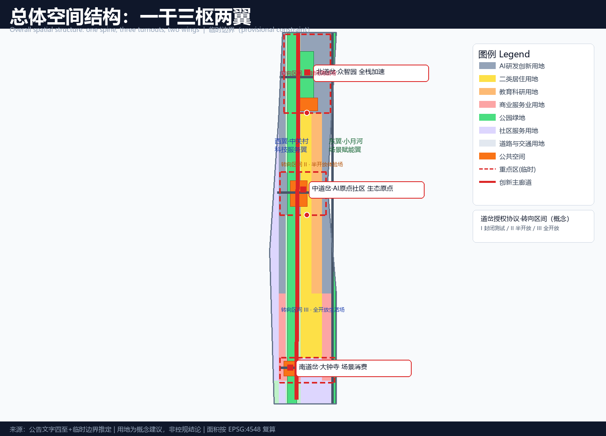
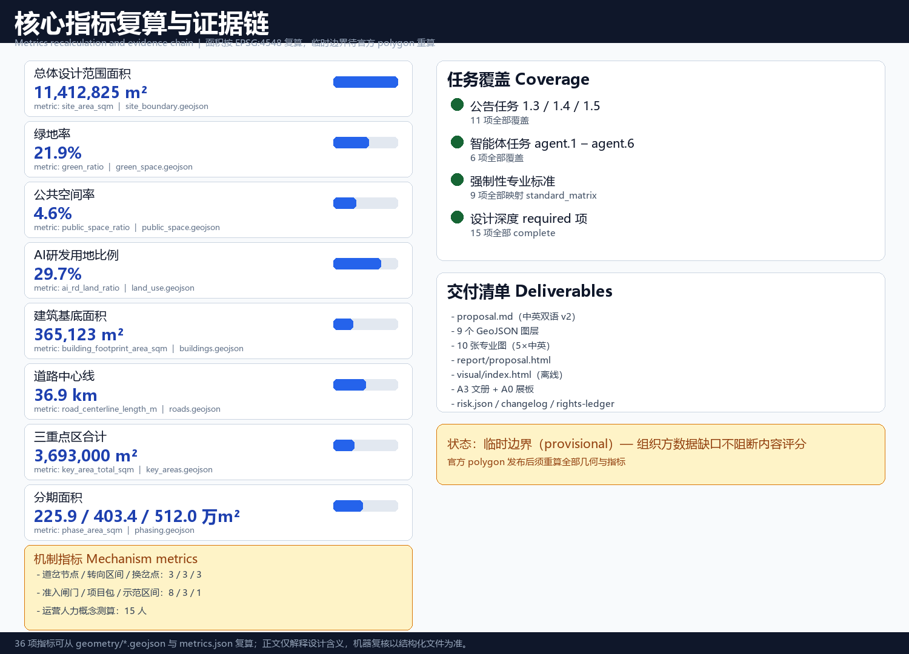

# Jing-Zhang Turnout · AI Switchover Belt — An Innovation-Switch Device on a Centennial Mainline

## Design Basis and Source Inventory

This proposal takes as its primary basis the Prequalification Announcement for the International Open Call for the Urban Design of the Centennial Jing-Zhang AI Innovation Belt, published by the Haidian Branch of the Beijing Municipal Commission of Planning and Natural Resources [source:OFFICIAL-ANNOUNCEMENT], and the agent-facing open-call taskbook as the rule basis for participation [source:AGENT-TASKBOOK]. Machine-readable basis includes the design brief, allowed design space, source registry, enums, planning limits, standard snapshots, and provisional geometry under `brief/site-package/` [source:SITE-PACKAGE] [standard:PROJECT-OFFICIAL-ANNOUNCEMENT]. The public source registry in `data/source_registry.json` is used to distinguish formal-ready, background-only, and provisional-only material [source:SOURCE-REGISTRY].

As of this version, the organizer has not released a verifiable official polygon; the repository provides provisional boundaries inferred from the announcement's textual limits and area constraints. All spatial layers in this proposal are generated with `provisional_constraint` geometry [data:geometry/site_boundary.geojson#SITE-001] [data:geometry/key_areas.geojson#PROV-KEY-001], used only for concept generation, display, and self-check—not as official redlines, road redlines, parcel boundaries, or ownership boundaries [source:PROVISIONAL-BOUNDARIES-BASIS]. Once official polygons are released, site boundary, key areas, land use, buildings, roads, green space, public space, phasing, and all area metrics must be recalculated; this recalculation path is recorded in `assumptions.json`.

Following the co-creation charter, all spatial proposals are conceptual suggestions, reference schemes, or material for professional teams to deepen—not substitutes for statutory planning, not government-approved conclusions, and not legal conclusions on FAR, building height, demolition/renovation/retention, road redlines, or engineering implementation [source:AGENT-TASKBOOK].

## Three-Level Scope Framework

The proposal is organized around the three official scope levels [source:OFFICIAL-ANNOUNCEMENT] [depth:three_level_scope_framework]:

| Level | Area | Objective | Deliverable |
| --- | ---: | --- | --- |
| Coordinated research area | 43.6 km² | AI ecosystem, future urban form, three-areas-two-wings synergy, cultural narrative | Naming, ecosystem map, scenario system, operations |
| Overall design area | 11.4 km² | Urban renewal framework, land use, mobility, municipal, urban character | land_use, roads, green_space, public_space, buildings, phasing layers [data:geometry/land_use.geojson#LU-001] |
| Key detailed-design area | 368.4 ha | Detailed design of three key areas | Three turnout-node mini-plans [data:geometry/key_areas.geojson#PROV-KEY-001] |

The three levels implement a "strategy—structure—node" cascade: the research level sets industrial and cultural judgments, the overall level translates them into land-use and spatial structure, and the key-area level tests implementability at node scale [depth:overall_spatial_structure]. All three levels share the same provisional boundary and metric baseline to avoid contradictions; every area, ratio, and scale can be recomputed from `geometry/*.geojson` and `metrics.json` [metric:site_area_sqm].

## Coordinated Research Area: Industry and Future-City Study

### Overall Concept and Naming System

The proposal advances **"Jing-Zhang Turnout · AI Switchover Belt"** as the overall concept of the belt [source:AGENT-TASKBOOK] [depth:overall_spatial_structure].

A railway turnout is the device that routes a train from the mainline onto a branch line. The proposal gives it three layers of meaning:

1. **Engineering turnout**: The switchback ("人字形") alignment at Qinglongqiao was, in essence, a great turnout designed by Zhan Tianyou on the steep slopes of Badaling—a maximum change of direction at minimum engineering cost. Today's innovation belt needs the same kind of "switching" among compute, data, scenarios, and talent.
2. **Historical turnout**: The 1909 completion of the Jing-Zhang Railway was modern China's first "self-directed turn" (self-funded, self-designed, self-built); the AI Innovation Belt a century later is the second "self-directed turn"—from imitative innovation to self-directed, open-source, globally collaborative innovation.
3. **Open-source turnout**: A fork in the code world is structurally isomorphic to a railway turnout—innovation branches from the mainline, experiments, and flows back. The turnout symbol is simultaneously the Chinese character "人" (person), a "Y" fork, and a binary branch, writing human-centeredness into the urban fabric itself.

Naming system: main name "Jing-Zhang Turnout", subtitle "AI Switchover Belt"; the three nodes are "North Turnout · Zhongzhiyuan (full-stack acceleration)", "Middle Turnout · AI Origin Community (ecosystem origin)", and "South Turnout · Dazhongsi (scenario consumption)"; the two wings are "West Wing · Zhongguancun Technology-Service Wing (factor allocation)" and "East Wing · Xiaoyuehe Scenario-Empowerment Wing (scenario and daily life)".

**Logo direction**: a double-rail fork symbol—two parallel rails converge at one "origin" and then branch, forming a composite of "人" and "Y"; a three-color palette of rail grey (centennial history), signal red (switching, alertness, innovation), and code blue (AI and open source); extendable to wayfinding, paving, lighting, and digital-twin interfaces [source:AGENT-TASKBOOK]. The logo is a conceptual direction; no third-party fonts, images, or trademarks are used without authorization.

### Five Functions and the Three-Areas-Two-Wings Loop

The proposal maps the five functions of the taskbook [source:AGENT-TASKBOOK]: full-stack self-directed innovation (North Turnout), world-class AI ecosystem (Middle Turnout), AI+ scenario-empowerment paradigm (East Wing + South Turnout), intelligent AI-vibrant city (spine + whole area), and global voice in AI governance (West Wing + operations).

The three areas and two wings form **two turnout loops** [depth:three_key_area_detailed_design]:

- **Innovation loop (North–Middle–West)**: the Middle Turnout origin community produces ideas and talent → the North Turnout Zhongzhiyuan completes full-stack engineering and production → the West Wing provides capital, IP, and global allocation → returns flow back into basic research at the origin.
- **Scenario loop (South–East–Middle)**: products from the North Turnout and West Wing enter the South Turnout Dazhongsi for test-and-validate and consumption scenarios → the East Wing Xiaoyuehe provides a lived, public scenario testbed → scenario data and demand feed back to the Middle Turnout for a new R&D cycle.

Both loops share the "spine" (the heritage-park innovation mainline) as their physical and spiritual channel, making the three areas and two wings a dynamic circulation rather than a static partition [data:geometry/roads.geojson#ROAD-001] [data:geometry/green_space.geojson#GREEN-001].

### The Turnout Authorization Protocol: ONE TURNOUT, ONE TURN — NO SWITCH, NO ENTRY

The core mechanism of the proposal is the **Turnout Authorization Protocol (TAP)** — translating the Jing-Zhang Railway's staff-and-ticket block system (one staff per section, no staff no entry, manual handover, degraded fallback) into an AI city governance protocol [source:AGENT-TASKBOOK] [depth:overall_spatial_structure]:

- **Turn Right**: any AI scenario must obtain a "turn right" (the equivalent of the train staff) at a turnout node — one turnout, one scenario; no authorization, no pilot [metric:turnout_node_count];
- **Block Section**: the "turn section" between two turnouts is the smallest governance unit of space, data, and service, mirroring the railway block section [metric:block_section_count];
- **Handover Point**: boundary nodes for authority handover and east–west stitching, mirroring the staff handover point [metric:handover_point_count];
- **Three-field Typology**: closed test field (Zhongzhiyuan·full-stack testing), semi-open experience field (Dazhongsi·consumption experience), fully open living field (AI Origin Community and heritage park·public life), opened by risk tier [metric:field_typology_count].

This makes the turnout a workable governance syntax: **every AI scenario holds a "staff", every block section is an independently pause-able governance unit, and every handover point has manual handover and review**. It also answers the "global voice in AI governance" function — TAP is itself an exportable AI urban governance model [source:AGENT-TASKBOOK] [metric:access_gate_count].

### TAP Technical Implementation and Data Isolation

The technical path of the Turnout Authorization Protocol follows five steps: apply—review—authorize—operate—withdraw [source:AGENT-TASKBOOK] [depth:land_use_layout]:

1. **Turn-right determination**: the operator submits a Turn Application with data inventory, algorithm description, and safety plan; after the T1 data-compliance review (authorization, de-identification, minimization) and the T2 scenario-safety assessment (risk tier, human fallback, physical switch), a "Turn Right" is issued with validity, scenario scope, and withdrawal conditions; all authorization records are archived for audit [metric:access_gate_count];
2. **Block-section data isolation**: every block section runs on "anonymous aggregation, minimal collection, access audit" — public-space scenarios collect only aggregate metrics by default; personal-data scenarios (S3/S5/S6/S10) keep data inside the section, no cross-scenario use, and full access trails [metric:block_section_count];
3. **Degraded mode**: the section director can switch to manual operation with one click (scenario paused, data sealed, human takeover), mirroring railway degraded operation — no AI-autonomous operation is promised; human review is built in [source:GENERATIVE-AI-INTERIM-MEASURES];
4. **Gate archiving**: review records, data ledgers, and human-review signatures at every T0–T7 gate are kept in the section data vault for regulator and public spot-checks [metric:turnout_node_count].

### Global AI Innovation Ecosystem Cases (5–8)

| # | Case | Summary | Spatial/mechanism translation for Jing-Zhang |
| --- | --- | --- | --- |
| 1 | London King's Cross | Railway-heritage district transformed into a knowledge-innovation area; Google HQ anchor | Most comparable: "heritage-park innovation belt" of railway heritage + universities + corporate HQ |
| 2 | Boston Kendall Square | University–industry loop; MIT-adjacent biotech and AI cluster | Origin community as a "500-meter campus innovation circle"; Beihang and BUPT are Haidian's MIT |
| 3 | Silicon Valley Sand Hill Road | Stanford seeding + venture capital + garage startups | West Wing carries capital and IP allocation |
| 4 | Singapore one-north | Nationally led R&D–test–living integration | Zhongzhiyuan should embed test-and-validate fields: "R&D as testing" |
| 5 | Shenzhen Nanshan | Hardware–software rapid iteration ecosystem | Dazhongsi as "storefront-laboratory" fast consumer testing |
| 6 | Hangzhou Future Sci-Tech City | Platform enterprises + scenario-driven agglomeration | Xiaoyuehe wing attracts enterprises through public scenarios |
| 7 | Paris Station F | Adaptive reuse of existing buildings into the world's largest startup campus | Heritage-line warehouses converted to developer stations |
| 8 | Zurich Science City | Dense R&D with high living quality | Green spine and public space retain talent long-term |

Conclusion: a successful AI ecosystem is not a single park but a complete turnout system of "seeding—engineering—scenario—capital" [source:AGENT-TASKBOOK]. The cases are public background references, not commitments of enterprise relocation.

## Overall Design Area: Urban Renewal at Regulatory-Plan Urban-Design Depth

The overall design area reaches the urban-design depth of a regulatory detailed plan [standard:MOHURD-CONTROL-DETAILED-PLANNING] [depth:land_use_layout]. The proposal advances the "one-spine, three-turnouts, two-wings" spatial structure:

- **One spine**: the Jing-Zhang heritage-park innovation mainline—a north–south green, slow-mobility, and public-space axis that stitches east and west [data:geometry/green_space.geojson#GREEN-001] [data:geometry/roads.geojson#ROAD-001];
- **Three turnouts**: the three key areas as turnout nodes for full-stack acceleration, ecosystem origin, and scenario consumption;
- **Two wings**: the west Zhongguancun technology-service wing (factor allocation) and the east Xiaoyuehe scenario-empowerment wing (public life).

Land-use structure (`geometry/land_use.geojson`, seamless partition of the submitted boundary, 53 units) [data:geometry/land_use.geojson#LU-001] [metric:ai_rd_land_ratio]: AI R&D land ≈29.7%, parks and open space ≈23.4%, residential ≈15.1%, commercial ≈8.7%, education and research ≈8.8%, community service ≈13.5%, transport ≈0.7%. This structure balances R&D, living, ecology, and services to avoid a single-function industrial park; the ratios are conceptual and must be calibrated once official regulatory conditions and surveys are available [metric:green_land_ratio].

Renewal logic: the heritage park is the stitching axis; identify underused land and breaks, and propose a framework of "retain historic fabric, retrofit inefficient buildings, build nodal landmarks, and connect the blue-green network" [depth:development_intensity_control]. Building footprints (`geometry/buildings.geojson`) express 10 conceptual buildings (≈365,000 m² total), representing discussable massing, not statutory floor area [data:geometry/buildings.geojson#BLDG-001] [metric:building_footprint_area_sqm]; FAR and building height are recorded as "pending official data" because official regulatory conditions are missing [metric:floor_area_ratio].

## Key-Area Detailed Design

All three key-area polygons are provisional rough extents under an organizer data gap [source:PROVISIONAL-BOUNDARIES-BASIS]; the following conclusions are directional designs for professional teams to deepen [depth:three_key_area_detailed_design] [data:geometry/key_areas.geojson#PROV-KEY-001].

### North Turnout · Zhongzhiyuan AI Self-Directed Innovation Acceleration Area (≈192.1 ha)

- **Positioning**: full-stack self-directed innovation system and global voice in AI governance [source:AGENT-TASKBOOK].
- **Structure**: "one valley, three clusters"—an ecological valley along the Qinghe tributary plus three R&D clusters (foundational algorithms, compute engineering, test and production) [data:geometry/buildings.geojson#BLDG-001] [data:geometry/green_space.geojson#GREEN-003].
- **Buildings**: conceptually retrofit existing stock into full-stack acceleration, compute-hub, test-validation, and incubation buildings (BLDG-001~004); no specific demolition/retention conclusions [data:geometry/buildings.geojson#BLDG-002].
- **Mobility**: a transverse connector to the Fifth Ring service road, with a slow-mobility-priority loop inside [data:geometry/roads.geojson#ROAD-004].
- **Public space**: central innovation green and public validation square enabling "R&D as testing" [data:geometry/public_space.geojson#PUBLIC-003].
- **AI scenarios**: low-altitude logistics corridor testing (subject to airspace permits), AI building-operations testbed [metric:ai_test_scenario_count].
- **Risks**: existing enterprise buildings and ownership require professional verification; Fifth Ring and Qinghe ecological constraints must be assessed.

### Middle Turnout · Beijing AI Origin Community (≈104.3 ha)

- **Positioning**: world-class AI innovation ecosystem; the "origin" of ideas and talent [source:AGENT-TASKBOOK].
- **Structure**: "one ring, one street, one courtyard"—open-source plaza ring, developer-service street, and campus co-creation courtyard, adjacent to Wudaokou and the university cluster [data:geometry/public_space.geojson#PUBLIC-001].
- **Buildings**: conceptually propose Open-Source House, pitching center, and talent residence (BLDG-005~007), retaining neighborhood life [data:geometry/buildings.geojson#BLDG-005].
- **Mobility**: transverse connector to Xueyuan Road with transit-station integration reserved [data:geometry/roads.geojson#ROAD-003].
- **AI scenarios**: open-source code clinic, AI talent interview rooms, campus AI companion [metric:ai_scenario_card_count].
- **Risks**: renewal near campuses is sensitive and requires university–district coordination; heritage elements require cultural-relic assessment.

### South Turnout · Dazhongsi AI Industry Cluster (≈72.0 ha)

- **Positioning**: AI-native new business forms and scenario consumption [source:AGENT-TASKBOOK].
- **Structure**: "one station, one street, one hall"—Dazhongsi station integration, AI-native commercial street, and AI reception-hall plaza [data:geometry/public_space.geojson#PUBLIC-002].
- **Buildings**: conceptually propose an AI-native commercial block and smart office building (BLDG-008~009) [data:geometry/buildings.geojson#BLDG-008].
- **Mobility**: transverse connector and an autonomous-shuttle loop (test scenario) [data:geometry/roads.geojson#ROAD-002].
- **AI scenarios**: AI storefront laboratory, AI medical-record translation (strict privacy boundary) [metric:ai_test_scenario_count].
- **Risks**: station-city integration involves rail ownership and engineering conditions requiring professional assessment; no engineering conclusions are given.

## AI Innovation Ecosystem, Personas, and AI+ Scenarios

### User Personas (5) [source:AGENT-TASKBOOK] [metric:user_persona_count]

| Persona | Description | Core needs | Spatial anchor |
| --- | --- | --- | --- |
| P1 University AI researchers | Faculty and students of Tsinghua, Beihang, BUPT | Compute, data, academic exchange, commercialization | Campus co-creation courtyard, Zhongzhiyuan testbed |
| P2 Open-source developers | Freelance/remote/community contributors | Low-cost workspace, code collaboration, belonging | Developer stations, Open-Source House |
| P3 AI startup teams | Seed-to-Series-A startups | Incubation, capital, scenarios, hiring | West Wing factor center, pitching center |
| P4 Local residents | Including elderly and children | Daily services, health, education, safety | Community land, parks, AI education scenarios |
| P5 Global visitors/investors | International conferences, delegations, media | Experience, information, reception, storytelling | Landmarks, reception-hall plaza, events |

### AI+ Scenario Cards (10) [metric:ai_scenario_card_count]

| ID | Scenario | Location | Users | Operational data | Privacy boundary | Human review | Operator | Layer |
| --- | --- | --- | --- | --- | --- | --- | --- | --- |
| S1 | Jing-Zhang Smart Mobility · park AI navigation | Whole spine | P5/P4 | Anonymous crowd-flow aggregation | No personal tracking | Monthly review | Park + dev community | roads/green_space |
| S2 | Track-inspection digital twin · heritage patrol | North heritage park | P1/P5 | Structural-health sensing | Public facility data | Heritage review | Heritage + Zhongzhiyuan | green_space |
| S3 | Open-source code clinic · developer station | Origin Open-Source House | P2/P3 | Authorized code diagnostics | Code belongs to users | Expert review | Dev community | buildings |
| S4 | Campus AI companion · AI education | University surroundings | P1/P4 | Anonymous teaching stats | Minors data strictly controlled | School review | Universities + firms | land_use(0801) |
| S5 | AI medical-record translation | Dazhongsi service point | P4 | De-identified summaries | Strict medical compliance | Licensed physicians | Medical providers | public_space |
| S6 | Legal AI assistant | West Wing factor center | P3 | Contract/compliance Q&A | No case-file retention | Lawyer review | Legal firms | buildings |
| S7 | AI storefront laboratory · consumer testing | Dazhongsi street | P3/P5 | Anonymous consumption analytics | No individual tracking | Merchant confirmation | Commercial operator | land_use(05) |
| S8 | Xiaoyuehe AI cycling companion | Xiaoyuehe greenway | P4/P5 | Route and narration | Anonymized location | Content review | Tourism operator | green_space |
| S9 | Urban AI dashboard · public-space operations | Three plazas | P4/P5 | Aggregated facility-use stats | Anonymous aggregation | Weekly human review | City operations center | public_space |
| S10 | AI talent interview room · pitching center | Origin pitching center | P3/P5 | Job/pitch matching | Authorized personal data | HR expert review | Talent services | buildings |

### Industry Test-and-Validation Scenarios (3) [metric:ai_test_scenario_count]

- **T1 Low-altitude logistics corridor** (Zhongzhiyuan–Qinghe): drone logistics and low-altitude traffic management testing, subject to airspace and safety permits; only space reservation is proposed, no operation is promised;
- **T2 Autonomous-shuttle loop** (Dazhongsi–Wudaokou): autonomous shuttle and station-city integration testing, subject to road works and regulatory assessment;
- **T3 AI building-operations testbed** (existing Zhongzhiyuan stock): AI energy and operations testing, subject to owner and engineering confirmation.

All scenarios are conceptual and are not described as approved operations [source:AGENT-TASKBOOK]. Personal-data scenarios follow the four principles of authorization, de-identification, minimization, and human review; public-space scenarios default to anonymous aggregation.

## Land Use, Building Scale, and Retain/Renovate/Demolish/New-Build

Land use is in `geometry/land_use.geojson` (53 units, seamless) [data:geometry/land_use.geojson#LU-001] [depth:land_use_layout]; building footprints are in `geometry/buildings.geojson` (10 conceptual buildings) [data:geometry/buildings.geojson#BLDG-001] [metric:building_density].

Per the taskbook boundary clause, this proposal gives no legal conclusions on FAR, building height, intensity, or specific demolition/renovation decisions [source:AGENT-TASKBOOK]. Statutory control indicators are uniformly recorded as `status=unknown` with the reason "pending official regulatory conditions and surveys," and a recalculation path is retained [metric:floor_area_ratio]. Conceptual footprints represent discussable massing for spatial testing only and do not equal approved construction scale [metric:building_footprint_area_sqm].

## Mobility, Rail, Municipal, and Public Services

The mobility strategy uses a "one spine, three transverse" skeleton [depth:mobility_system]: the spine is the innovation-mainline slow corridor [data:geometry/roads.geojson#ROAD-001]; the three transverse connectors serve Dazhongsi, Origin Community, and Zhongzhiyuan [data:geometry/roads.geojson#ROAD-002] [data:geometry/roads.geojson#ROAD-003] [data:geometry/roads.geojson#ROAD-004]; the east Xiaoyuehe waterfront road supplements the north–south connection [data:geometry/roads.geojson#ROAD-005]. Rail stations (Dazhongsi, Wudaokou, etc.) are reserved for integration; no alignments or engineering conclusions are given [source:AGENT-TASKBOOK].

Municipal and new infrastructure: distributed energy, edge compute, and 5G/sensing networks are suggested to be reserved alongside renewal projects and integrated with conventional utilities; capacity and loads require professional assessment [depth:infrastructure_strategy]. Public services rely on community-service land and public-space nodes [data:geometry/land_use.geojson#LU-001] [metric:public_space_ratio].

## Blue-Green Space, Public Space, and Urban Character

The blue-green system is "one corridor, one belt, three nodes" [depth:blue_green_network]: the heritage-park innovation green corridor (≈2.50 km² green system, green ratio ≈21.9%) [data:geometry/green_space.geojson#GREEN-001] [metric:green_ratio]; the Xiaoyuehe blue-green belt [data:geometry/green_space.geojson#GREEN-002]; and three nodes—the Origin open-source plaza [data:geometry/public_space.geojson#PUBLIC-001], the Dazhongsi AI reception-hall plaza [data:geometry/public_space.geojson#PUBLIC-002], and the Zhongzhiyuan public validation square [data:geometry/public_space.geojson#PUBLIC-003]; the public-space ratio is in [metric:public_space_ratio].

### Public-Interest and Inclusive Design

The public-space ratio of about 4.6% (521,678 m²) corresponds to three experience-able places: the Origin open-source plaza (front of the Open-Source House), the Dazhongsi AI reception-hall plaza (station front), and the Zhongzhiyuan public validation square, with pocket-park nodes reserved in residential community land [data:geometry/public_space.geojson#PUBLIC-001] [metric:public_space_ratio] [depth:blue_green_public_space]. Inclusion is delivered in four ways:

- **All-age friendly**: plazas and the green corridor are fully accessible, with senior-friendly seating, children's activity areas, and family facilities [standard:BARRIER-FREE-ENVIRONMENT-LAW];
- **Non-digital alternative paths**: every AI scenario keeps manual counters, phone, and on-site services; AI is advisory only and never the sole channel [standard:ELDERLY-SMART-TECH-PLAN-2020-45];
- **Free public scenarios**: S1 (park AI navigation), S8 (cycling companion), and S9 (urban dashboard) are free to the public with anonymous aggregation by default;
- **Opt-out and feedback**: the public can leave AI experience zones and bypass test scenarios at any point; community liaisons collect feedback and publish monthly operation briefings [source:AGENT-TASKBOOK].

### AI Pilgrimage Landmarks (3) [metric:ai_landmark_count]

- **L1 Qinglongqiao Switchback Memorial Field** (north heritage park): a digital-twin installation honoring the 1909 switchback alignment, with touchable track nodes and timetable light-art, connecting heritage display with AI cultural narrative [source:AGENT-TASKBOOK];
- **L2 Code-Origin Stele** (Origin Community open-source plaza): commemorating the spirit of Zhongguancun's journey from "Electronics Street" to "AI Origin," serving as the community's event anchor [data:geometry/public_space.geojson#PUBLIC-001];
- **L3 Dazhongsi AI Fork** (Dazhongsi station front): an interactive landmark letting visitors "choose an innovation branch," doubling as a civic information node [data:geometry/public_space.geojson#PUBLIC-002].

Landmarks are conceptual directions requiring rights clearance and professional deepening; they are not described as approved construction [source:AGENT-TASKBOOK]. The urban-character palette of "rail grey + signal red + code blue" runs through paving, wayfinding, lighting, and street furniture to form a unified "turnout" visual language [depth:urban_character].

## Renewal Project List, Policies, and Phasing

Renewal projects (12 items, conceptual) [metric:renewal_project_count]: north heritage-park digital-twin installation; Zhongzhiyuan full-stack acceleration building retrofit; Zhongzhiyuan compute hub; Zhongzhiyuan public validation square; Origin Open-Source House; Origin pitching center; Origin talent residence; Dazhongsi AI-native commercial block; Dazhongsi smart office; West Wing factor-allocation center; Xiaoyuehe waterfront path connection; innovation-spine slow corridor stitching.

Phasing (`geometry/phasing.geojson`) [data:geometry/phasing.geojson#PHASE-001] [metric:phase_area_sqm]:

- **Near term 2026–2028** (≈225.9 ha): Zhongzhiyuan full-stack priority area—testbed, acceleration buildings, public validation square;
- **Mid term 2028–2031** (≈403.4 ha): Origin Community and technology-service wing—Open-Source House, pitching center, factor center;
- **Long term 2031–2035** (≈512.0 ha): Dazhongsi scenario area and whole-area stitching—commercial block, station-city integration, blue-green connection.

Phasing and projects are conceptual; implementing entities, funding, and policies require professional teams and government processes [source:AGENT-TASKBOOK] [depth:implementation_phasing].

### Implementability Design: Project Packages, Admission Gates, Staffing and Emergency Response

Four concrete mechanisms support implementability [depth:implementation_phasing] [source:AGENT-TASKBOOK]:

**① Three independently pause-able project packages** [metric:project_package_count]:
- North full-stack package (Zhongzhiyuan testbed, acceleration buildings, validation square) — subject to enterprise ownership confirmation;
- Middle origin package (Open-Source House, pitching center, talent residence) — subject to campus–district coordination;
- South scenario package (AI-native commercial block, station-city integration) — subject to rail and engineering conditions.
Any package can be paused independently without blocking the others.

**② T0–T7 tiered admission gates** [metric:access_gate_count]: concept review (T0) → data compliance (T1) → scenario safety (T2) → test run (T3) → pilot opening (T4) → impact evaluation (T5) → scale-up (T6) → full opening (T7). No scenario opens to the public before passing T4; all gate records are archived for audit.

**③ Pilot block section** [metric:pilot_block_section_count]: the "Origin Community–Zhongzhiyuan" segment serves as the near-term pilot block section, with three first-batch scenarios (code clinic, campus AI companion, building-operations testbed) run under T0–T4 gates before the protocol is replicated.

**④ Operations staffing and emergency response** [metric:operation_staff_concept_count]: each block section is staffed with a section director, data-compliance officer, scenario coordinator, and community liaison (conceptual estimate of about 5 people per section); emergency response follows a "pause—human takeover—review—resume" four-step plan, and every AI scenario retains human fallback and a physical switch [source:AGENT-TASKBOOK].

### Global AI Event System and Long-Term Operations

- **Annual events**: anchored to the 1909 opening of the Jing-Zhang Railway, an annual "Jing-Zhang Innovation Day" and "Jing-Zhang AI Innovation Festival" each October; quarterly "Turnout Developer Conference"; monthly "Scenario Open Day" for the public to experience test scenarios [source:AGENT-TASKBOOK];
- **Brand and visual system**: extending the "Turnout" logo and three-color system across conferences, exhibitions, and hackathons;
- **Developer community**: a "Turnout Dev Club" with the Open-Source House as physical base, operating dual-track online repository + offline workshops;
- **Scenario open operations**: a "Scenario Open Bank"—apply, review, launch, feedback loop; public-space scenarios default to open anonymous data;
- **Public experience and landmark operations**: landmarks anchor the festival, open days, and daily tours;
- **International outreach and conversion**: the "Turnout" brand for global storytelling; a "visit—experience—land" path via the developer conference, scenario open days, and talent interview rooms.

All operational arrangements are conceptual and are not described as confirmed government arrangements [source:AGENT-TASKBOOK].

## Indicators, Area Recalculation, and Compliance Matrix

Core indicators are recomputed from `geometry/*.geojson` in EPSG:4548 [metric:site_area_sqm]: overall design area ≈11.413 million m² (provisional boundary); green ratio ≈21.9% (2,498,870 m²) [metric:green_ratio]; public-space ratio ≈4.6% (521,678 m²) [metric:public_space_ratio]; building footprints ≈365,000 m² [metric:building_footprint_area_sqm]; three key areas ≈3.693 million m² (provisional) [metric:key_area_total_sqm]; road centerlines ≈36.9 km (projected length) [metric:road_centerline_length_m]; phasing 2.259/4.034/5.120 million m² [metric:phase_area_sqm].

Indicator meaning: green ratio supports a park-city quality that retains talent; public-space ratio supports innovation-interaction density; building footprint and R&D-land ratio respond to industrial space supply; and the counts of scenario cards, test scenarios, personas, and landmarks respond to the taskbook's hard requirements [source:AGENT-TASKBOOK] [depth:metrics_evidence].

Compliance coverage: all announcement tasks 1.3/1.4/1.5, all agent taskbook tasks agent.1–agent.6, and all mandatory professional standards are mapped item by item in `compliance_matrix.json`, `standard_matrix.json`, and `design_depth_matrix.json` [metric:ai_scenario_card_count]. Mechanism metrics (turnout nodes 3, block sections 3, handover points 3, field types 3, admission gates 8, project packages 3, pilot section 1, conceptual staffing 15) are registered item by item in metrics.json and reproducible from the narrative [metric:turnout_node_count] [metric:access_gate_count]. This proposal uses provisional boundaries; the organizer data gap does not block content scoring, but all precision-sensitive metrics must be recalculated once official polygons are released [source:PROVISIONAL-BOUNDARIES-BASIS].

## Risks, Copyright, and Compliance

- **Legal basis**: all evidence derives from the announcement, taskbook, public repository materials, and public cases; provenance is in `sources.json` [source:SOURCE-REGISTRY];
- **Copyright**: logo, naming, and scenario cards are original AI-generated concepts; no unauthorized fonts, images, trademarks, or portraits are used; cited cases are attributed to public sources; see `report/copyright_statement.md`;
- **No non-public material**: no classified maps, non-public tables, personal data, or uncleared material is used;
- **AI generation responsibility**: this package is generated by an AI agent; methods and model are in `agent.json`; all conclusions are verifiable;
- **No official-approval or implementation claims**: no official approval, implementation commitment, investment promise, or policy arrangement is stated;
- **Pending data and professional review**: official polygons, regulatory conditions, existing buildings, ownership, engineering, rail, and heritage data are pending and require professional verification;
- **Data-security response**: three-tier protection (authorization—de-identification—audit) plus a breach response (scenario removal—notification—remediation—review); personal-data scenarios are reviewed by licensed professionals, see `risk.json`;
- **Heritage response**: the digital-twin installation in the heritage park is virtual display only with no physical alteration; cultural-relic approval and rights clearance are required before construction [source:AGENT-TASKBOOK];
- **Operations response**: emergencies follow "pause—human takeover—review—resume" with regular drills; test scenarios (T1 low-altitude logistics, T2 autonomous shuttle) must not proceed without airspace, road, and safety permits [metric:ai_test_scenario_count];

- **Concept attribute**: all spatial proposals are open co-creation suggestions—not substitutes for statutory planning and not government-approved conclusions [source:AGENT-TASKBOOK].

## References

This section lists the materials that most influenced the design [source:SOURCE-REGISTRY]; the complete machine index is in `sources.json` and the three matrices.

1. Beijing Municipal Commission of Planning and Natural Resources, Haidian Branch: Prequalification Announcement for the International Open Call for the Urban Design of the Centennial Jing-Zhang AI Innovation Belt (2026-05), public announcement.
2. Open-call organizer: Excerpts of the Agent-Facing Taskbook for the Centennial Jing-Zhang AI Innovation Belt Open Call (2026-05), cleared material.
3. Repository maintainers: Provisional Boundary Inference and Public-Source Verification (2026-08), provisional boundary documentation.
4. MOHURD: Measures for Urban Design Administration (2017) and technical standards for regulatory detailed planning.
5. MNR: Guidelines for the Land-Use Classification of Territorial Spatial Surveys, Planning, and Use Control (Trial).
6. NPC Standing Committee: Barrier-Free Environment Construction Law of the PRC (2023).
7. CAC et al.: Interim Measures for the Management of Generative AI Services (2023).
8. State Council: Implementation Plan for Effectively Resolving Difficulties of the Elderly in Using Intelligent Technologies (2020).
9. Public materials on King's Cross Central, MIT Kendall Square Initiative, and Singapore one-north (background references; see `sources.json`).
10. OpenStreetMap contributors' public data (background cross-check, ODbL license; see `sources.json`).
