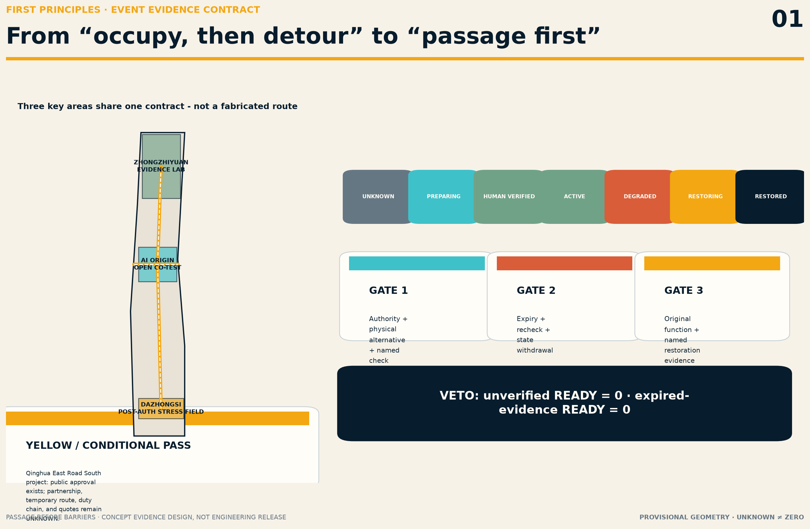
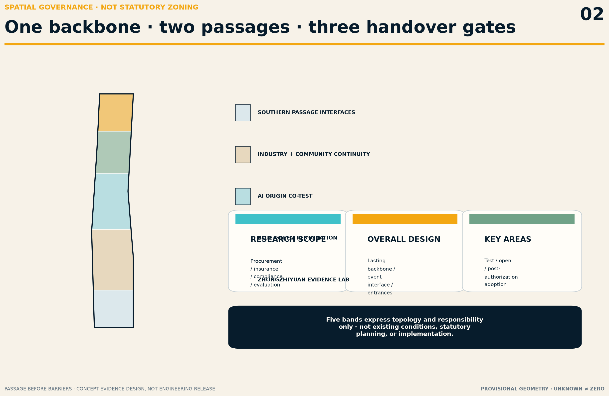
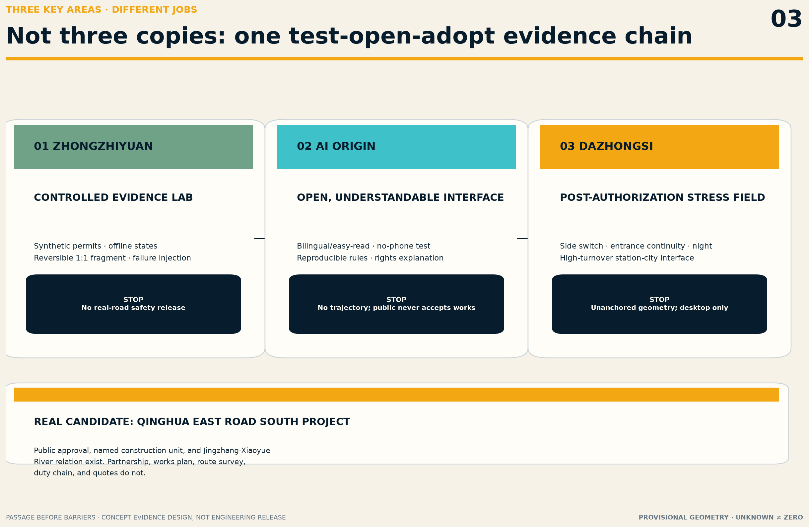
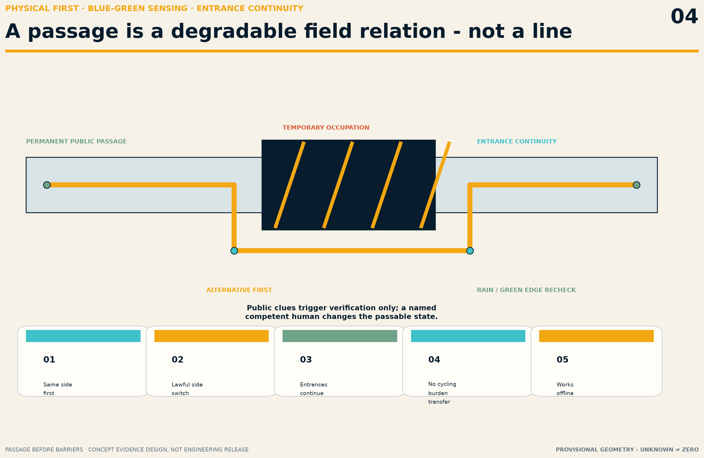
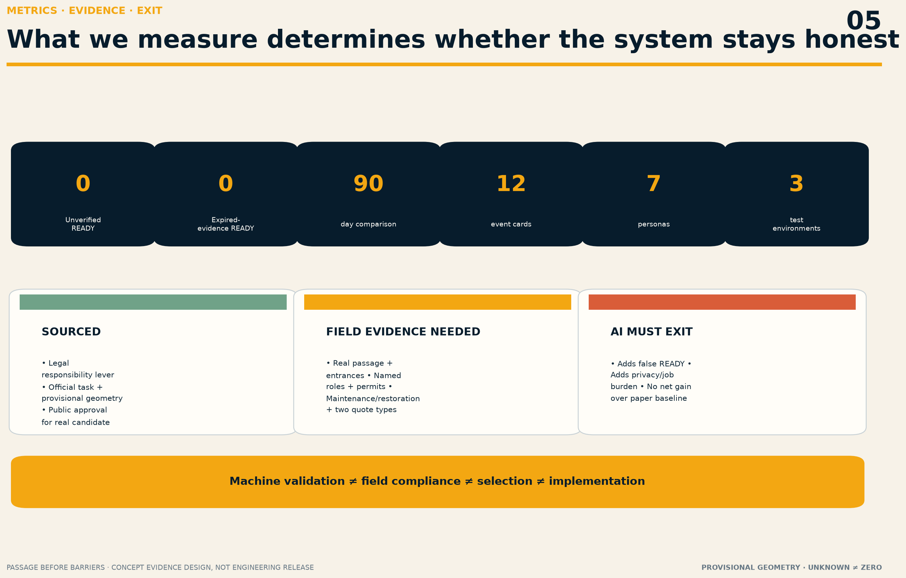

# PASSAGE BEFORE BARRIERS / 京张先通

> **Passage first; barrier second.** One temporary break that some people cannot cross can invalidate an entire public journey. Passage Before Barriers is not another navigation app. It turns public passage during urban renewal into a contract that can be verified, can expire, must degrade safely, and must end with restoration.

## Design basis and source inventory

The proposal responds to the full official task: the 43.6 km² research scope, approximately 11.4 km² overall-design scope, and three key areas, using the official announcement, Agent taskbook, repository site package, and source registry [source:OFFICIAL-ANNOUNCEMENT] [source:AGENT-TASKBOOK] [standard:PROJECT-AGENT-OPEN-CALL-TASKBOOK]. It is an AI-generated open co-creation proposal. It does not replace statutory planning, engineering design, traffic management, professional accessibility review, construction permits, government decisions, or public participation.

The overall and key-area geometries are provisional rough polygons from the repository. They support intake discussion, spatial relationships, and reproducible calculations only. They are not official boundaries, road redlines, project limits, ownership, existing conditions, or construction evidence [source:BOUNDARY-SOURCE] [source:KEY-AREA-SOURCE] [data:geometry/site_boundary.geojson#SITE-001]. Dazhongsi is a taskbook area name; `PROV-KEY-003` remains an unanchored provisional rectangle and may not be shifted to the station. When official/canonical geometry appears, every layer, metric, figure, PDF, and HTML output must be regenerated together.

China's Barrier-Free Environment Construction Law requires temporary barrier-free facilities to meet applicable construction standards. When such facilities are temporarily occupied, it calls for notice, protection/warnings/signals, necessary alternatives, and restoration after the occupation ends [source:CN-BARRIER-FREE-LAW] [standard:CN-BARRIER-FREE-LAW]. Beijing's regulation links approved temporary occupation, alternative measures, restored function, and responsibility [source:BEIJING-BARRIER-FREE-REGULATION] [standard:BEIJING-BARRIER-FREE-REGULATION]. These laws establish a public problem and responsibility mechanism; they do not prove that any Jingzhang site is unlawful, compliant, approved, or suitable for this proposal.

The purpose, access date, licence, and limitation of every source are recorded in `sources.json`; unresolved conditions remain visible in `assumptions.json`. Participant-supplied sources do not become centrally approved repository data merely by entering a submission. Spatial and engineering conclusions must still return to applicable official/canonical evidence [source:SOURCE-REGISTRY] [source:PROCESSED-FACT-PACK].

## First principles: the smallest public problem and service atom

### Who actually bears the loss

Barriers, repairs, events, and utility works can suddenly sever walking, wheelchair, cane, stroller, cycling, and entrance routes. People affected include disabled people, older adults, children and carers, temporarily injured people, travellers with luggage, night workers, delivery workers, visitors, and people without smartphones. Failure is not a minor usability defect: it can force people into motor traffic, block station or doorway access, impose long detours, cancel trips, or cause injury.

### What must work without AI

The minimum service has five steps:

1. The occupying party provides applicable authorization, boundary, duration, named responsibility, and restoration scope.
2. Before occupation begins, it installs the physical alternative passage, paper notice/map, and human contact route.
3. A person with the appropriate responsibility and competence verifies the passage on site; it may not display “passable” before that verification.
4. While active, the event is maintained by evidence expiry, human inspection, and degradation routes; missing critical evidence or failed physical conditions revoke the usable state.
5. At the end, the responsible party restores the original function, signs off by name, and retains minimum public evidence.

Paper forms, physical wayfinding, a phone chain, manual inspection, and a restoration form are the non-AI baseline. AI may only parse public or authorized documents, flag missing/expired evidence, draft bilingual and easy-read notices, and queue contradictions for human review. AI does not approve occupation, determine engineering safety or accessibility compliance, control signals/barriers/equipment, direct traffic or emergency response, repair, inspect, release, or restore [data:visual/assets/passage-contract.json].

## Three-level scope framework

The overall concept is **one lasting backbone, two parallel passages, and three handover gates**. The permanent public passage is the first route. Every renewal, maintenance, or event intersecting it must establish the second route first. The three gates govern authorization and verification before occupation, validity and degradation during operation, and restoration and sign-off after occupation [depth:three_level_scope_framework] [depth:overall_spatial_structure].

| Level | Problem to solve | Spatial answer | Current evidence boundary |
| --- | --- | --- | --- |
| Coordinated research scope | How can years of construction avoid transferring access costs to the public? | Make continuity a shared interface for procurement, engineering, insurance, compliance, and public evaluation | Institutional and industry coordination only; no contracts claimed |
| Overall-design scope | How can the park, east–west links, stations, and entrances remain continuous during works? | Identify a conceptual lasting backbone that cannot be interrupted without an alternative, plus event interfaces | Provisional geometry expresses topology only and locates no real break |
| Three key areas | How can R&D, open adoption, and high-turnover interfaces form a closed loop? | Zhongzhiyuan tests rules/components; AI Origin tests public information; Dazhongsi is tested only after authorization | Roles for research, not existing facilities or government assignments |

### Three areas and two wings

- **Zhongzhiyuan AI Innovation Acceleration Area:** candidate for controlled synthetic documents, missing-item detection, offline state machines, and conceptual temporary guard/wayfinding/ramp components; never a real-road safety release.
- **Beijing AI Origin Community:** candidate for open rules, bilingual/easy-read notices, no-phone comprehension, developer reproducibility, and public-rights explanation; no personal trajectory collection.
- **Dazhongsi AI Industry Cluster:** only after a real station-city/public-space project, manager, contractor, professional roles, and permits are in place may it become a controlled high-turnover arrival test; currently UNKNOWN.
- **Zhongguancun technology-service wing:** combines traffic engineering, accessibility, law, insurance, procurement, supervision, evaluation, and open-source software into a procurable service package.
- **Xiaoyue River scenario-enablement wing:** may test rain/snow, night conditions, green-space maintenance, walking/cycling conflict, and ecological interfaces under authorization; park users are not unpaid inspectors.

## Coordinated research scope: industry and future-city research

### Name, visual identity, and public language

The name 京张先通 communicates an order of responsibility, not a claim that the entire belt is already open. `PASSAGE BEFORE BARRIERS` makes the sequence explicit. The vocabulary includes:

- **Passage evidence card:** a pre-occupation evidence summary, not an administrative permit.
- **Expiry clock:** the published time of the next human recheck or evidence expiry.
- **Handover gate:** human sign-off at opening, operation, and restoration.
- **Restoration mark:** named evidence that original function was restored, never an AI-generated completion badge.

The logo direction is one continuous amber path through two offset navy barriers: the path continues and the barrier yields. Unlicensed railway images, trademarks, portraits, and fonts are excluded. Every visual state uses text, shape, and texture in addition to colour [source:AGENT-TASKBOOK].

### Six global method cases

Cases contribute methods only; foreign statutes, dimensions, agencies, and performance are not transplanted to Beijing.

| Case | Method to learn | Not transferred |
| --- | --- | --- |
| London TfL Temporary Traffic Management handbook | Compare pedestrian risk before works; continuous detectable guidance; signs are not the sole safeguard; observe while active | UK signs, dimensions, and TLRN authority [source:CASE-TFL-TTM] |
| US PROWAG | An alternative pedestrian route must work end to end; temporary status does not remove basic accessibility features | US legal standards and numerical values [source:CASE-US-PROWAG] |
| NYC DOT Street Works | Connect temporary walkways, occupation permits, inspection, and surface restoration in one street-works chain | New York permit names and agencies [source:CASE-NYC-STREET-WORKS] |
| Singapore LTA Work Zone | Link permit procedure, traffic-control plan, and restoration requirements | Singapore codes and approval authority [source:CASE-SG-LTA-WORK-ZONE] |
| Toronto TS 1.00 | The contractor maintains a protected, continuous, end-to-end accessible temporary passage with daily responsibility | Canadian dimensions and AODA interpretations [source:CASE-TORONTO-WORK-ZONE] |
| Transport for NSW Traffic Control at Work Sites | Retain crossings, provide close alternatives, and include lighting/security/cycling in traffic management | Australian technical requirements [source:CASE-NSW-WORK-SITES] |

The Jingzhang innovation is not an app but a reusable public contract linking event, evidence, responsibility, expiry, and restoration across projects. Industry value must be tested through fewer omissions, fewer false READY states, and lower public detour/communication burden—not sensor counts, model calls, investment totals, or invented company lists.

## Overall-design scope: urban renewal and regulatory-plan-depth urban design

### Spatial structure and land use

The provisional overall boundary is divided into five conceptual continuity-research bands: southern public-passage interfaces; industry/community continuity; AI Origin co-testing; blue-green restoration observation; and Zhongzhiyuan evidence testing. They are narrative and topology checks, not statutory land-use changes. Coverage in `land_use.geojson` shows that the submitted layer closes; it does not prove existing conditions or planning control [data:geometry/land_use.geojson#LU-PF-01] [metric:site_area_sqm] [standard:MNR-LAND-USE-CLASSIFICATION-GUIDE].

The spatial control is not a fabricated “belt-wide accessible route.” It requires five interfaces whenever a real project crosses the lasting backbone: pre-occupation notice, same-side-first alternative passage, side-switch/crossing decision, adjacent-entrance continuity, and end-of-term restoration. Actual alignments, road redlines, slope, width, lighting, drainage, crossings, and station organization remain UNKNOWN until formal surveys and professional documents exist [depth:traffic_rail_slow_parking].

## Land use, building scale, and retain–renovate–demolish strategy

The proposal does not solve construction-period continuity with large new buildings. The conceptual building layer contains only three reversible indoor/semi-indoor support interfaces: controlled testing, public explanation, and responsibility handover. They are not existing buildings or conclusions on building scale or demolition [data:geometry/buildings.geojson#BLDG-PF-01] [metric:building_footprint_area_sqm] [standard:MOHURD-URBAN-DESIGN-MEASURES].

Ownership, retention/renovation/demolition, FAR, height, density, setbacks, fire egress, and heritage conditions all remain UNKNOWN [depth:development_intensity_controls] [depth:retain_renovate_demolish].

Public-space components during works follow reversible, low-consumption, maintainable principles: physical guard/continuous edge, level passage, side-switch cues, paper status, named contact, and expiry time. Applicable professionals must determine material, dimensions, fixation, and safety class; the component library is not a standard detail set or procurement specification.

## Detailed design for key areas

### 1. Zhongzhiyuan: controlled continuity test field

Without occupying a real public road, synthetic permits, fictional roles, and a reversible 1:1 fragment test document omissions, state degradation, physical guidance, offline conditions, missing signs, and restoration sign-off. A prototype process does not prove a real road is usable [data:geometry/key_areas.geojson#PROV-KEY-001].

### 2. Beijing AI Origin Community: open, understandable interface

Event states, evidence expiry, complaint/contact entry, non-digital maps, and bilingual/easy-read templates become reproducible public knowledge. Disabled users, older adults, carers, and field staff may test only whether information is understandable in a consented, controlled environment; they do not perform engineering acceptance [data:geometry/key_areas.geojson#PROV-KEY-002].

### 3. Dazhongsi: post-authorization stress field

The area can study side switching, doorway continuity, cycling conflict, and night information at high-turnover station/commercial/office/residential arrivals. But `PROV-KEY-003` is unanchored; real assets, roads, station entrances, work plans, operators, and passage capacity are UNKNOWN. Before written site authorization, applicable permits, a field baseline, and professional verification, only desktop scenarios are allowed [data:geometry/key_areas.geojson#PROV-KEY-003].

### A real priority engagement candidate, not a selected pilot

The Beijing Development and Reform Commission approved the Public Space Improvement Project on the South Side of Qinghua East Road, naming Xueyuanlu Subdistrict Office as the construction unit. Public descriptions place it between Jingzhang Railway Heritage Park and the Xiaoyue River green corridor; a municipal article records discontinuous pedestrian/cycling movement and station-area parking issues and states a planned 2026 start [source:QINGHUA-EAST-ROAD-APPROVAL] [source:QINGHUA-EAST-ROAD-PUBLIC-BRIEF]. This makes it a priority engagement candidate. No construction organization, occupation plan, contractor/supervisor, route survey, pilot authorization, or quotation has been obtained. News extents, renderings, and provisional polygons may not be converted into an engineering redline.

## AI innovation ecosystem, personas, and AI+ scenarios

### Seven personas

| Group | Core task | Responsibility that cannot be transferred to them |
| --- | --- | --- |
| Wheelchair/mobility-aid users | End-to-end passage, turning, crossings, and entrance continuity | Proving temporary-facility compliance |
| Blind/low-vision users | Continuous detectable edge, non-visual information, no projection hazard | Risking themselves to test engineering safety |
| Older people, children, and carers | Low cognitive load, short detour, rest, no-phone comprehension | Installation, maintenance, and field control |
| Cyclists and delivery workers | Clear dismount/merge/detour relations without entering pedestrian or motor flows | Completing construction traffic planning |
| Residents, students, and visitors | Advance notice, continuous entrances, reachable responsible party | Uploading continuous location/trajectory data |
| Contractor, supervisor, and maintenance staff | One executable checklist, clear handover, explicit expiry | Endorsing a platform's incorrect state |
| Road/facility managers, approval and emergency roles | Verifiable documents, action within authority, restoration evidence | Replacement by AI in statutory/professional judgment |

### Twelve event-contract scenario cards

All scenarios share one state contract rather than twelve unrelated AI features [data:visual/assets/passage-contract.json].

| Card | Event and main users | Non-AI main path | AI may do | Human gate/degradation trigger | Verification metric |
| --- | --- | --- | --- | --- | --- |
| S01 Planned footway occupation | Pedestrians, wheelchair users, entrances | Permit pack, physical path, paper map, opening/closing checks | Flag missing/expired documents | VERIFIED only after professional check; obstruction means DEGRADED | Unverified READY = 0 |
| S02 Emergency repair | Night residents, emergency staff | Safety first, human guard, approved alternative | Organize a public-status draft | AI issues no emergency instruction; authorized party closes | False open = 0 |
| S03 Station forecourt works | Passengers, luggage, cyclists | Human-confirm side switch, station/egress relationships | Detect version conflict | Missing station/traffic/work-party evidence means UNKNOWN | Entrance-continuity evidence rate |
| S04 Green-space/greenway maintenance | Runners, children, blind users | Guarding, same-side alternative, no-phone cue | Draft easy-read notice | Confirm ecology/landscape/facility role by ownership | Wrong-entry events; comprehension |
| S05 Temporary event occupation | Visitors, residents, event operators | Event permit, removable components, clear/restoration form | Check version and expiry | Not restored after event means RESTORING | On-time restoration sign-off |
| S06 Utility excavation | Pedestrians, cyclists, workers | Physical separation from trench; manual patrol | Compare evidence checklist | Failed safety/traffic check immediately closes/degrades | Hazard clue-to-state-withdrawal time |
| S07 Rain/snow/ponding | Wheelchairs, strollers, older people | Post-weather human recheck, clearing, alternative | Prompt a recheck, not decide usability | Expired drainage/slip evidence means DEGRADED | Valid post-weather recheck rate |
| S08 Night lighting failure | Night workers, visitors | Field lighting and named contact, not phone torch | Flag overdue inspection | No lighting verification revokes ACTIVE | Expired-but-usable display = 0 |
| S09 Walking–cycling conflict | Cyclists, children, couriers | Physical separation/dismount rule; observation | Classify aggregate conflict clues | Traffic professional decides; model never controls flow | Near-miss use; human takeover time |
| S10 Missing detectable edge | Blind users, maintenance staff | Continuous physical edge and tactile/manual check | Flag checklist omission | Public clue triggers check but cannot prove repair | Clue–verify–repair closure rate |
| S11 Adjacent entrance interruption | Residents, schools/offices, shops | Per-entrance list; professional threshold/guidance handling | Compare work stage with entrance list | Unconfirmed ownership/fire/operation means UNKNOWN | Evidence rate for required entrance continuity/alternative |
| S12 End-of-term restoration | All users, facility manager | Clear site, verify original function, named restoration mark | Flag overdue/conflicting files | Only competent named evidence produces RESTORED | On-time restoration; false restoration = 0 |

### Three industry-test environments

1. **Zhongzhiyuan synthetic evidence lab:** fictional projects, de-identified templates, and failure injection test the rule checker; no real unpublished work documents.
2. **AI Origin controlled 1:1 exercise:** a reversible passage fragment on an authorized non-road site compares paper and AI-assisted processes; it is not engineering acceptance.
3. **Authorized shadow/limited real-project pilot:** only after the real manager, works/event party, professionals, permits, insurance, and publication scope are complete. Otherwise it remains shadow observation and cannot affect field decisions.

AI net value is judged on four questions only: fewer critical-evidence omissions, less staff organization time, no added false READY state, and no added privacy or job burden. If net value fails, AI exits while the non-AI passage contract remains.

## Traffic, rail, municipal, and public-service facilities

The design order is “same-side continuity first, lawful side switching, uninterrupted entrances, and no transfer of cycling conflict to pedestrians.” `roads.geojson` is a conceptual lasting backbone, not an existing road, work access, or redline [data:geometry/roads.geojson#ROAD-PF-01] [standard:MOHURD-CONTROL-DETAILED-PLANNING]. Rail entrances, signals, works vehicles, bus stops, fire egress, and emergency traffic remain under the relevant professionals; AI controls none of them.

The minimum infrastructure baseline is printable event ID, paper state, named phone number, human-check time, and offline guidance. The digital layer may be a local static ledger and deterministic rule checker. It requires no camera, face, trajectory, continuous location, or cloud digital twin. Real utility, power, lighting, drainage, network, and maintenance capacity are not publicly evidenced and remain UNKNOWN [depth:municipal_new_infrastructure].

## Blue-green space, public space, and urban character

Permanent blue-green space is the lasting public backbone, not the leftover area of construction. Works-period design must consider tree pits/green edges, ponding, dark zones, running/cycling, child stopping, detectable edges, and cleaning/maintenance. `green_space.geojson` and `public_space.geojson` show conceptual research interfaces only [data:geometry/green_space.geojson#GREEN-PF-01] [data:geometry/public_space.geojson#PUBLIC-PF-01].

Their ratios come from provisional submission geometry and cannot be read as new green space, existing open space, or a project promise [metric:green_ratio] [metric:public_space_ratio].

The public-space component library includes continuous physical edges, reversible guarding, level passage, low/large-type/tactile-compatible notice surfaces, advance side-switch cues, paper maps, expiry clock, human contact board, and restoration-evidence board. A professional team selects each component from real risks; display quality never replaces work-site safety.

## Jingzhang culture, Zhongguancun culture, and three public landmarks

Railway culture is not reduced to decoration. Three working ethics are extracted: Jingzhang public memory says a path must actually arrive; Zhongguancun culture says reproducible failure is worth more than unverifiable success; responsible AI says models obey evidence, authority, and final human judgment [source:AGENT-TASKBOOK].

Three reversible “pilgrimage/honour” interfaces are not large permanent buildings:

1. **Passage Stage:** shows one event's non-AI baseline, evidence gaps, roles, and current state; only authorized minimum information is published.
2. **Expiry Clock:** puts the next required human recheck in the most visible place and rewards timely degradation, not permanent green status.
3. **Restoration Mark:** records who confirmed restored function, when, and with what competent evidence; honour goes to people who close responsibility gaps and publish failure, not to equipment-call volume.

Wayfinding uses a four-step grammar—continuous path, break, alternative, restoration—with Chinese, English, graphics, and human contact in parallel. Railway history, heritage lists, fonts, photographs, and portraits are used only after source accuracy and rights are confirmed [depth:blue_green_public_space].

## Renewal project list, implementation policy, and phasing

| ID | Concept project | Near-term deliverable | Admission/stop condition |
| --- | --- | --- | --- |
| PF-01 Minimum passage-event contract | State, evidence, responsibility, validity, restoration fields | Legal/professional review; research only when authority is unclear |
| PF-02 Paper passage-first pack | Physical sign, map, checklist, phone chain, restoration mark | Synthetic testing without a real site is allowed; never impersonate a permit |
| PF-03 Reversible component test | Controlled 1:1 fragment and failure injection | Written site permission, risk assessment, human supervision |
| PF-04 Open rule checker | Offline missing/expiry/contradiction alerts | No connection to control devices; no safety conclusion |
| PF-05 Priority-candidate engagement | Xueyuanlu project evidence list and invitation draft | Without written participation it remains a candidate, never a field pilot |
| PF-06 Annual continuity review | Publish authorized failures, degradation, restoration, and AI-exit records | Authorized, minimized, reviewable information only |

### 90-day evidence-gate pilot

- **Days 1–15: responsibility and real baseline.** Read one real event only within authorization, mapping roles, permits, existing conditions, and gaps; otherwise run a synthetic desktop exercise.
- **Days 16–30: non-AI baseline.** Run opening, checking, degradation, and restoration with paper forms, physical guidance, phone chain, and human inspection.
- **Days 31–60: controlled comparison.** Compare manual and AI-assisted processes at an authorized site; named humans still decide every field state.
- **Days 61–75: safe failure injection.** Exercise missing signs, expired evidence, absent responsible person, offline operation, night, and post-rain checks without creating real hazards.
- **Days 76–90: restoration and counterfactual.** Sign off restoration and compare omissions, time, false alerts, false READY, comprehension, and job burden; AI exits if net value is absent.

Two zero-tolerance measures are “marked passable without human verification = 0” and “usable state retained after evidence expiry = 0.” Every other threshold must follow real baseline, risk class, and agreement by responsible parties. Coverage, detour limits, incident reduction, and satisfaction targets are not invented in advance.

### Responsibility and cost

The occupation/work/event party bears the plan, physical passage, maintenance, notice, restoration, and corresponding cost. Road/facility managers, approval bodies, contractor, supervisor, traffic/accessibility professionals act only within real authority. The public supplies clues and comprehension feedback. AI assists only. A real RACI must come from authorization documents [data:visual/assets/passage-contract.json].

The principal cost is people and field responsibility, not the model: coordination, professional survey, traffic/accessibility review, physical components, installation/maintenance, daily checks, night/rain/snow response, insurance, independent review, restoration, and exit. No RMB total or saving ratio is stated because two comparable quotations do not yet exist. Before a real pilot, obtain comparable evidence for physical components plus installation/maintenance and for professional inspection/traffic organization; identify who pays, maintains, and bears failure cost.

## Long-term operation, activities, and international communication

Annual operation is not a one-off AI show. It has four fixed cycles: quarterly removal of expired evidence, semi-annual blind manual/AI comparison, annual public continuity review, and mandatory rereview after rule or standard changes. Developer communities maintain synthetic tests and offline rules; professionals maintain applicable standards and role boundaries; field duty holders maintain real facilities; the public participates only in authorized information-comprehension tests and problem clues.

An annual “Passage Before Barriers Open Review” can connect Zhongzhiyuan testing, AI Origin open explanation, and the Zhongguancun service wing without claiming existing international cooperation. External communication states only what reproducible public good was created, how far the evidence reaches, and which professional/field review is still needed. Submission, review, selection, authorized pilot, and completed implementation remain distinct.

## Metrics, area recalculation, and compliance matrix

Provisional submission geometry permits recalculation of overall area, key-area count, and conceptual green/public-space metrics [metric:site_area_sqm] [metric:key_area_count] [metric:green_ratio]. Concept building footprints and public spaces are also reproducible from submitted layers [metric:public_space_ratio] [metric:building_footprint_area_sqm].

These values describe only the submission geometry, not statutory or existing-condition indicators. FAR, height, road redlines, real passage length/width/slope, real project area, users, cost, incidents, efficiency, and AI net value remain UNKNOWN.

Operational measures have four layers: admission completeness (authority and named roles), erroneous state (false READY/expired READY), active degradation (detection to withdrawal/human action), and restoration closure (original function and sign-off). Passing machine intake, spatial review, professional matrices, and visual packaging means only that the submission can be reviewed—not that the proposal is compliant, high-scoring, selected, or field-ready [depth:metrics_recalculation].

## Risk, copyright, and compliance

Veto conditions include: claiming implementation without written authorization; letting public reports or model outputs switch a safety/passable state; deriving exact routes from provisional geometry, news renderings, or commercial maps; replacing professional duty with volunteers/residents/general guards; omitting expiry, offline degradation, or restoration sign-off; or retaining AI after it shows no net value [depth:risk_missing_data].

The proposal collects no name, phone number, account, face, plate, precise personal location, image, continuous location, or personal trajectory. Any future field requires a new necessity, authorization, minimization, retention, and publication review. “Improving passage” is not an unlimited data-collection justification.

Global cases, open projects, and community methods are attributed as method references only. Switchback Protocol v1.0's state, review, and fallback ideas are acknowledged within the CC-BY-4.0 boundary declared by contributors in Issue #1119. This proposal independently defines a passage-event contract and copies no other proposal's text, drawing, geometry, or package structure [source:SWITCHBACK-PROTOCOL-METHOD]. Copyright and toolchain records are in `report/copyright_statement.md`.

Before implementation, obtain official/canonical overall and key-area geometries; written participation by a real project; event/work boundary and applicable permits; road/facility ownership; contractor, supervisor, maintenance, professional verification, and restoration roles; field survey; traffic, rail, utility, fire, drainage, lighting, heritage, and green-space conditions; two comparable cost sources; and insurance, complaint, incident, data-protection, and exit arrangements. Where an item is missing, the object remains UNKNOWN, scope is reduced, or work stops.

## References

Primary fact entries include the official announcement and Agent taskbook, the national Barrier-Free Environment Construction Law, Beijing's barrier-free regulation, Beijing road-occupation approval and construction registers, and the Qinghua East Road public-space project approval and public description [source:OFFICIAL-ANNOUNCEMENT] [source:CN-BARRIER-FREE-LAW] [source:QINGHUA-EAST-ROAD-APPROVAL]. They establish the competition task, temporary-occupation/restoration responsibility mechanism, and one real priority engagement candidate. Combined, they still cannot derive a project redline, temporary route, professional compliance, budget, or authorization.

Complete URLs, uses, limitations, access dates, and licence boundaries for global cases and open methods are recorded in `sources.json`. London, US, New York, Singapore, Toronto, and New South Wales sources compare alternative-passage, permit, maintenance, and restoration methods only. Foreign agencies, standards, and values are not imported. Provisional geometry supports intake visualization and reproducible submission calculations only [source:BOUNDARY-SOURCE] [data:geometry/site_boundary.geojson#SITE-001]; official geometry, road redlines, existing-condition survey, and real-project data require a complete redraw and recalculation.

`assumptions.json` retains gaps in organization, site, permits, responsibility, cost, data, and AI net value. `compliance_matrix.json`, `standard_matrix.json`, and `design_depth_matrix.json` connect the narrative to tasks, standards, depth, layers, metrics, and checks. Current numerical values describe the package itself and are not existing-condition or approval conclusions [depth:metrics_recalculation] [metric:site_area_sqm]. The evidence chain exists not to manufacture certainty but to show reviewers and later professionals what has a source, what is a design recommendation, and what must await human authorization and field evidence.
